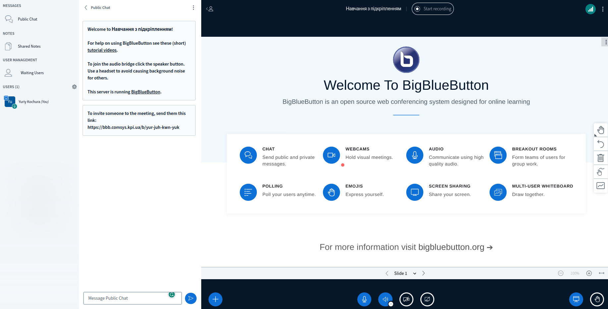
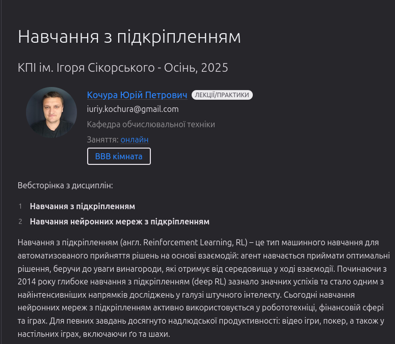
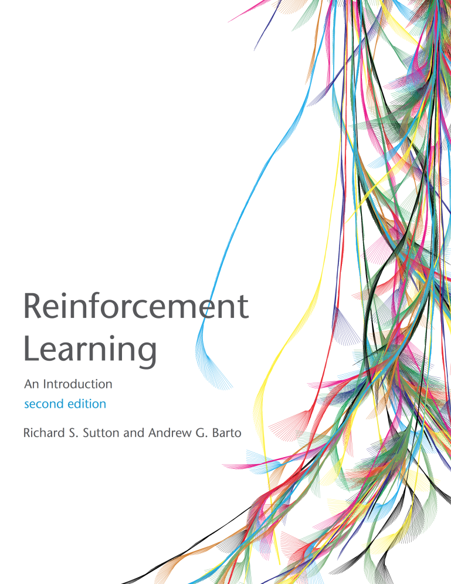
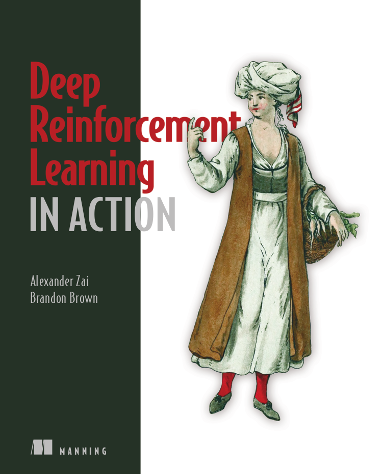
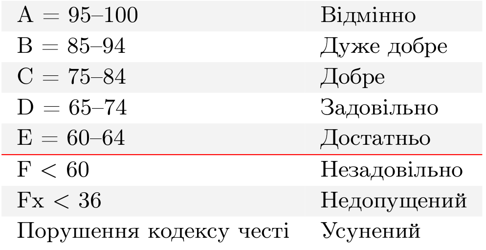

class: middle, center, title-slide 

# Навчання з підкріпленням

Осінь, 2023

  
Кочура Юрій Петрович 
[iuriy.kochura@gmail.com](mailto:iuriy.kochura@gmail.com)  
<a href="https://t.me/y_kochura">@y_kochura</a>  

???

R: https://www.cs.toronto.edu/~duvenaud/courses/csc2541/index.html projects

---

# Інструктор

Лекції та практики:
- Кочура Юрій Петрович 
  - Кафедра ОТ, ФІОТ 

 

.center[
.circle.width-40[]
]

---

class: middle 
# Опис
*Навчання з пiдкрiпленням* (англ. reinforcement learning, RL) &mdash; це галузь машинного навчання, а також формалiзм для автоматизованого прийняття рiшень на основi взаємодiй. 

За останнi 6 рокiв глибинне навчання з пiдкрiпленням (deep RL) стало одним з найiнтенсивнiших напрямкiв дослiджень у сферi штучного iнтелекту. Сьогоднi deep RL дозволяє досягати надлюдської продуктивностi в рядi завдань: вiдео iгри, покер, а також у настiльних iграх, включаючи ґо та шахи.

???
Цей курс познайомить Вас з сiмейством статистичних алгоритмiв, якi вивчають оптимальну стратегiю, метою якої є максимiзацiя загальної винагороди, отриманої агентом при взаємодiї з навколишнiм середовищем.

---

class: middle 
count: false
# Опис

## Навчальна мета
- Познайомитись з фундаментальною теорією та особливостями навчання з підкріпленням. 
- Навчитись вирішувати прості задачі за допомогою методів RL.
- Познайомитесь з дослідженнями в галузі RL  ($\leq$ останні 10 років).

---

class: middle 
# Потрібні навички

- Рівень володіння англійською мовою не нижче А2.
- Базовi знання з лiнiйної алгебри та теорiї ймовiрностей.
- Досвiд тренування глибинних мереж (iнiцiалiзацiя, оптимiзацiя, регуляризацiя, вибiр методу та метрик для оцiнки).

---

class: middle 
# Заняття

- Лекції та практики в асинхронному режимі онлайн 
- Семінар в синхронному режимі онлайн на платформі BigBlueButton:   [https://bbb.comsys.kpi.ua/b/yur-juh-kwn-yuk](https://bbb.comsys.kpi.ua/b/yur-juh-kwn-yuk)

.center.width-100[]

---

class: middle

# Оголошення та обговорення

.smaller-x[Усі *оголошення* та *обговорення* будуть здійснюватись в Telegram (повідомте мене, якщо потрібно Вас додати)

- Задавайте питання, які Вас турбують
- Не соромтесь!
]

.grid[
.kol-1-2[
.center.width-100[]
.center.smaller-x[Оголошення]
]

.kol-1-2[
.center.width-90[]
.center.smaller-x[Обговорення]
]
]

---

class: middle

# Що робити, якщо розпочалась повітряна тривога?

У випадку оголошення повітряної тривоги у Вашому місті &mdash; залиште заняття та прямуйте до найближчого укриття. 

---

class: middle 
# Вебсторінка

Усі навчальні матеріали будуть розміщуватись на цій вебсторінці:   [https://courses-cs-kpi.github.io/rl-23fall/](https://courses-cs-kpi.github.io/rl-23fall/)

.center.width-80[]

---

class: middle, center

# Розклад занять

 .larger-x[[roz.kpi.ua](http://roz.kpi.ua/)]

---

class: middle

# Підручники

Офіційного підручника українською мовою немає, але ряд допоміжних питань будуть розглядатись з наступних книг для всебічного ознайомлення з галуззю. 

.grid[
.kol-1-2[
[.center.width-80[]](http://incompleteideas.net/book/the-book-2nd.html)
.center[Безкоштовна]
]

.kol-1-2[
[.center.width-80[]](https://www.manning.com/books/deep-reinforcement-learning-in-action)
.center[Безкоштовний перегляд]
]
]

---

class: middle
# Особливості

- Для магiстрiв 2-го курсу
- Мова викладання: українська, англiйська
- 6 лекцій
- 3 (три) практичнi роботи + семінар + проєкт
- Екзамен

---

class: middle

# Практичні завдання

Вправи, які допоможуть Вам краще познайомитись з RL. 

---

class: middle

# Семінар 

Семінарське заняття &mdash; форма навчального заняття, при якій викладач організує дискусію навколо попередньо визначених тем, до котрих студенти готують тези виступів на підставі індивідуально виконаних завдань (рефератів). Семінарські заняття проводяться в аудиторіях, навчальних кабінетах або на онлайн-зустрічах з однією академічною групою. 

.footnote[Джерело: [Вікіпедія](https://uk.wikipedia.org/wiki/%D0%A1%D0%B5%D0%BC%D1%96%D0%BD%D0%B0%D1%80)]

???
Семінари (метод викладання) &mdash; англ. Seminars (teaching method) &mdash; зібрання групи студентів, які зайняті науковими дослідженнями або вивченням наукових проблем, під керівництвом одного або декількох викладачів для обговорення питань, що представляють взаємну цікавість.

Семінарське заняття &mdash; форма навчального заняття, при якій викладач організує дискусію навколо попередньо визначених тем, до котрих студенти готують тези виступів на підставі індивідуально виконаних завдань (рефератів). Семінарські заняття проводяться в аудиторіях, навчальних кабінетах або на онлайн-зустрічах з однією академічною групою.

---

class: middle

# Проєкт

Тема проєкту на ваш вибір. Деталі будуть оголошені пізніше. 

---

class: middle
# Система оцінювання

- 30%  &nbsp;&emsp; Практичнi завдання (10% кожне)
- 20%  &nbsp;&emsp; Семінар
- 20%  &nbsp;&emsp; Проєкт
- 30%  &nbsp;&emsp; Екзамен 

**Примітка!** Умова допуску до семестрового контролю (екзамену): 
 .center[*Практичні + Семінар + Проєкт* $\geq 42\%$]

---

class: middle 
# Шкала оцінок

Шкала оцiнок [КПI iм. Iгоря Сiкорського](https://kpi.ua/grading):

.center.width-65[]

---

class: middle 
# Кодекс честі

## Академічна доброчесність

Ви можете обговорювати завдання практичних робiт у групах. Однак, кожен студент(-ка)
повинен(-на) пiдготувати розв’язки завдань самостiйно. Пiд час проходження цього курсу Ви
зобов’язанi дотримуватись політики та принципів академічної доброчесності визначених
Кодексом честi КПI iм. Iгоря Сiкорського ([Детальніше Розліл 3](https://kpi.ua/code) та усi наступнi
правила:

1. Кожен з Вас повинен вiдправляти на перевiрку власно виконану роботу. Використання чужих розв’язкiв або програмного коду i представлення їх за свої напрацювання є плагiатом та серйозним порушенням основних академiчних стандартiв.

1. Ви не повиннi дiлитися своїми розв’язками з iншими студентами, а також просити iнших дiлитися своїми розв’язками з Вами.

1. Якщо Ви отримували допомогу у вирiшеннi певного завдання, Ви маєте зазначити це у звiтi, а саме: вiд кого та яку допомогу отримали.

---

class: middle 
# Кодекс честі

## Норми етичної поведінки

Норми етичної поведінки студентів і працівників університету визначені у [розділі 2 Кодексу честі](https://kpi.ua/code) 
Національного технічного університету України «Київський політехнічний інститут імені Ігоря
Сікорського».

---

class: middle 
# Кодекс честі

## Виконання завдань: практики, проєкт та семінар

Викладачем встановлюється граничний термін для виконання усіх видів завдань з метою послідовного і збалансованого засвоєння студентами навчального матеріалу та моніторингу виконання здобувачами індивідуальних навчальних планів згідно з графіком навчального процесу. Здача на перевірку виконаних завдань після встановлених термінів
супроводжується штрафними балами. Кінцевим терміном для здачі на перевірку усіх видів завдань є останнє заняття з комп’ютерного практикуму. У період проведення в університеті
семестрового контролю приймання завдань не здійснюється. Студент(-ка) має можливість переробити або доопрацювати завдання на перездачі з метою підвищення
свого поточного рейтингу.

---

class: middle 
# Кодекс честі

## Процедура оскарження оцінок

Якщо студент(-ка) вважає, що його(її) роботу недооцінено або переоцінено — потрібно
звернутися до викладача, який здійснював оцінювання та повідомити про це із зазначенням
короткого обґрунтування (оцінка буде переглянута).

---

class: middle 
# Як успішно завершити курс?

???
Викладач зацікавлений у тому, щоб усі досягли успіху під час вивчення дисципліни та дізналися якомога більше не лише про “зміст предмету”, а й про те, як ми можемо покращити світ навколо нас. 

---

class: middle 
count: false
# Як успішно завершити курс?

  - Визначте пріоритети
    - Використовуйте свій час та енергію так, щоб могли досягти поставлених цілей у навчанні, роботі та власному житті.

---

class: middle 
count: false
# Як успішно завершити курс?

  - Визначте пріоритети
    - Використовуйте свій час та енергію так, щоб могли досягти поставлених цілей у навчанні, роботі та власному житті.

  - Працюйте систематично
    - Подібно до спортивних тренувань, навчання вимагає систематичності та регулярності для того, щоб досягти реального прогресу.

---

class: middle 
count: false
# Як успішно завершити курс?

  - Визначте пріоритети
    - Використовуйте свій час та енергію так, щоб могли досягти поставлених цілей у навчанні, роботі та власному житті.

  - Працюйте систематично
    - Подібно до спортивних тренувань, навчання вимагає систематичності та регулярності для того, щоб досягти реального прогресу.

  - Спілкуйтеся з однодумцями
    - Знайдіть друга з яким зможете обговорювати матеріали лекцій і не тільки. Слідкуйте за людьми, трудовою етикою яких Ви захоплюєтесь &mdash; успішні люди надихаю.

---

class: middle 
count: false
# Як успішно завершити курс?

  - Визначте пріоритети
    - Використовуйте свій час та енергію так, щоб могли досягти поставлених цілей у навчанні, роботі та власному житті.

  - Працюйте систематично
    - Подібно до спортивних тренувань, навчання вимагає систематичності та регулярності для того, щоб досягти реального прогресу.

  - Спілкуйтеся з однодумцями
    - Знайдіть друга з яким зможете обговорювати матеріали лекцій і не тільки. Слідкуйте за людьми, трудовою етикою яких Ви захоплюєтесь &mdash; успішні люди надихаю.

  - Залишайтесь духовно та фізично здоровими
    - Навчаючись онлайн, швидше за все, Ви будете проводите більше часу за комп’ютером, ніж це було б під час офлайн навчання, тому не забувайте робити перерви, ходити на прогулянки, спати рекомендовану кількість годин та їсти здорову їжу для підтримання свого організму.

---

class: end-slide, center
count: false

.larger-xx[Почнемо 🎬⏳] 