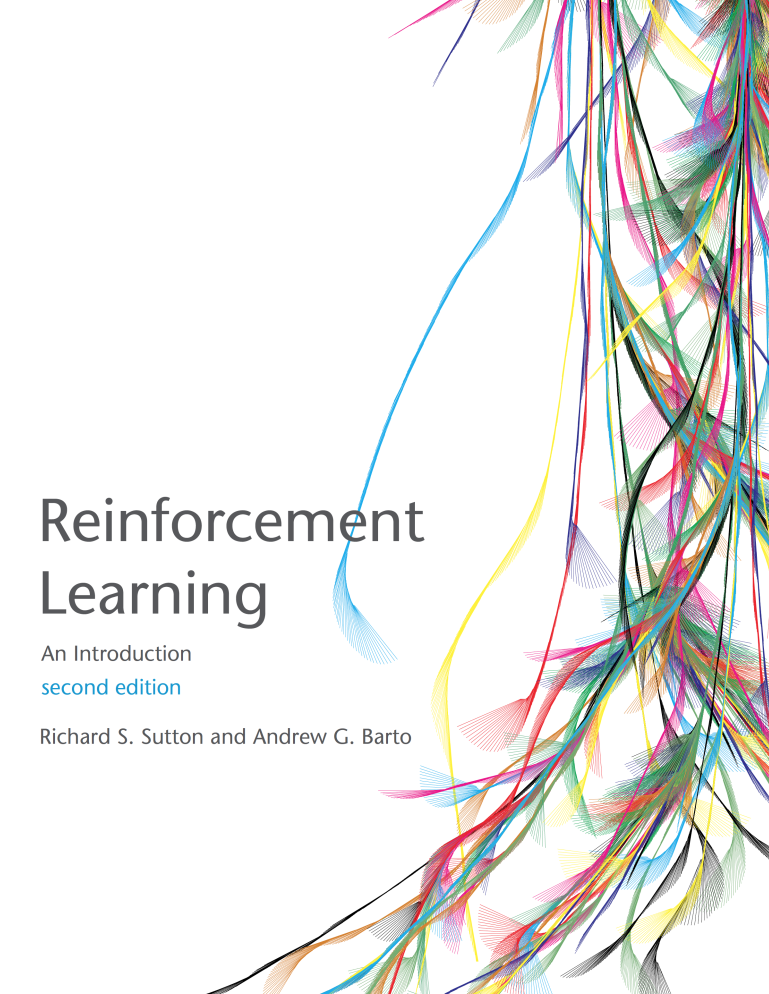

class: middle, center, title-slide 

# Навчання з підкріпленням

Осінь, 2021

  
Кочура Юрій Петрович 
[iuriy.kochura@gmail.com](mailto:iuriy.kochura@gmail.com)  
<a href="https://t.me/y_kochura">@y_kochura</a>  

???

R: https://www.cs.toronto.edu/~duvenaud/courses/csc2541/index.html projects

---

# Інструктор

Лекції та практики:
- Кочура Юрій Петрович 
  - Кафедра ОТ, ФІОТ 

 

.center[
.circle.width-40[]
]

---

# Опис

## Деталі
- Зрозумієте основи та особливості навчання з підкріпленням (RL). 
- Навчитесь вирішувати прості задачі за допомогою методів RL.
- Познайомитесь з дослідженнями в галузі RL  ($\leq$ останні 10 років).

---

# Матеріали

Лекції будуть проходити онлайн в BigBlueButton:   [https://bbb.comsys.kpi.ua/b/yur-juh-kwn-yuk](https://bbb.comsys.kpi.ua/b/yur-juh-kwn-yuk)

.center.width-90[]

---

class: middle 

## Розклад & Слайди

- Розклад занять: [rozklad.kpi.ua](http://rozklad.kpi.ua)
- Слайди будуть надсилатись у телеграм групу після заняття

---

class: middle

## Підручник

Офіційного підручника українською немає, але ряд допоміжних питань будуть розглядатись  з ([Reinforcement Learning: An Introduction](http://incompleteideas.net/book/the-book-2nd.html)) для всебічного ознайомлення з галуззю. 

.center.width-60[]

---

class: middle

## Практичні завдання

Вправи, які допоможуть Вам познайомитись з RL. 

---

class: middle

## Проєкт

Тема проєкту на ваш вибір. Деталі будуть оголошені пізніше. 

---

# Система оцінювання

- 30%  &nbsp;&emsp; Практичнi завдання (10% кожне)
- 40%  &nbsp;&emsp; Проєкт
- 30%  &nbsp;&emsp; Залік

**Примітка!** Умова допуску до семестрового контролю (заліку): 
$$ \text{Practices} + \text{Project} \geq 42\%$$

---

class: end-slide, center
count: false

Кінець!
