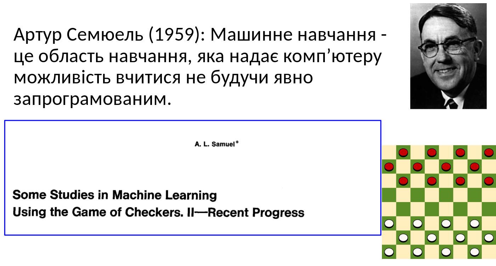
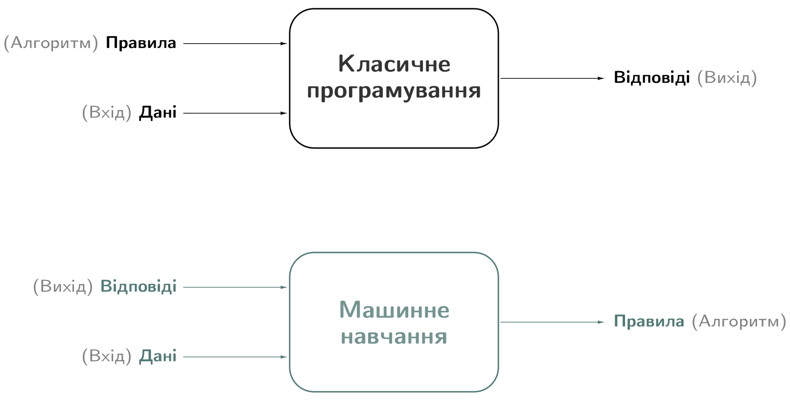
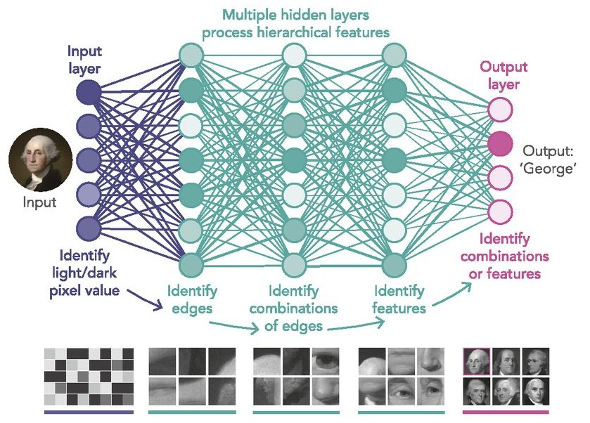
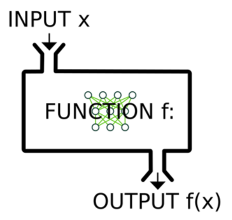
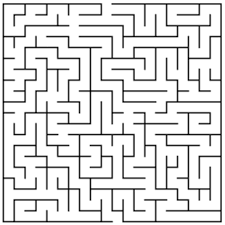
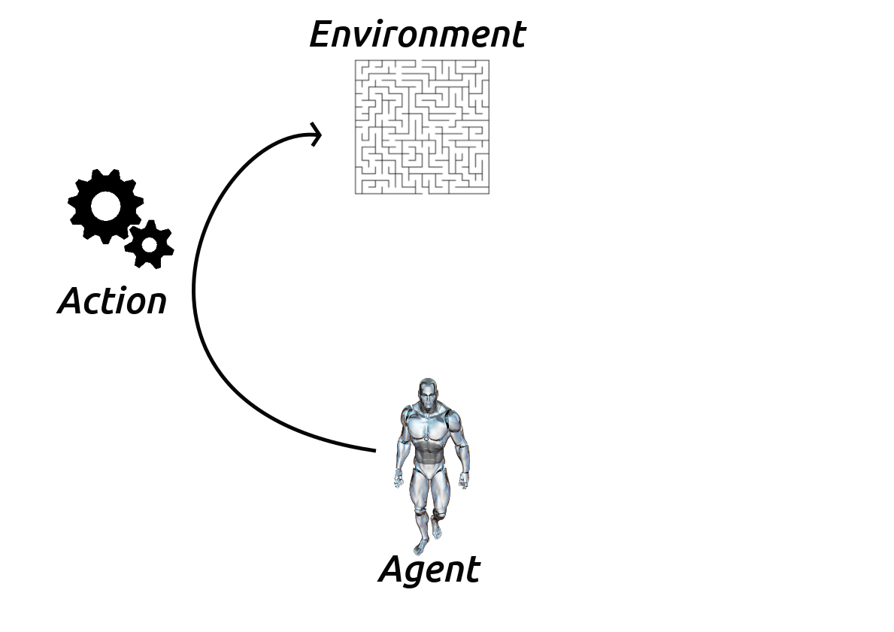
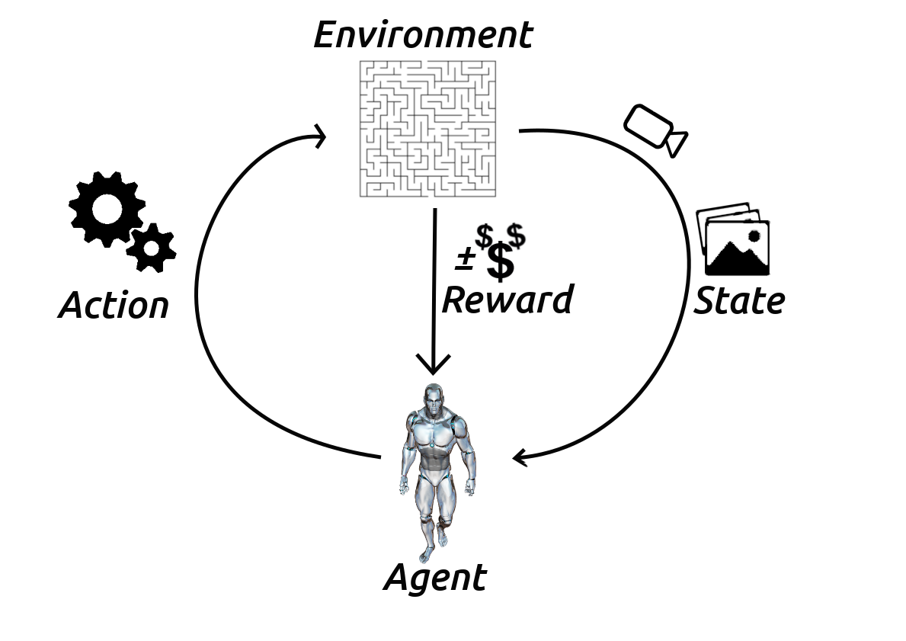

class: middle, center, title-slide

# Навчання з підкріпленням

Лекція 0: Вступ

  
Кочура Юрій Петрович 
[iuriy.kochura@gmail.com](mailto:iuriy.kochura@gmail.com)  
<a href="https://t.me/y_kochura">@y_kochura</a>  

---

# Сьогодні

- Огляд основ машинного навчання
- Вступ до навчання з підкріпленням

---

class: middle

# Огляд основ машинного навчання

## Що таке машинне навчання?

---

class: middle

# Визначення за Артур Семюель

.center[
.width-100[]
]

---

class: middle

# Визначення за Том Мітчелл

Том Мітчелл (1998): Комп’ютерна програма, яка учиться з досвiду **E** по вiдношенню до деякого
класу задач **T** та мiри продуктивностi **P** називається машинним навчанням, якщо її продуктивнiсть у задачах
з **T**, що вимiрюється за допомогою **P**, покращується з досвiдом **E**.

.right[
.width-30[]
]

  - Досвід (дані): ігри в які грає програма сама з собою
  - Вимір продуктивності: коефіцієнт виграшу

---

class: middle

# Класичне програмуванн vs машинне навчання

.center[
.width-100[]
]

---

class: middle

# Типи навчання

За характером навчальних даних (**досвiду**) машинне навчання подiляють на чотири типи: контрольоване (з учителем), напiвконтрольоване, неконтрольоване (без учителя) та з пiдкрiпленням.

.center[
.width-100[]
]

---

class: middle

# Як вчиться людина?

- Ми та інші розумні істоти, вчимось завдяки **взаємодії із своїм оточенням**

- Взаємодії часто бувають **послідовними** - майбутні взаємодії можуть залежати від попередніх

- Ми направлені на **результат**

- Ми можемо вчитися **не маючи прикладів** оптимальної поведінки

---

class: middle

# Мозок людини

Базовою обчислювальною одиницею мозку є нейрон. Мозок дорослої людини складається з $86$ мiльярдiв нейронiв, якi з’єднанi між собою приблизно
$10^{14}$ − $10^{15}$ синапсами.

.footnote[Джерело: [F. A. Azevedo та ін.](https://onlinelibrary.wiley.com/doi/abs/10.1002/cne.21974), 2009.]

---

class: middle

# Біологічний та штучний нейрон

.center[
.width-100[]
]

---

# Деякі функції активації

.center[
.width-100[]
]

---

class: middle

# Людина добре сприймати візуальну інформацію

---

class: middle, center

.width-100[]

Що Ви бачите?

???

.italic[Як Ви це робите?]

---

class: middle

.center[
.width-70[]

Собака-вівця чи швабра?
]

---

class: middle

Людський мозок настільки добре інтерпретує візуальну інформацію, що **розрив** між зображенням та його семантичною інтерпретацією (пікселями) важко оцінити інтуїтивно: 

 
.center[

Це мухомор.
]

---

class: middle, center

.width-70[]

Це мухомор.

---

class: middle, center

.width-30[] +
.width-30[] +
.width-30[]

Це мухомор.

---

class: middle, center

.width-80[]

Це мухомор.

---

class: middle, center

# Як навчить машин бачити?

---

class: middle

.center.width-60[]

---

count: false
class: black-slide

.center.width-60[]

---

count: false
class: black-slide, middle

.center.width-80[]

---

count: false
class: black-slide, middle

.center.width-80[]

---

class: middle

Для пошуку шаблону в даних (витягування семантичної інформації, ознак) потрібна побудова **складних моделей**, які б отримати вручну було б дуже складно.

Однак, можна написати програму, яка буде **вчитись** знаходити шаблон в даних самостійно. 

---

class: middle

.center.width-100[]

---

class: middle

# Що входить до задачі машинного навчання?

- Постановка проблеми + дані
- Навчання моделі
- Визначення функції втрат
- Вибір алгоритму оптимізації

---

class: middle

# Які дані використовуються?

.center.width-100[]

---

class: middle

# Ознаки у машинному навчанні

Ознаки - це спостереження, які використовуються для прийняття рішень моделлю.

- Для класифікації зображень **кожен** піксель є ознакою
- Для розпізнавання голосу, **частота** та **гучність** є ознаками
- Для безпілотних автомобілів дані з **камер**, **радарів** і **GPS** є ознаками

---

class: middle

# Типи ознак у робототехніці

- Пікселі (RGB дані)
- Глибина (сонар, лазерні далекоміри)
- Орієнтація або прискорення (гіроскоп, акселерометр, компас)

---

class: middle

# Недонавчання vs перенавчання

.center.width-100[]

---

class: middle
count: false

# Недонавчання vs перенавчання

.center.width-80[]

---

class: middle

# Що таке модель?

Хоча те, що знаходиться всерединi глибинної нейронної мережi, може бути складним, за своєю суттю це просто функцiї. Вони беруть певнi вхiднi данi: **INPUT x** i
генерують деякi вихiднi данi: **OUTPUT f(x)**

.center.width-30[]

---

# З чого складається модель?

.center.width-100[]

---

# Джерела помилок моделі

- Зсув  (Bias)
- Розкид (Variance)
- Шум (Irreducible error)

$$Err = Bias^2 + Variance + Irreducible error$$

.center.width-70[]

---

# Інтуїція

  
.center.width-55[]

---

class: middle

# Applications and successes

---

class: middle, center, black-slide

<iframe width="600" height="450" src="https://www.youtube.com/embed/5kpsZoKjPgQ" frameborder="0" allowfullscreen></iframe>

Object detection, pose estimation, segmentation (2019)

---

class: middle, center, black-slide

<iframe width="600" height="450" src="https://www.youtube.com/embed/V1eYniJ0Rnk" frameborder="0" allowfullscreen></iframe>

Reinforcement learning (Mnih et al, 2014)

---

class: middle, center, black-slide

<iframe width="600" height="450" src="https://www.youtube.com/embed/HcZ48JDamyk" frameborder="0" allowfullscreen></iframe>

Strategy games (Deepmind, 2016-2018)

---

class: middle, center, black-slide

<iframe width="600" height="450" src="https://www.youtube.com/embed/qhUvQiKec2U" frameborder="0" allowfullscreen></iframe>

Autonomous cars (NVIDIA, 2016)

---

class: middle, center, black-slide

<iframe width="600" height="450" src="https://www.youtube.com/embed/tlThdr3O5Qo" frameborder="0" allowfullscreen></iframe>

Autopilot (Tesla, 2019)

???

A full build of Autopilot neural networks involves 48 networks that take 70,000 GPU hours to train 🔥. Together, they output 1,000 distinct tensors (predictions) at each timestep.

---

class: middle, black-slide

.center[
<video loop controls preload="auto" height="400" width="600">
  <source src="./figures/lec7/physics-simulation.mp4" type="video/mp4">
</video>

Physics simulation (Sanchez-Gonzalez et al, 2020)

]

---

class: middle, black-slide, center

<iframe width="600" height="450" src="https://www.youtube.com/embed/gg7WjuFs8F4" frameborder="0" allowfullscreen></iframe>

AI for Science (Deepmind, AlphaFold, 2020)

---

class: middle, center, black-slide

<iframe width="600" height="450" src="https://www.youtube.com/embed/7gh6_U7Nfjs" frameborder="0" allowfullscreen></iframe>

Speech synthesis and question answering (Google, 2018)

---

class: middle, center, black-slide

<iframe width="600" height="450" src="https://www.youtube.com/embed/Khuj4ASldmU" frameborder="0" allowfullscreen></iframe>

Artistic style transfer (Ruder et al, 2016)

---

class: middle, center, black-slide

<iframe width="600" height="450" src="https://www.youtube.com/embed/kSLJriaOumA" frameborder="0" allowfullscreen></iframe>

Image generation (Karras et al, 2018)

---

class: middle, center, black-slide

<iframe width="600" height="450" src="https://www.youtube.com/embed/egJ0PTKQp4U?start=223" frameborder="0" allowfullscreen></iframe>

Music composition (NVIDIA, 2017)

---

class: middle, center, black-slide

<iframe width="600" height="450" src="https://www.youtube.com/embed/BIDaxl4xqJ4" frameborder="0" allowfullscreen></iframe>

Dali Lives (2019)

---

class: middle, center

.width-70[]

.italic[ Асоціацією обчислювальної техніки (ACM) нагороджено в 2018 році премією Тюрінга таких науковців: .bold[Yann LeCun], .bold[Geoffrey Hinton], .bold[Yoshua Bengio]  за концептуальні та інженерні прориви, які зробли в глибинних нейронних мережах.]

---

# Чому DL працює?

.center.grid[
.kol-1-2[
Алгоритми (старі та нові)  
.width-90[]
]
.center.kol-1-2[
Зростає кількість даних  
.width-50[]
]
]

.center.grid[
.kol-1-2[
Програмне забезпечення 
.width-90[]
]
.kol-1-2[
Більш швидкі обчислювальні машини   
.width-50[]
]
]

???

The success of deep learning is multi-factorial...

---

class: middle

.center.circle.width-30[]

.italic["For the last forty years we have programmed computers; for the next forty years we will train them."]

.pull-right[Chris Bishop, 2020.]

---

class: middle

# Вступ до навчання з підкріпленням

---

class: middle 

Основним викликом штучного інтелекту та машинного
навчання є прийняття правильних рішень в умовах **невизначеності**

---

class: middle

# Визначення RL

**Навчання з підкріпленням (reinforcement learning, RL)** - сімейство алгоритмів, які вивчають оптимальну стратегію, метою якої є максимізація загальної винагороди, отриманої агентом при взаємодії з навколишнім середовищем. 

.center[
.width-10[]
]

- <small>Наприклад, кінцевою винагородою більшості ігор є перемога. Система навчання з підкріплення може стати експертом у складних іграх, шляхом оцінювання послідовності попередніх ігрових ходів, які в підсумку призвели до перемоги або програшу.</small>

---

class: middle
count: false

# Визначення RL

**RL** -  наука про те, як приймати рішення на основі взаємодій 

- Це вимагає від нас задуматися над:
  - часом
  - (довгостроковими) наслідками спричинені діями
  - збором досвіду
  - передбаченням майбутнього
  - боротьбою з невизначеністю

---

class: middle

# Застосування RL

- Ігри ([Atari](https://www.youtube.com/watch?v=V1eYniJ0Rnk&list=RDCMUCbfYPyITQ-7l4upoX8nvctg&index=1), [AlphaGo](https://www.youtube.com/watch?v=mzpW10DPHeQ))
- Робототехніка ([End-to-End Training](https://www.youtube.com/watch?v=CE6fBDHPbP8))
- Фінанси
- Взаємодія людини з комп’ютером
- ...

---

class: middle

# Причини використання RL

1. Пошук раніше невідомих рішень 
  - Приклад, програма, яка може грати в Go краще, ніж будь-яка людина, будь-коли 

2. Пошук рішень в режимі реального часу за непередбачених обставин 
  - Приклад, робот, який може орієнтуватися на місцевості, яка значно відрізняється від будь-якої очікуваної місцевості

- Алгоритми навчання з підкріпленням намагаються задовільнити обидва випадки

- Зауважте, що другий пункт стосується не (просто) узагальнення - це більшою мірою про ефективне навчання в режимі реального часу під час взаємодії з середовищем

---

class: middle

# Агент (agent)

.center[
.width-10[]
]

**Агент (agent)** - це те, що існує окремо від інших речей та використовує певну стратегію (policy) для максимізації очікуваної винагороди (reward), отриманої від переходу між станами середовища (environment).

---

class: middle

# Середовище (environment)

.center[
.width-20[]
]

**Середовище** - це стохастичний та невизначений світ, в якому агент існує та діє.

---

class: middle

# Дія (action)

.center[
.width-60[]
]

**Дія** - механізм, за допомогою якого агент переходить між дозволеними середовищем станами. Агент обирає дію, використовуючи стратегію.

---

class: middle

# Винагорода (reward)

.center[
.width-60[]
]

**Винагорода** - числовий результат, отриманий агентом у наслідок переходу між стананами, які визначені середовищем (дії).

---

class: middle

# Цикл взаємодії

.center[
.width-60[]
]

**Стан** - значення параметрів, що описують поточну конфігурацію середовища. Агент використовує ці параметри для вибору дії.

---

class: middle

# Глибинне RL (Deep RL)

.center[
.width-60[]
]

**При глибинному навчанні з підкріпленням** агент зазвичай обробляє 2D-зображення із використанням згорткових нейронних мереж (CNN) - це дає йому можливість  навчатись "із побаченого" завдяки [наскрізній мережі](https://www.coursera.org/lecture/machine-learning-projects/what-is-end-to-end-deep-learning-k0Klk), яка перетворює набір пікселів у дії.

---

class: middle

# Характеристика RL

Чим навчання з підкріплення відрізняється від інших парадигм машинного навчання?

- Ніякого контролю, лише сигнал про винагороду

- Зворотній зв'язок може затримуватися, а не миттєво передаватися

- Час має значення

- Більш ранні рішення агента впливають на його наступні дії

---

class: middle

# Основні поняття RL

- Середовище (environment)

- Винагорода (reward)

- Агент (agent), який включає:

  - Стан агента (agent state)

  - Cтратегію (policy)

  - **Q-функцію**, яка відома як **функція значення стан-дія** (state-action value function)

  - Модель (за бажанням)

---

class: end-slide, center
count: false

Кінець

---

count: false

# Література

- LeCun, Y., Bengio, Y., & Hinton, G. (2015). Deep learning. nature, 521(7553), 436-444.
