class: middle, center, title-slide

# Навчання з підкріпленням

Лекція 1: Вступ

  
Кочура Юрій Петрович 
[iuriy.kochura@gmail.com](mailto:iuriy.kochura@gmail.com)  
<a href="https://t.me/y_kochura">@y_kochura</a>  

---

# Сьогодні

- Огляд основ машинного навчання
- Побудова нейронних мереж

---

class: middle

# Огляд основ машинного навчання

## Що таке машинне навчання?

---

class: middle

# Визначення за Артур Семюель

.center[
.width-100[]
]

---

class: middle

# Визначення за Том Мітчелл

Том Мітчелл (1998): Комп’ютерна програма, яка учиться з досвiду **E** по вiдношенню до деякого
класу задач **T** та мiри продуктивностi **P** називається машинним навчанням, якщо її продуктивнiсть у задачах
з **T**, що вимiрюється за допомогою **P**, покращується з досвiдом **E**.

.right[
.width-30[]
]

  - Досвід (дані): ігри в які грає програма сама з собою
  - Вимір продуктивності: коефіцієнт виграшу

---

class: middle

# Класичне програмуванн vs машинне навчання

.center[
.width-100[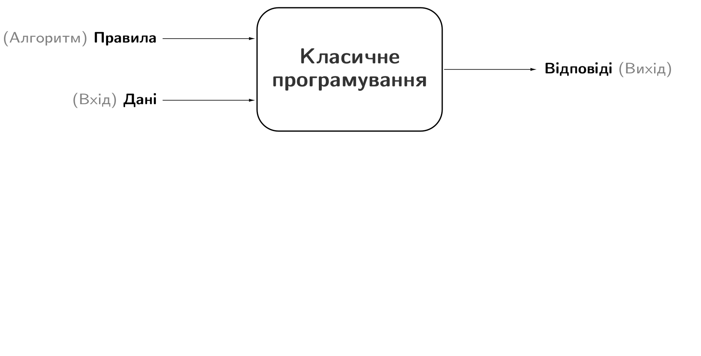]
]

---

class: middle
count: false

# Класичне програмуванн vs машинне навчання

.center[
.width-100[]
]

---

class: middle

# Типи навчання

За характером навчальних даних (**досвiду**) машинне навчання подiляють на чотири типи: контрольоване (з учителем), напiвконтрольоване, неконтрольоване (без учителя) та з пiдкрiпленням.

.center[
.width-100[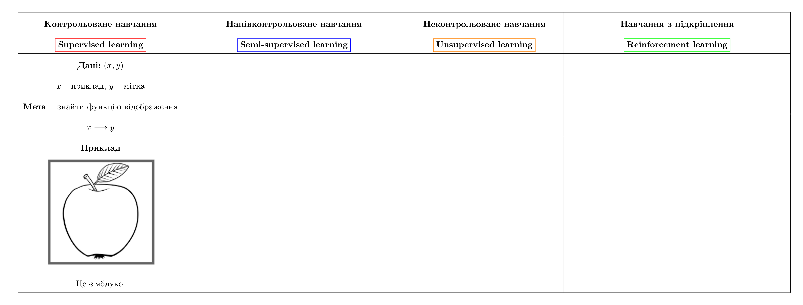]
]

---

class: middle
count: false

# Типи навчання

.center[
.width-100[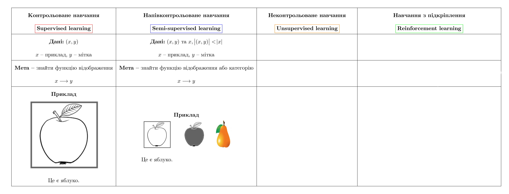]
]

---

class: middle
count: false

# Типи навчання

.center[
.width-100[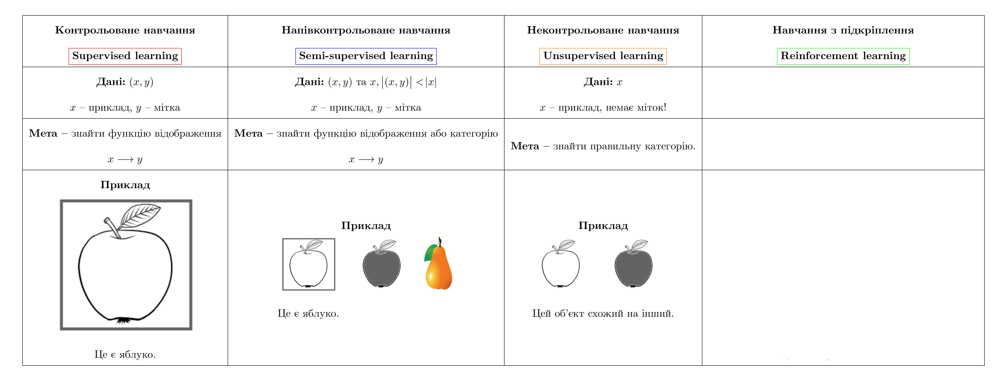]
]

---

class: middle
count: false

# Типи навчання

.center[
.width-100[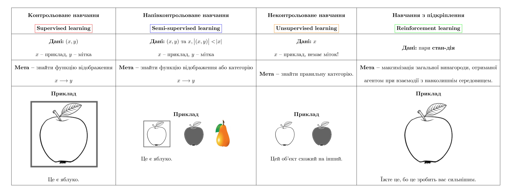]
]

---

class: middle

# Як вчиться людина?

- Ми та інші розумні істоти, вчимось завдяки **взаємодії із своїм оточенням**

- Взаємодії часто бувають **послідовними** - майбутні взаємодії можуть залежати від попередніх

- Ми направлені на **результат**

- Ми можемо вчитися **не маючи прикладів** оптимальної поведінки

---

class: middle

# Мозок людини

Базовою обчислювальною одиницею мозку є нейрон. Мозок дорослої людини складається з $86$ мiльярдiв нейронiв, якi з’єднанi між собою приблизно
$10^{14}$ − $10^{15}$ синапсами.

.footnote[Джерело: [F. A. Azevedo та ін.](https://onlinelibrary.wiley.com/doi/abs/10.1002/cne.21974), 2009.]

---

class: middle

# Біологічний та штучний нейрон

.center[
.width-100[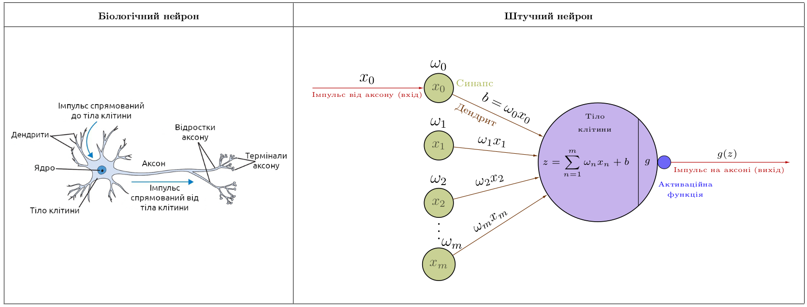]
]

---

class: middle,
# Деякі функції активації

.center[
.width-100[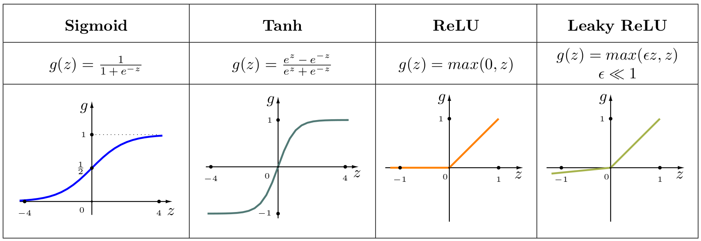]
]

---

class: middle

# Людина добре сприймати візуальну інформацію

---

class: middle, center

.width-100[]

Що Ви бачите?

???

.italic[Як Ви це робите?]

---

class: middle

.center[
.width-70[]

Собака-вівця чи швабра?
]

---

class: middle

Людський мозок настільки добре інтерпретує візуальну інформацію, що **розрив** між зображенням та його семантичною інтерпретацією (пікселями) важко оцінити інтуїтивно: 

 
.center[

Це мухомор.
]

---

class: middle, center

.width-70[]

Це мухомор.

---

class: middle, center

.width-30[] +
.width-30[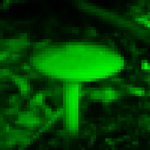] +
.width-30[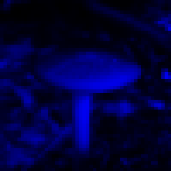]

Це мухомор.

---

class: middle, center

.width-80[]

Це мухомор.

---

class: middle, center

# Як навчить машин бачити?

---

class: middle

.center.width-60[]

---

count: false
class: black-slide

.center.width-60[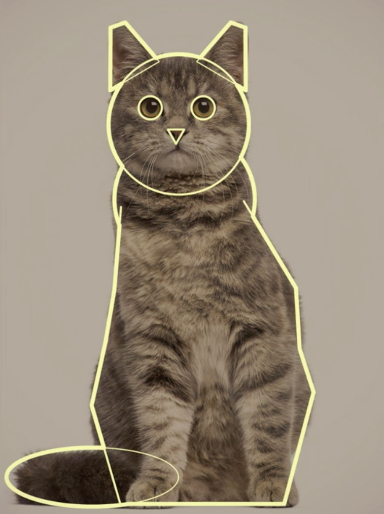]

---

count: false
class: black-slide, middle

.center.width-80[]

---

count: false
class: black-slide, middle

.center.width-80[]

---

class: middle

Для пошуку шаблону в даних (витягування семантичної інформації, ознак) потрібна побудова **складних моделей**, які б отримати вручну було б дуже складно.

Однак, можна написати програму, яка буде **вчитись** знаходити шаблон в даних самостійно. 

---

class: middle

.center.width-100[]

---

class: middle

# Що входить до задачі машинного навчання?

- Постановка проблеми + дані
- Навчання моделі
- Визначення функції втрат
- Вибір алгоритму оптимізації

---

class: middle

# Які дані використовуються?

.center.width-100[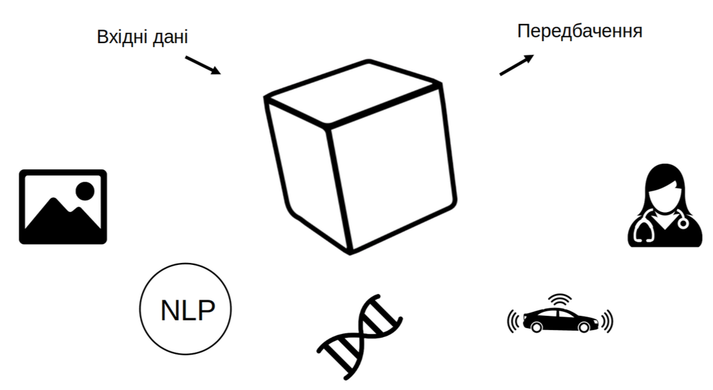]

---

class: middle

# Ознаки у машинному навчанні

Ознаки - це спостереження, які використовуються для прийняття рішень моделлю.

- Для класифікації зображень **кожен** піксель є ознакою
- Для розпізнавання голосу, **частота** та **гучність** є ознаками
- Для безпілотних автомобілів дані з **камер**, **радарів** і **GPS** є ознаками

---

class: middle

# Типи ознак у робототехніці

- Пікселі (RGB дані)
- Глибина (сонар, лазерні далекоміри)
- Орієнтація або прискорення (гіроскоп, акселерометр, компас)

---

class: middle

# Недонавчання vs перенавчання

.center.width-100[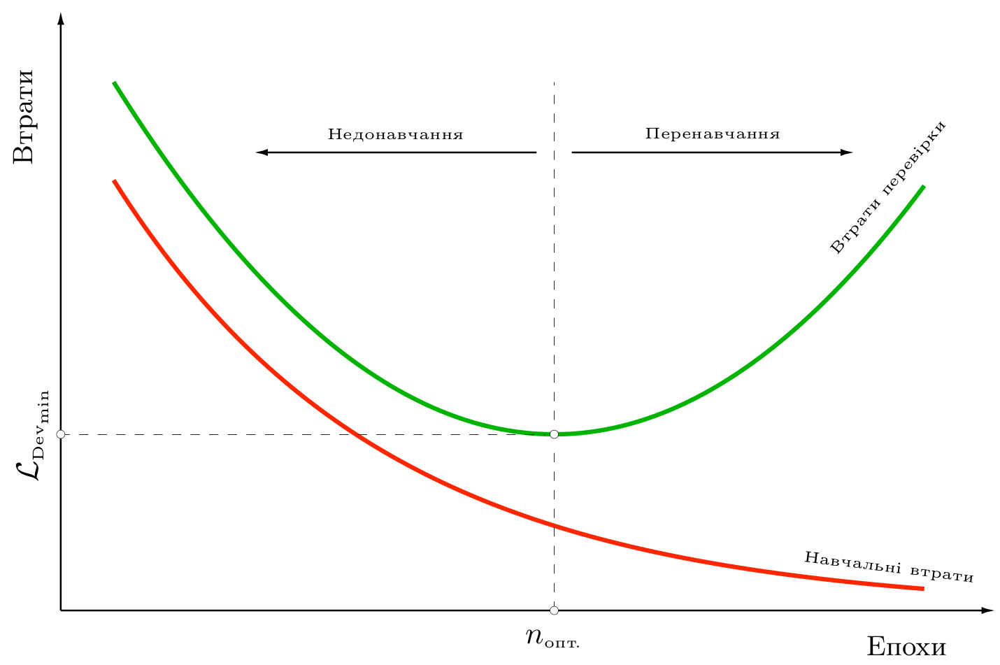]

---

class: middle
count: false

# Недонавчання vs перенавчання

.center.width-80[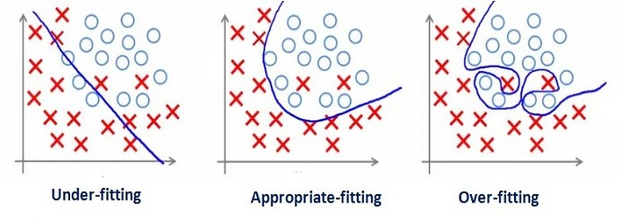]

---

class: middle

# Що таке модель?

Хоча те, що знаходиться всерединi глибинної нейронної мережi, може бути складним, за своєю суттю це просто функцiї. Вони беруть певнi вхiднi данi: **INPUT x** i
генерують деякi вихiднi данi: **OUTPUT f(x)**

.center.width-30[]

---

# З чого складається модель?

.center.width-100[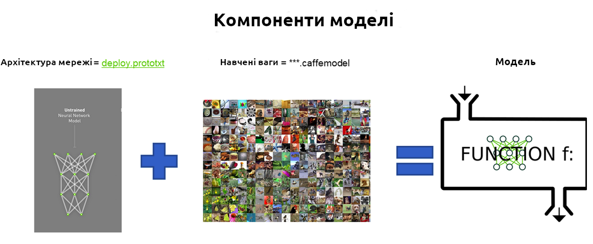]

---

# Джерела помилок моделі

- Зсув  (Bias)
- Розкид (Variance)
- Шум (Irreducible error)

$$Err = Bias^2 + Variance + Irreducible error$$

.center.width-70[]

---

# Інтуїція

  
.center.width-55[]

---

class: middle

# Облсті застосування та успіхи ШІ

---

class: middle, center, black-slide

<iframe width="600" height="450" src="https://www.youtube.com/embed/5kpsZoKjPgQ" frameborder="0" allowfullscreen></iframe>

Object detection, pose estimation, segmentation (2019)

---

class: middle, center, black-slide

<iframe width="600" height="450" src="https://www.youtube.com/embed/V1eYniJ0Rnk" frameborder="0" allowfullscreen></iframe>

Reinforcement learning (Mnih et al, 2014)

---

class: middle, center, black-slide

<iframe width="600" height="450" src="https://www.youtube.com/embed/HcZ48JDamyk" frameborder="0" allowfullscreen></iframe>

Strategy games (Deepmind, 2016-2018)

---

class: middle, center, black-slide

<iframe width="600" height="450" src="https://www.youtube.com/embed/qhUvQiKec2U" frameborder="0" allowfullscreen></iframe>

Autonomous cars (NVIDIA, 2016)

---

class: middle, center, black-slide

<iframe width="600" height="450" src="https://www.youtube.com/embed/tlThdr3O5Qo" frameborder="0" allowfullscreen></iframe>

Autopilot (Tesla, 2019)

???

A full build of Autopilot neural networks involves 48 networks that take 70,000 GPU hours to train 🔥. Together, they output 1,000 distinct tensors (predictions) at each timestep.

---

class: middle, black-slide

.center[
<video loop controls preload="auto" height="400" width="600">
  <source src="./figures/lec1/physics-simulation.mp4" type="video/mp4">
</video>

Physics simulation (Sanchez-Gonzalez et al, 2020)

]

---

class: middle, black-slide, center

<iframe width="600" height="450" src="https://www.youtube.com/embed/gg7WjuFs8F4" frameborder="0" allowfullscreen></iframe>

AI for Science (Deepmind, AlphaFold, 2020)

---

class: middle, center, black-slide

<iframe width="600" height="450" src="https://www.youtube.com/embed/7gh6_U7Nfjs" frameborder="0" allowfullscreen></iframe>

Speech synthesis and question answering (Google, 2018)

---

class: middle, center, black-slide

<iframe width="600" height="450" src="https://www.youtube.com/embed/Khuj4ASldmU" frameborder="0" allowfullscreen></iframe>

Artistic style transfer (Ruder et al, 2016)

---

class: middle, center, black-slide

<iframe width="600" height="450" src="https://www.youtube.com/embed/kSLJriaOumA" frameborder="0" allowfullscreen></iframe>

Image generation (Karras et al, 2018)

---

class: middle, center, black-slide

<iframe width="600" height="450" src="https://www.youtube.com/embed/egJ0PTKQp4U?start=223" frameborder="0" allowfullscreen></iframe>

Music composition (NVIDIA, 2017)

---

class: middle, center, black-slide

<iframe width="600" height="450" src="https://www.youtube.com/embed/BIDaxl4xqJ4" frameborder="0" allowfullscreen></iframe>

Dali Lives (2019)

---

class: middle, center, black-slide

<iframe width="600" height="450" src="https://www.youtube.com/embed/J_2fIGmsoRg" frameborder="0" allowfullscreen></iframe>

Reface оживив відомі київські мурали до Дня Києва (2021)

---

class: middle, center

.width-70[]

.italic[ Асоціацією обчислювальної техніки (ACM) нагороджено в 2018 році премією Тюрінга таких науковців: .bold[Yann LeCun], .bold[Geoffrey Hinton], .bold[Yoshua Bengio]  за концептуальні та інженерні прориви, які зробли в глибинних нейронних мережах.]

---

# Чому DL працює?

.center.grid[
.kol-1-2[
Алгоритми (старі та нові)  
.width-90[]
]
.center.kol-1-2[
Зростає кількість даних  
.width-50[]
]
]

.center.grid[
.kol-1-2[
Програмне забезпечення 
.width-90[]
]
.kol-1-2[
Більш швидкі обчислювальні машини   
.width-50[]
]
]

???

Успіх глибинного навчання є багатофакторним ...

---

class: middle

.center.circle.width-30[]

.italic["For the last forty years we have programmed computers; for the next forty years we will train them."]

.pull-right[Chris Bishop, 2020.]

???
Крістофер Бішоп є технічним співробітником Microsoft і директором Microsoft Research AI4Science. Він також є почесним професором комп’ютерних наук Единбурзького університету та членом Дарвінівського коледжу в Кембриджі. У 2017 році він був обраний членом Королівського товариства.

---

class: middle

# Виклики ШІ

Основним викликом штучного інтелекту та машинного навчання є прийняття правильних рішень в умовах **невизначеності**

---

class: blue-slide, middle, center
count: false

.larger-xx[Перцептрон]

Одношарова нейронна мережа

Перцептрон vs Логістична регресія

---

# Перцептрон

Перцептрон (Rosenblatt, 1958)

$$g(z) = \begin{cases}
   1 &\text{if } z =\sum_i w_i x_i + b \geq 0  \\\\
   0 &\text{otherwise}
\end{cases}$$

Ця модель спочатку була мотивована біологією, де $w_i$ &mdash; це синаптичні ваги для вхідних сигналів $x_i$ та  $g$ активації.
.center.width-65[]

.footnote[Джерело: Frank Rosenblatt, [Mark I Perceptron operators' manual](https://apps.dtic.mil/sti/pdfs/AD0236965.pdf), 1960.]

???

У листопаді 1958 року Френк Розенблатт винайшов персептрон, або Mark I, у Корнельському університеті. Завершений у 1960 році, це був перший комп’ютер, який міг вивчати нові навички методом проб і помилок, використовуючи тип нейронної мережі, яка симулювала процеси мислення людини.

---

class: middle

.center[
.width-70[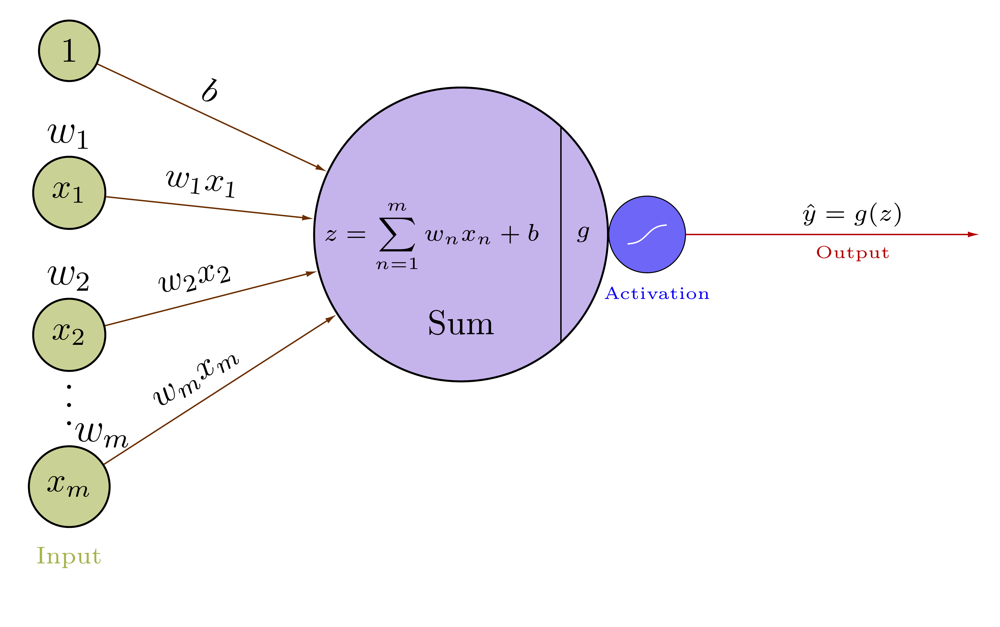]
]

.smaller-xx[
$$
\begin{aligned}
\mathbf{X} = \begin{bmatrix}
x\_1  \\\\
x\_2  \\\\
\vdots \\\\
x\_m
\end{bmatrix} 
&&
\mathbf{W} = \begin{bmatrix}
w\_1  \\\\
w\_2  \\\\
\vdots \\\\
w\_m
\end{bmatrix}
&& 
\mathbf{X}^T = \begin{bmatrix}
x\_1 & x\_2 & \cdots & x\_m
\end{bmatrix} 
\end{aligned}$$

$$\boxed{\begin{aligned}z &= \sum\_{n=1}^{m} w\_n x\_n + b = \mathbf{X}^T \cdot \mathbf{W} + b = \mathbf{W}^T \cdot \mathbf{X} + b \\\\
\hat y &= g(z) \\\\
\mathcal{L}(\hat y, y) &= - \frac{1}{n} \sum\_{i=1}^{n} \big(y^{(i)} \log(\hat y^{(i)}) + (1- y^{(i)}) \log(1 -\hat y^{(i)}) \big)
\end{aligned}}$$

]

---

class: middle

.center[
.width-80[]
]

.smaller-xx[

.center[*Пряме поширення*]

$$\boxed{\begin{aligned}z &= \sum\_{n=1}^{m} w\_n x\_n + b = \mathbf{X}^T \cdot \mathbf{W} + b = \mathbf{W}^T \cdot \mathbf{X} + b \\\\
\hat y &= g(z) \\\\
\mathcal{L}(\hat y, y) &= - \frac{1}{n} \sum\_{i=1}^{n} \big(y^{(i)} \log(\hat y^{(i)}) + (1- y^{(i)}) \log(1 -\hat y^{(i)}) \big)
\end{aligned}}$$

]

---

class: middle

## Приклад

Припустимо $m = 3$

$$
\begin{aligned}
\mathbf{X} = \begin{bmatrix}
x\_1  \\\\
x\_2  \\\\
x\_3
\end{bmatrix} = \begin{bmatrix}
-0.1  \\\\
0.7  \\\\
0.5
\end{bmatrix} 
&&
\mathbf{W} = \begin{bmatrix}
w\_1  \\\\
w\_2  \\\\
w\_3
\end{bmatrix} =
\begin{bmatrix}
1  \\\\
-2  \\\\
2
\end{bmatrix}
&&
b = 0.8
\end{aligned}$$

$$\boxed{\begin{aligned}
z = \sum_{n=1}^{3} w_n x_n + b &= w_1 x_1 + w_2 x_2 + w_3 x_3 + b = \\\\
&= 1 \cdot -0.1 + -2 \cdot 0.7 + 2 \cdot 0.5 + 0.8 = 0.3
\end{aligned}}$$

$$\boxed{\begin{aligned}
z = \mathbf{X}^T \cdot \mathbf{W} + b &= \begin{bmatrix}
x\_1 & x\_2 &  x\_3 
\end{bmatrix} \begin{bmatrix}
w\_1  \\\\
w\_2  \\\\
w\_3
\end{bmatrix} + b = \\\\
&= w_1 x_1 + w_2 x_2 + w_3 x_3 + b = 0.3
\end{aligned}}$$

$$\hat y  = g(z) = g(\mathbf{X}^T \cdot \mathbf{W} + b) = \frac{1}{1 + \exp(-z)} = \frac{1}{1 + \exp(-0.3)} \approx 0.57 $$

---

class: blue-slide, middle, center
count: false

.larger-xx[Одновимірний градієнтний спуск]

---

class: middle

## Одновимірний градієнтний спуск
.smaller-x[

Розглянемо деяку неперервну, диференційовану  функцію $f: \mathbb{R} \rightarrow \mathbb{R}$. Розклавши в ряд Тейлора, ми отримуємо:

$$f(x + \varepsilon) = f(x) + \varepsilon f^{'}(x) + \mathcal{O}(\varepsilon^2)$$

Для простоти давайте виберемо фіксований розмір кроку $\alpha > 0$ та оберемо $\varepsilon = -\alpha f^{'}(x)$. Підставивши це у попередній вираз:

$$f(x -\alpha f^{'}(x)) = f(x) - \alpha f^{'2}(x)  + \mathcal{O}(\alpha^2 f^{'2}(x))$$

Якщо похідна $f^{'}(x) \neq 0$ не зникає, ми робимо прогрес, оскільки $\alpha f^{'2}(x) > 0$. Крім того, ми завжди можемо вибрати $\alpha$ досить малим, щоб вирази вищого порядку занулити. Тому ми приходимо до

$$f(x -\alpha f^{'}(x)) \lessapprox f(x)$$

Це означає, що якщо ми використовуємо:

$$x \leftarrow x -\alpha f^{'}(x)$$

для ітерації по $x$, значення функції $f(x)$  може зменшитись. 
]

???
Gradient descent in one dimension is an excellent example to explain why the gradient descent algorithm may reduce the value of the objective function.

The Taylor series is used to describe what the function looks like in the neighborhood of some poin $x$.

That is, in first-order approximation $f(x + \varepsilon)$  is given by the function value $f(x)$ and the first derivative $f^{'}(x)$ at $x$. It is not unreasonable to assume that for small $\varepsilon$ moving in the direction of the negative gradient will decrease $f$. 

Therefore, in gradient descent we first choose an initial value $x$ and a constant $\alpha > 0$ and then use them to continuously iterate $x$ until the stop condition is reached, for example, when the magnitude of the gradient $|f^{'}(x)|$ is small enough or the number of iterations has reached a certain value.

---

class: middle

.center[
.width-80[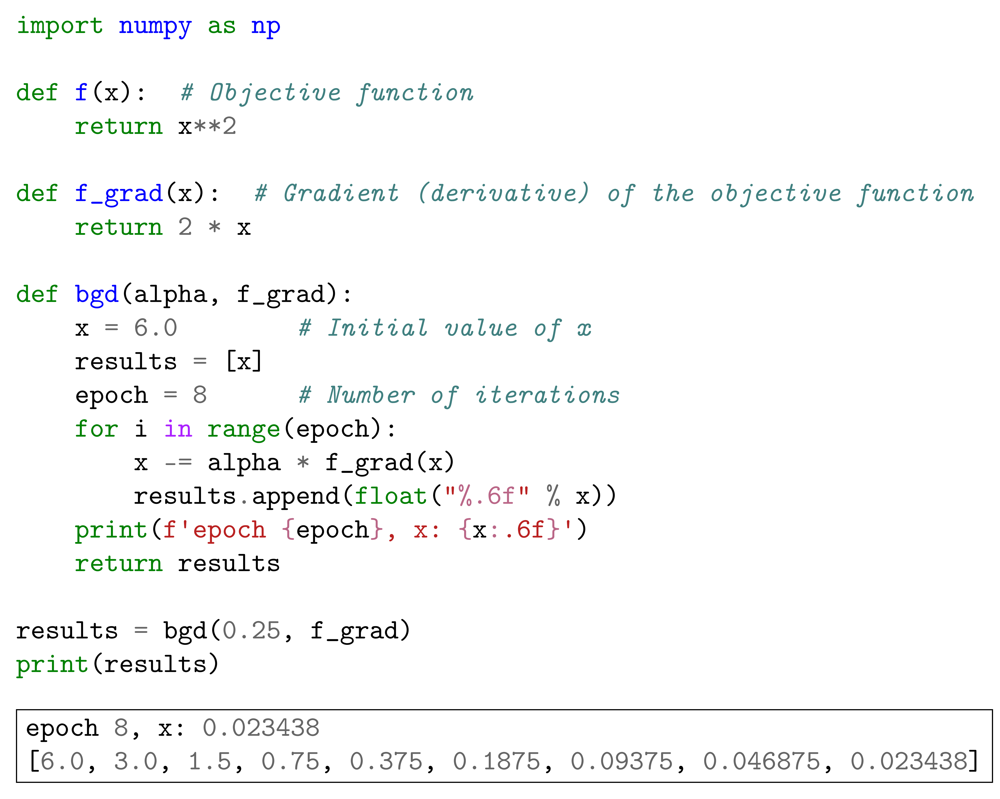]
]

???

For simplicity we choose the objective function $f(x) = x^2$ to illustrate how to implement gradient descent. Although we know that $x = 0$ is the solution to minimize $f(x)$, we still use this simple function to observe how $x$ changes.

---

class: middle

Хід оптимізації за значеннями $x$ 

.center[
.width-80[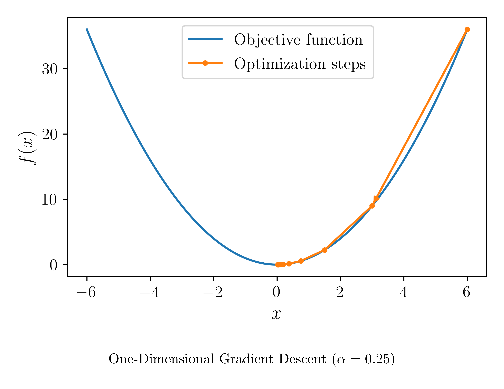]
]

---

class: middle

Хід оптимізації за значеннями $x$ 

.center[
.width-80[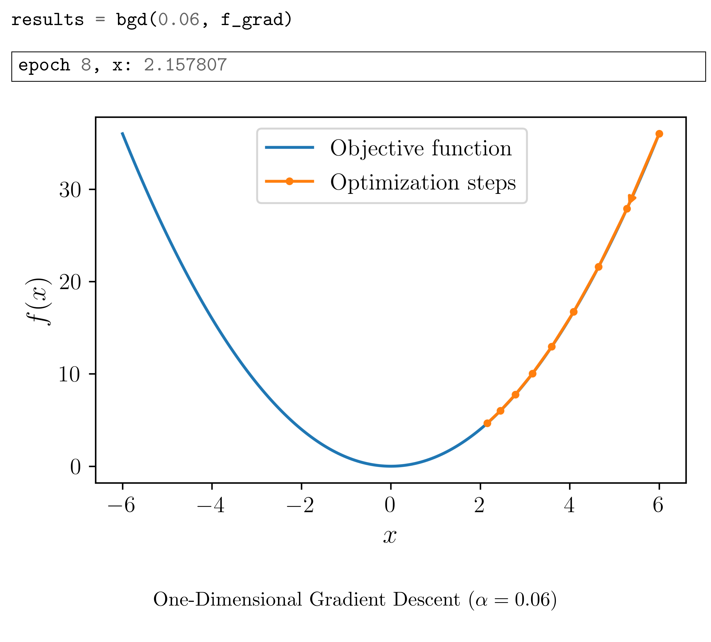]
]

???
If we use a learning rate that is too small, it will cause $x$ to update very slowly, requiring more iterations to get a better solution.

---

lass: middle

Хід оптимізації за значеннями $x$ 

.center[
.width-80[]
]

???
if we use an excessively high learning rate, $|\alpha f^{'}(x)|$ might be too large for the first-order Taylor expansion formula. That is, the term $\mathcal{O}(\alpha^2 f^{'2}(x))$ might become significant. In this case, we cannot guarantee that the iteration of $x$ will be able to lower the value of $f(x)$.

---

class: blue-slide, middle, center
count: false

.larger-xx[Перцептрон: Зворотне поширення]

---

class: middle

У позначеннях Лейбніца **правило ланцюжка** стверджує, що
$$
\begin{aligned}
\frac{\partial \ell}{\partial \theta\_i} &= \sum\_{k \in \text{parents}(\ell)} \frac{\partial \ell}{\partial u\_k} \underbrace{\frac{\partial u\_k}{\partial \theta\_i}}\_{\text{recursive case}}
\end{aligned}$$

---

class: middle

## Зворотне поширення

- Оскільки нейронна мережа є **композицією диференційованих функцій**, загальні похідні втрат можна оцінити зворотно, застосовуючи рекурсивно правило ланцюжка до її обчислювального графу.
- Реалізація цієї процедури називається зворотним *автоматичним диференціюванням* або **зворотним поширенням**.

---

class: middle

.smaller-xx[

.center[*Пряме поширення*]

$$\boxed{\begin{aligned}z &= \sum\_{n=1}^{m} w\_n x\_n + b = \mathbf{X}^T \cdot \mathbf{W} + b = \mathbf{W}^T \cdot \mathbf{X} + b \\\\
\hat y &= g(z) = \sigma(z) = \frac{1}{1 + \exp(-z)} \\\\
\mathcal{L}(\hat y, y) &= - \frac{1}{n} \sum\_{i=1}^{n} \big(y^{(i)} \log(\hat y^{(i)}) + (1- y^{(i)}) \log(1 -\hat y^{(i)}) \big)
\end{aligned}}$$

.grid[
.kol-2-3[

.center[*Зворотне поширення*]

$$\boxed{\begin{aligned}
\frac{\partial \mathcal{L}(\hat y, y)}{\partial \hat y} &= -\frac{y}{\hat y} + \frac{1- y}{1 - \hat y} \\\\[18pt]
\frac{\partial \mathcal{L}(\hat y, y)}{\partial z} &= \frac{\partial \mathcal{L}(\hat y, y)}{\partial \hat y} \frac{\partial \hat y}{\partial z} = \hat y - y \\\\[18pt]
\frac{\partial \mathcal{L}(\hat y, y)}{\partial \mathbf{W}} &= \frac{\partial \mathcal{L}(\hat y, y)}{\partial \hat y} \frac{\partial \hat y}{\partial z} \frac{\partial z}{\partial \mathbf{W}} = \mathbf{X}^T \cdot (\hat y - y) \\\\[18pt]
\frac{\partial \mathcal{L}(\hat y, y)}{\partial b} &=  \frac{\partial \mathcal{L}(\hat y, y)}{\partial \hat y} \frac{\partial \hat y}{\partial z} \frac{\partial z}{\partial b} = \hat y - y
\end{aligned}}$$
]

.kol-1-3[
.center[*Оновлення параметрів*]

$$\boxed{\begin{aligned}
\mathbf{W} &= \mathbf{W} - \alpha \frac{\partial \mathcal{L}(\hat y, y)}{\partial \mathbf{W}} \\\\[18pt]
b &= b - \alpha \frac{\partial \mathcal{L}(\hat y, y)}{\partial b}
\end{aligned}}$$
]]
]

---

class: blue-slide, middle, center
count: false

.larger-xx[Персептрон з багатьма виходами]

---

class: middle

# Multi Output Perceptron

.smaller-x[Оскільки всі входи щільно з’єднані з усіма виходами, ці шари називаються *Dense*]

.center[
.width-70[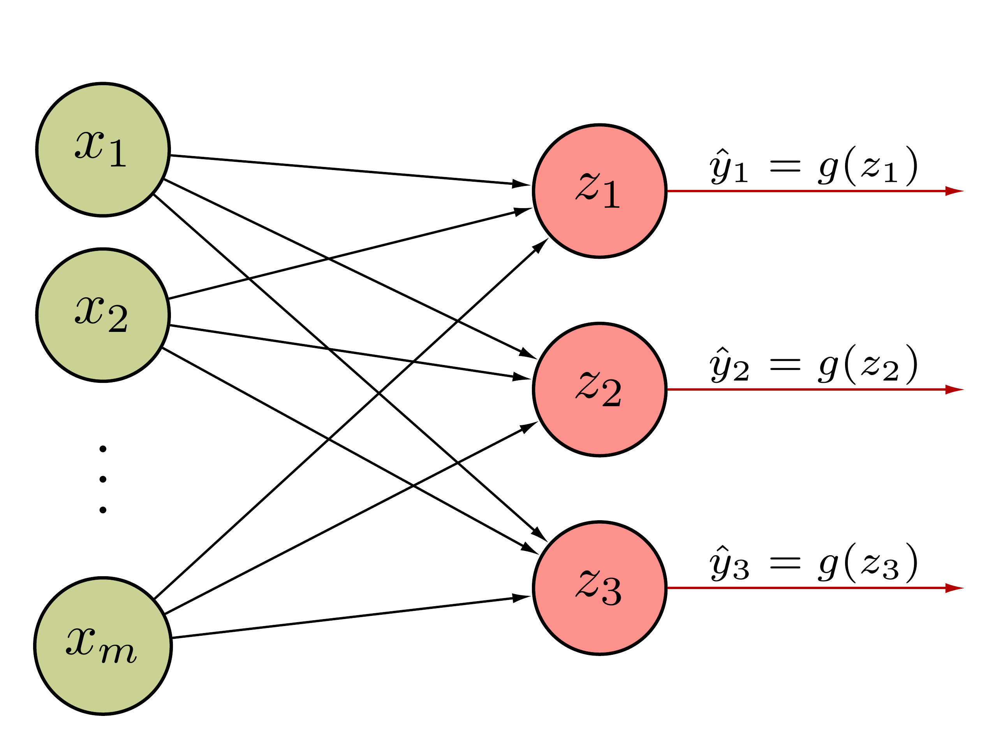]
]

$$z\_j = \sum\_{n=1}^{m} w\_{j, n} x\_n  + b\_j$$

---

class: middle

## Example

.center[
.width-50[]
]
.smaller-xx[
$$\begin{aligned}
\mathbf{X}^{m \times 1} = \begin{bmatrix}
x\_1  \\\\
x\_2  \\\\
\vdots \\\\
x\_m
\end{bmatrix} 
&&
\mathbf{W}^{3 \times m} = \begin{bmatrix}
w\_{11} & w\_{12} &  \cdots & w\_{1m} \\\\
w\_{21} & w\_{22} & \cdots & w\_{2m} \\\\
w\_{31} & w\_{32} & \cdots & w\_{3m}
\end{bmatrix}
&& 
\mathbf{b}^{3 \times 1} = \begin{bmatrix}
b\_1 \\\\
b\_2 \\\\
b\_3
\end{bmatrix}
\end{aligned}$$

$$\boxed{\begin{aligned}
\mathbf{z} =  \mathbf{W} \cdot \mathbf{X} + \mathbf{b} 
&= \begin{bmatrix}
w\_{11} & w\_{12} &  \cdots & w\_{1m} \\\\
w\_{21} & w\_{22} & \cdots & w\_{2m} \\\\
w\_{31} & w\_{32} & \cdots & w\_{3m}
\end{bmatrix} \cdot
\begin{bmatrix}
x\_1  \\\\
x\_2  \\\\
\vdots \\\\
x\_m
\end{bmatrix} + 
\begin{bmatrix}
b\_1 \\\\
b\_2 \\\\
b\_3
\end{bmatrix} = \\\\
&= 
\begin{bmatrix}
w\_{11} x\_1 + w\_{12} x\_2 +  \cdots + w\_{1m} x\_m + b\_1 \\\\
w\_{21} x\_1 + w\_{22} x\_2 +  \cdots + w\_{2m} x\_m + b\_2 \\\\
w\_{31} x\_1 + w\_{32} x\_2 +  \cdots + w\_{3m} x\_m + b\_3 
\end{bmatrix} = \begin{bmatrix}
z\_1 \\\\
z\_2 \\\\
z\_3
\end{bmatrix}
\end{aligned}}$$

]

---

class: middle

.center[
.width-100[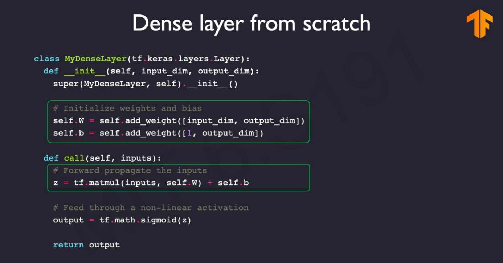]
]

.footnote[Slide source: [MIT 6.S191](http://introtodeeplearning.com/)]

---

class: middle

.smaller-x[Оскільки всі входи щільно з’єднані з усіма виходами, ці шари називаються *Dense*]

.center[
.width-100[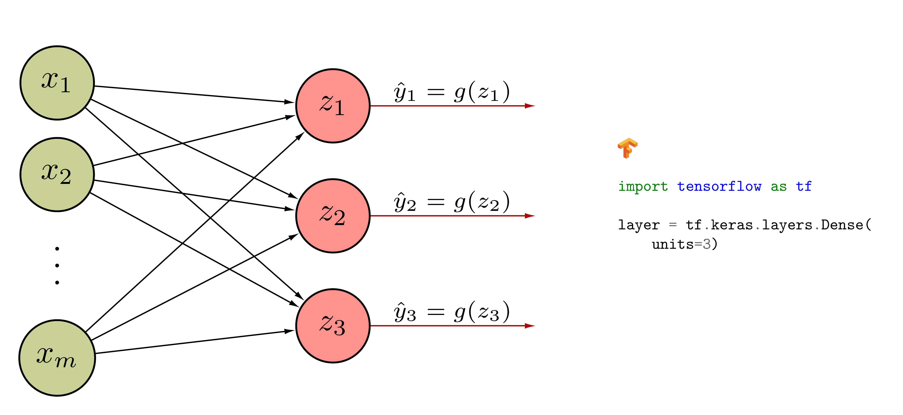]
]

$$z\_j = \sum\_{n=1}^{m} w\_{j, n} x\_n  + b\_j$$

---

class: blue-slide, middle, center
count: false

.larger-xx[Багатошаровий перцептрон]

---

class: middle

# Багатошаровий перцептрон

.center[
.width-100[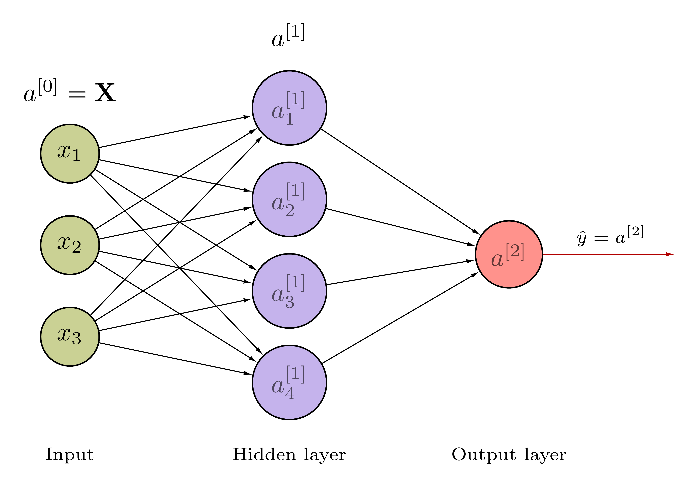]
]

---

class: middle

# Мережа з одним прихованим шаром

.center[
.width-100[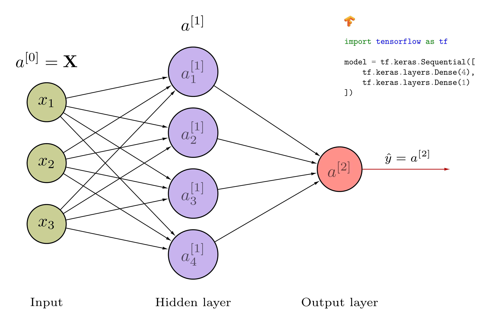]
]

---

class: middle

## Мережа з одним прихованим шаром
.center[
.width-60[]
]

.smaller-xx[
$$\begin{aligned}
\mathbf{X} = \begin{bmatrix}
x\_1  \\\\
x\_2  \\\\
x\_3
\end{bmatrix} 
&&
\mathbf{W}^{[1]} = \begin{bmatrix}
w\_{11} & w\_{12} &  w\_{13} \\\\
w\_{21} & w\_{22} &  w\_{23} \\\\
w\_{31} & w\_{32} &  w\_{33} \\\\
w\_{41} & w\_{42} &  w\_{43}
\end{bmatrix}
&& 
\mathbf{b}^{[1]} = \begin{bmatrix}
b\_1 \\\\
b\_2 \\\\
b\_3 \\\\
b\_4
\end{bmatrix}
&&
\mathbf{W}^{[2]} = \begin{bmatrix}
w\_{1} & w\_{2} &  w\_{3} & w\_{4} 
\end{bmatrix}
&& 
b^{[2]} = b
\end{aligned}$$

$$\boxed{\begin{aligned}
\mathbf{z}^{[1]} &= \mathbf{W}^{[1]} \cdot \mathbf{X} + \mathbf{b}^{[1]} \\\\
\mathbf{a}^{[1]} &= g^{[1]}(\mathbf{z}^{[1]}) \\\\
z^{[2]} &= \mathbf{W}^{[2]} \cdot \mathbf{a}^{[1]} + b^{[2]} \\\\
\hat y &= a^{[2]} = g^{[2]}(z^{[2]})
\end{aligned}}$$
]

---

class: middle

# Глибинна нейронна мережа

.center[
.width-100[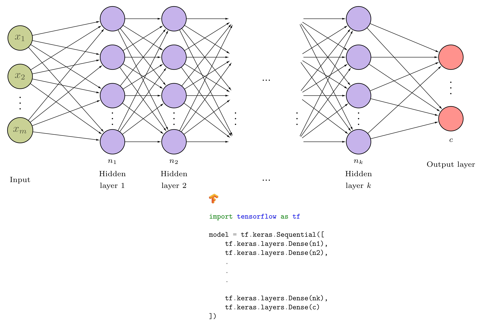]
]

---

class: end-slide, center
count: false

.larger-xx[Кінець]

---

count: false

# Література

- LeCun, Y., Bengio, Y., & Hinton, G. (2015). Deep learning. nature, 521(7553), 436-444.
