class: middle, center, title-slide

# Навчання з підкріпленням

Лекція 1: Вступ до RL

  
Кочура Юрій Петрович 
[iuriy.kochura@gmail.com](mailto:iuriy.kochura@gmail.com)  
<a href="https://t.me/y_kochura">@y_kochura</a>  

???
Важливо розрізняти проблеми (задачі) та їх способи розв'язання, або, іншими словами, між завданнями, які ми хочемо вирішити, та алгоритмами, які ми розробляємо для їх вирішення. Алгоритми глибинного навчання можна застосовувати до багатьох типів проблем. Класифікація зображень та інші задачі прогнозування є класичним застосуванням глибинного навчання, оскільки автоматизована обробка зображень до глибокого навчання була дуже обмеженою, враховуючи складність зображень. Але є багато інших завдань, які ми хотіли б автоматизувати, наприклад автономне керування автомобілем тощо. Управління автомобілем передбачає певну обробку зображень, але, що більш важливо, алгоритм повинен навчитися діяти, а не просто класифікувати чи передбачати. Задачі такого роду, де необхідно приймати рішення або запровадити певну поведінку (виконати дії), прийнято називатами задачами контролю.

---

class:  black-slide, 
background-image: url(./figures/lec1/wave.png)
background-size: cover

# Сьогодні

.larger-x[ 
 

  Розгляд основних понять навчання з підкріпленням: 

🎙️ Загальна характеристика  
🎙️ Цикл взаємодії   
🎙️ Гіпотеза винагороди   
🎙️ Стан агента  
🎙️ Стратегія       
🎙️ Функції цінності  
🎙️ Класифікація агентіві  
🎙️ Підзадачі RL  

]

---

class: blue-slide, middle, center
count: false

.larger-xx[Загальна характеристика]

---

class: middle 

Основним викликом штучного інтелекту та машинного
навчання є прийняття правильних рішень в умовах **невизначеності**

---

class: middle

# Визначення RL

**Навчання з підкріпленням (reinforcement learning, RL)** &mdash; сімейство алгоритмів, які вивчають оптимальну стратегію, метою якої є максимізація загальної винагороди, отриманої агентом при взаємодії з навколишнім середовищем. 

.center[
.width-10[]
]

- <small>Наприклад, кінцевою винагородою більшості ігор є перемога. Модель навчання з підкріплення може стати експертом у складних іграх, шляхом оцінювання послідовності попередніх ігрових ходів, які в підсумку призвели до перемоги або програшу.</small>

---

class: middle
count: false

# Визначення RL

**RL** &mdash;  наука про те, як приймати рішення на основі взаємодій 

- Це вимагає від нас задуматися над:
  - часом
  - (довгостроковими) наслідками спричинені діями
  - збором досвіду
  - передбаченням майбутнього
  - боротьбою з невизначеністю

---

class: middle

# Застосування RL

- Ігри ([Atari](https://www.youtube.com/watch?v=V1eYniJ0Rnk&list=RDCMUCbfYPyITQ-7l4upoX8nvctg&index=1), [AlphaGo](https://www.youtube.com/watch?v=mzpW10DPHeQ))
- Робототехніка ([End-to-End Training](https://www.youtube.com/watch?v=ImUoubi_t7s))
- Фінанси
- Взаємодія людини з комп’ютером
- ...

---

class: middle

# Причини використання RL

- .bold[Пошук раніше невідомих рішень] 
  - Приклад, програма, яка може грати в Go краще, ніж будь-яка людина, будь-коли 

---

class: middle
count: false

# Причини використання RL

.gray-t[
- .bold[Пошук раніше невідомих рішень] 
  - Приклад, програма, яка може грати в Go краще, ніж будь-яка людина, будь-коли]
- .bold[Пошук рішень в режимі реального часу за непередбачених обставин] 
  - Приклад, робот, який може орієнтуватися на місцевості, яка значно відрізняється від будь-якої очікуваної місцевості

---

class: middle
count: false

# Причини використання RL

.gray-t[
- .bold[Пошук раніше невідомих рішень] 
  - Приклад, програма, яка може грати в Go краще, ніж будь-яка людина, будь-коли
- .bold[Пошук рішень в режимі реального часу за непередбачених обставин] 
  - Приклад, робот, який може орієнтуватися на місцевості, яка значно відрізняється від будь-якої очікуваної місцевості]

1. Алгоритми навчання з підкріпленням намагаються задовільнити обидва випадки

---

class: middle
count: false

# Причини використання RL

.gray-t[
- .bold[Пошук раніше невідомих рішень] 
  - Приклад, програма, яка може грати в Go краще, ніж будь-яка людина, будь-коли
- .bold[Пошук рішень в режимі реального часу за непередбачених обставин] 
  - Приклад, робот, який може орієнтуватися на місцевості, яка значно відрізняється від будь-якої очікуваної місцевості]

1. Алгоритми навчання з підкріпленням намагаються задовільнити обидва випадки

2. Зверність увагу, що другий пункт стосується не (просто) узагальнення &mdash; це більшою мірою про ефективне навчання в режимі реального часу під час взаємодії агента з середовищем

---

class: middle

# Агент (agent)

.center[
.width-20[]
]

**Агент (agent)** &mdash; це те, що існує окремо від інших речей та використовує певну стратегію (policy) для максимізації очікуваної винагороди (reward), отриманої від переходу між станами середовища (environment).

---

class: middle

# Середовище (environment)

.center[
.width-30[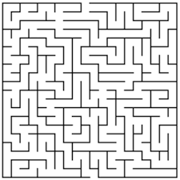]
]

**Середовище** &mdash; це стохастичний та невизначений світ у якому існує та діє агент.

---

class: middle

# Дія (action)

.center[
.width-80[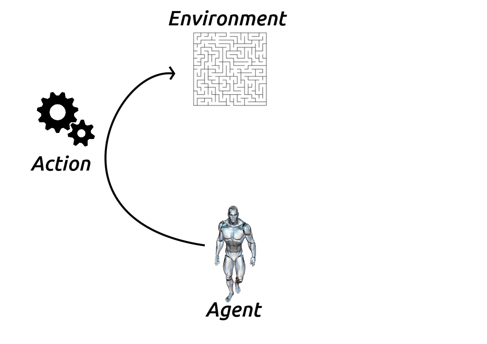]
]

**Дія** &mdash; механізм за допомогою якого агент переходить між дозволеними середовищем станами. Агент обирає дію, використовуючи стратегію.

---

class: middle

# Винагорода (reward)

.center[
.width-80[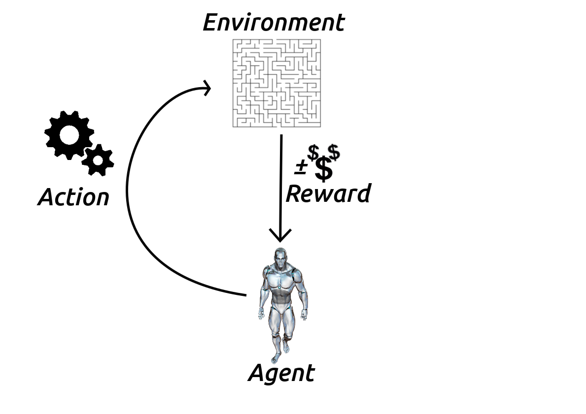]
]

**Винагорода** &mdash; це скалярний сигнал, який отримує агент внаслідок переходу між визначеними станами середовища.

---

class: middle

# Глибинне RL (Deep RL)

.center[
.width-100[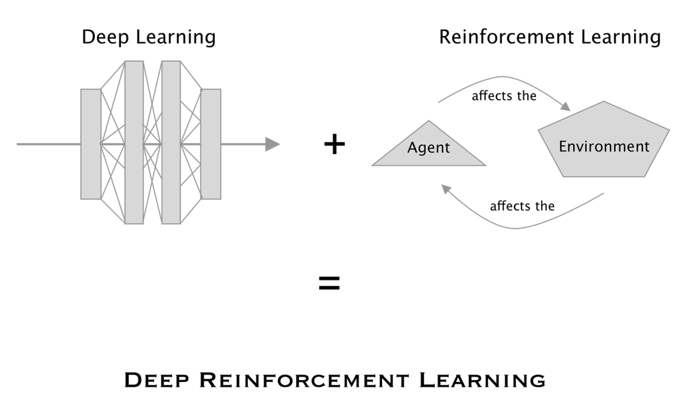]
]

.footnote[Джерело: Zai, A., & Brown, B. (2020). Deep reinforcement learning in action.]

???

Глибокі нейронні мережі популярні, тому що вони в багатьох випадках є найточнішими параметричними моделями машинного навчання для багатьох завдань комп'ютерного зору, наприклад класифікації зображень. Це значною мірою пов’язано зі способом представлення даних.

---

class: middle
count: false

# Глибинне RL (Deep RL)

.center[
.width-60[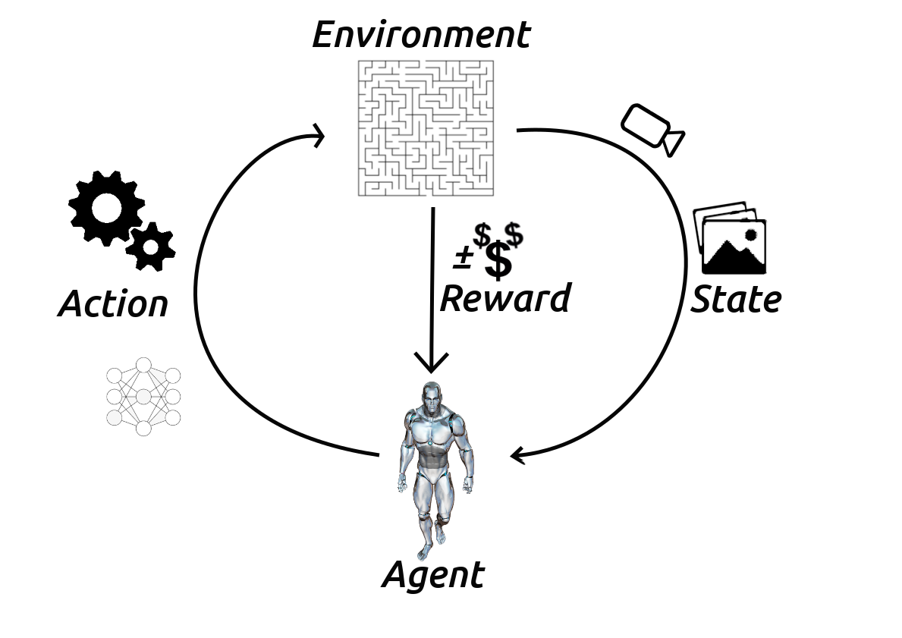]
]

**У глибинному навчанні з підкріпленням** агент зазвичай обробляє 2D-зображення згортковими нейронними мережами (CNNs) &mdash; це дає йому можливість  навчатись "із побаченого" завдяки [наскрізній мережі](https://www.coursera.org/lecture/machine-learning-projects/what-is-end-to-end-deep-learning-k0Klk), яка перетворює набір пікселів у дії.

---

class: middle

# Характеристика RL

Чим навчання з підкріплення відрізняється від інших парадигм машинного навчання?

- Ніякого контролю, лише сигнал про винагороду

---

class: middle
count: false

# Характеристика RL

Чим навчання з підкріплення відрізняється від інших парадигм машинного навчання?
.gray-t[
- Ніякого контролю, лише сигнал про винагороду]

- Зворотній зв'язок може затримуватися, а не миттєво передаватися

---

class: middle
count: false

# Характеристика RL

Чим навчання з підкріплення відрізняється від інших парадигм машинного навчання?
.gray-t[
- Ніякого контролю, лише сигнал про винагороду

- Зворотній зв'язок може затримуватися, а не миттєво передаватися]

- Час має значення

---

class: middle
count: false

# Характеристика RL

Чим навчання з підкріплення відрізняється від інших парадигм машинного навчання?
.gray-t[
- Ніякого контролю, лише сигнал про винагороду

- Зворотній зв'язок може затримуватися, а не миттєво передаватися

- Час має значення]

- Досвід агента впливає на його наступні дії

---

class: middle

# Основні поняття RL
Формалізм навчання з підкріплення включає у себе такі поняття:

- Середовище (динаміка задачі)

---

class: middle
count: false

# Основні поняття RL
Формалізм навчання з підкріплення включає у себе такі поняття:

.gray-t[
- Середовище (динаміка задачі)]
- Винагорода (визначає мету)

---

class: middle
count: false

# Основні поняття RL
Формалізм навчання з підкріплення включає у себе такі поняття:

.gray-t[
- Середовище (динаміка задачі)
- Винагорода (визначає мету)]
- Агент, який включає:
  - Стан агента (agent state)

---

class: middle
count: false

# Основні поняття RL
Формалізм навчання з підкріплення включає у себе такі поняття:

.gray-t[
- Середовище (динаміка задачі)
- Винагорода (визначає мету)]
- Агент, який включає:
  - Стан агента (agent state)
  - Cтратегію (policy)

---

class: middle
count: false

# Основні поняття RL
Формалізм навчання з підкріплення включає у себе такі поняття:

.gray-t[
- Середовище (динаміка задачі)
- Винагорода (визначає мету)]
- Агент, який включає:
  - Стан агента (agent state)
  - Cтратегію (policy)
  - **Q-функцію** (state-action value function)

---

class: middle
count: false

# Основні поняття RL
Формалізм навчання з підкріплення включає у себе такі поняття:
.gray-t[
- Середовище (динаміка задачі)
- Винагорода (визначає мету)]
- Агент, який включає:
  - Стан агента (agent state)
  - Cтратегію (policy)
  - **Q-функцію** (state-action value function)
  - Модель (за бажанням)

---

class: blue-slide, middle, center
count: false

.larger-xx[Цикл взаємодії]

---

class: middle

# Цикл взаємодії

.center[
.width-80[]
]

**Стан** &mdash; значення параметрів, що описують поточну конфігурацію середовища. Агент використовує ці параметри для вибору дії.

---

class: middle
count: false

# Цикл взаємодії

.center[
.width-80[]
]

*Мета* &mdash; оптимізувати загальну винагороду, отриману агентом при взаємодії з навколишнім середовищем.

---

class: middle

# Агент та середовище

.center[
.width-45[]
]

На кожному кроці в момент часу $t$ агент:
.smaller-x[
- Отримує спостереження $O_t$ та винагороду $R_t$
- Виконує дію $A_t$
]

Середовище:
.smaller-x[
- Отримує дію $A_t$
- Продукує спостереження $O\_{t+1}$ та винагороду $R\_{t+1}$
]
---

class: middle

# Винагорода

**Винагорода** $R_t$ &mdash; це скалярний сигнал, який отримує агент у якості зворотного зв'язку від середовища.
- Показує, наскільки добре працює агент у момент часу $t$ відповідно до поставленої мети.
- *Завдання агента* &mdash; максимізувати кумулятивну винагороду:

$$\boxed{G\_t = R\_{t+1} + R\_{t+2} + R\_{t+3} + \cdots}$$

- $G\_t$ називається **загальною винагородою (return)** &mdash; сума всіх винагород, які агент розраховує отримати при дотриманні стратегії від певного стану до кінця епізоду.

    - Епізод &mdash; кожна спроба агента вивчити середовище.

.footnote[Словник: [Machine Learning Glossary: Reinforcement Learning](https://developers.google.com/machine-learning/glossary/recsystems)]

---

class: blue-slide, middle, center
count: false

.larger-xx[Гіпотеза винагороди]

---

class: middle, 

 Навчання з підкріпленням базується на **гіпотезі винагороди**:

.success["Будь-яка мета може бути формалізована як результат максимізації сукупної винагороди."]

---

class: middle

# Ключові поняття

Формалізм навчання з підкріплення включає у себе такі поняття:

- *Середовище* (динаміка задачі)

- *Винагорода* (визначає мету)

- *Агент*, який включає:

  - Стан агента

  - Cтратегію (policy)

  - **Q-функцію**, відома також як **функція цінності стан-дія** (state-action value function)

  - Модель (за бажанням)

---

class: middle

# Компоненти агента

.grid[
.kol-1-2[

- *Стан агента* 

- Cтратегія

- Q-функція

- Модель 

]
.kol-1-2[
.width-100[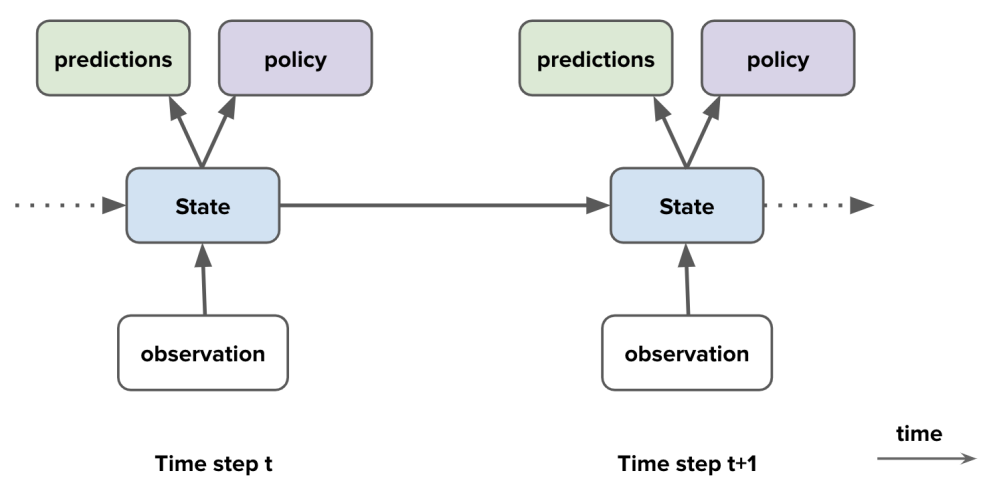]]
]

---

class: middle

# Стан середовища

.grid[
.kol-2-3[
.smaller-x[
**Стан середовища** &mdash; це внутрішній стан, зазвичай невидимий агенту
- Навіть якщо стан середовища видимий агенту він може містити багато зайвої інформації

]]
.kol-1-3[
.width-80[]]
]

---

class: middle

# Стан агента

.grid[
.kol-2-3[
.smaller-x[
- **Історія** &mdash; це послідовність з спостережень $O$, дій $A$ та винагород $R$:

$$\boxed{H\_t = O\_0, A\_0, R\_1, O\_1, \cdots , O\_{t - 1}, A\_{t - 1}, R\_t, O\_t}$$

- Історія використовується для побудови **стану агента** $S\_t$ 

]]
.kol-1-3[
.width-110[]]
]

---

class: middle

# Повністю оглядове середовище

Припустимо, що агент бачить повністю стан середовища. Тоді:

- спостереження = стан середовища

- Стан агента є просто спостереженням:
$$\boxed{S\_t = O\_t  = \text{стан середовища}}$$

.alert[
.smaller-x[
У цьому випадку агент бере участь у [процесі прийняття рішень Маркова (Markov decision process - MDP)](https://uk.wikipedia.org/wiki/%D0%9C%D0%B0%D1%80%D0%BA%D0%BE%D0%B2%D1%81%D1%8C%D0%BA%D0%B8%D0%B9_%D0%BF%D1%80%D0%BE%D1%86%D0%B5%D1%81_%D0%B2%D0%B8%D1%80%D1%96%D1%88%D1%83%D0%B2%D0%B0%D0%BD%D0%BD%D1%8F). Цей процес названий на честь [Андрія Маркова](https://uk.wikipedia.org/wiki/%D0%9C%D0%B0%D1%80%D0%BA%D0%BE%D0%B2_%D0%90%D0%BD%D0%B4%D1%80%D1%96%D0%B9_%D0%90%D0%BD%D0%B4%D1%80%D1%96%D0%B9%D0%BE%D0%B2%D0%B8%D1%87). MDP слугує математичною основою для того, щоб змоделювати прийняття рішення в ситуаціях, де результати є частково випадкові та частково під контролем агента, який приймає рішення. 
]
]

.footnote[Додатково можна почитати про MDP у розділі 3 [Reinforcement Learning: An Introduction](http://incompleteideas.net/book/RLbook2020.pdf) або у розділі 2 [Algorithms for Reinforcement Learning](https://sites.ualberta.ca/~szepesva/papers/RLAlgsInMDPs.pdf)]

---

class: middle

## Марковські процеси прийняття рішень (MDPs)

MDPs надають корисний математичний апарат 

.highlight[.bold[*Визначення.*]] Процес прийняття рішень є Марковським, якщо

$$\boxed{p(r, \ s \ |\  S_t, \ A_t)  = p(r, \ s \ |\  H\_t, \ A\_t)}$$ 

- Це означає, що стан містить все, що нам потрібно знати з історії
- Додавання історії не допомагає 
- $\Longrightarrow$ Як тільки стан стане відомим, історію можна буде відкинути
    - Середовище + стан агента &mdash; Марковські
    - Історія $H\_t$ є Марковською
- Як правило, стан агента $S\_t$ є деяким стисненням $H\_t$
- *Примітка*: $S\_t$ &mdash; стан агента, а не середовища  

---

class: middle

# Частково оглядове середовище

- **Часткова оглядовість**: агент отримує неповну інформацію про стан середовища
    - Камера зору не повідомляє роботу його абсолютне місце розташування
    - Агент, що грає в покер, бачить лише відкриті карти
- Тепер спостереження не є Марковським процесом
- Формально &mdash; це **частково оглядовий процес прийняття рішень Маркова** (partially observable Markov decision process, POMDP)
- **Стан середовища** все ще може бути Марковським, але агент цього не знає
- Ми все ще можемо побудувати стан агента, який буде Марковським

---

class: middle, 

# Стан агента

.grid[
.kol-2-3[
.smaller-x[
- Дії агента залежать від його стану
- **Стан агента** є функцією історії
- Для конкретного стану: $S\_t = O\_t$ 
- Більш загально:
$$\boxed{S\_{t + 1} = u(S\_{t},  A\_{t},  R\_{t + 1}, O\_{t + 1})}$$ де $u$ &mdash; функція оновлення стану

- Стан агента, як правило, **набагато** менший, ніж стан середовища

]]
.kol-1-3[
.width-110[]]
]

---

class: middle, center

# Стан агента

Повний стан середовища-лабіринту

.width-30[]

---

class: middle, center

# Стан агента

Потенційна дальність спостережень агента

.width-30[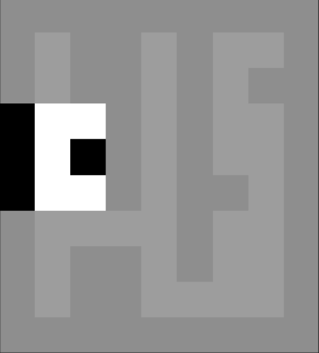]

---

class: middle, center

# Стан агента

Спостереження в іншому місці

.width-30[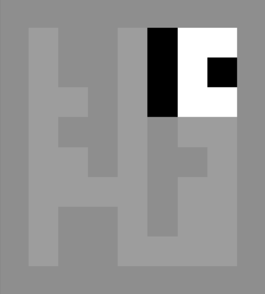]

---

class: middle, center

# Стан агента

Два спостереження неможливо відрізнити

.width-30[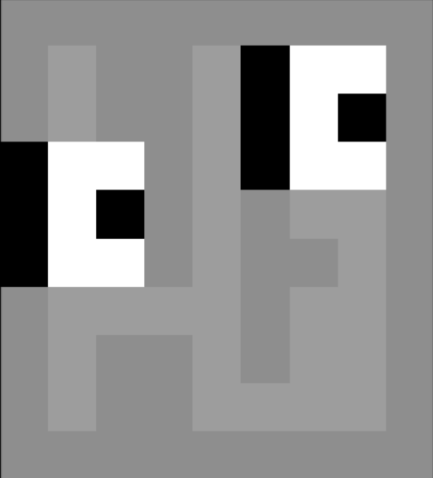]

---

class: middle, center

# Стан агента

Ці два стани не є Марковськими

.width-30[]

---

class: middle

# Частково оглядове середовище

- Маючи справу з частково оглядовим середовищем, агент може побудувати правильне представлення стану
- Приклади станів агента:
    - Останнє спостереження: $S\_t = O\_t$ (може бути недостатньо)
    - Уся історія:  $S\_t = H\_t$ (може бути занадто великим) 
    - Загальне оновлення: $S\_{t} = u(S\_{t-1},  A\_{t-1},  R\_{t}, O\_{t})$ (але як обрати/вивчити u?)

- Побудувати повнісю Марковський стан агента часто є неможливим

---

class: middle

# Компоненти агента

- Стан агента 

- *Cтратегія* (Policy)

- Q-функція

- Модель 

---

class: middle

# Стратегія

- Стратегія визначає поведінку агента

- Стратегія &mdash; це план переходу між станом агента до дії

- [Детерімінована](https://uk.wikipedia.org/wiki/%D0%94%D0%B5%D1%82%D0%B5%D1%80%D0%BC%D1%96%D0%BD%D0%BE%D0%B2%D0%B0%D0%BD%D1%96%D1%81%D1%82%D1%8C) стратегія: $A = \pi(S)$

- [Стохастична](https://uk.wikipedia.org/wiki/%D0%A1%D1%82%D0%BE%D1%85%D0%B0%D1%81%D1%82%D0%B8%D1%87%D0%BD%D1%96%D1%81%D1%82%D1%8C) стратегія: $\pi(A | S) = p (A | S)$

---

class: middle

# Компоненти агента

- Стан агента 

- Cтратегія 

- *Q-функція* (функція цінності)

- Модель 

---

class: blue-slide, middle, center
count: false

.larger-xx[Функції цінності]

---

class: middle

# Цінність

Очікувана сукупна винагорода від стану $s$ називається **цінністю (value)**:

$$\boxed{\begin{aligned}
v(s) &= \mathop{\mathbb{E}}\ [G\_t \ | \ S\_t = s] = \\\\
&= \mathop{\mathbb{E}}\ [R\_{t+1} + R\_{t+2} + R\_{t+3} + \cdots  \ | \ S\_t = s]
\end{aligned}}$$

.smaller-xx[
- Цінність залежить від дій агента 
- Метою є **максимізація цінності** $v(s)$ шляхом вибору агентом правильних дій
- Винагороди та цінності визначають *користь* станів та дій (немає контрольованого зворотного зв'язку)
- Зверніть увагу, що загальна винагорода та цінність можуть бути визначені рекурсивно:
]

$$\boxed{\begin{aligned}
G\_t &= R\_{t+1} + G\_{t + 1} \\\\
v(s) &= \mathop{\mathbb{E}}\ [R\_{t+1} + v(S\_{t+1})  \ | \ S\_t = s]
\end{aligned}}$$

---

class: middle

# Цінність дій &mdash; Q-функція

.smaller-x[
- **'Q' означає якість (quality)** 
]

Q-функція дозволяє оцінити **цінність (якість) дій** :

$$\boxed{\begin{aligned}
q(s, a) &= \mathop{\mathbb{E}}\ [G\_t \ | \ S\_t = s, A\_t = a] = \\\\
&= \mathop{\mathbb{E}}\ [R\_{t+1} + R\_{t+2} + R\_{t+3} + \cdots  \ | \ S\_t = s, A\_t = a]
\end{aligned}}$$

.success[.smaller-xx[
**Q-функція** &mdash; функція якості, яка передбачає очікувану загальну винагороду (return) від виконання дій у певному стані та дотриманні заданої стратегії.
]]

- Значення стану та дії буде детальніше розглянуто пізніше 

.footnote[Словник: [Machine Learning Glossary: Reinforcement Learning](https://developers.google.com/machine-learning/glossary/recsystems)]

---

class: middle

# Q-функція

- Фактична функція цінності &mdash; це очікувана загальна винагорода:

$$\boxed{\begin{aligned}
v\_{\pi}(s) &= \mathop{\mathbb{E}}\ [G\_t \ | \ S\_t = s, \pi] = \\\\
&= \mathop{\mathbb{E}}\ [R\_{t+1} + \gamma R\_{t+2} + \gamma^2 R\_{t+3} + \cdots  \ | \ S\_t = s, \pi]
\end{aligned}}$$

- Тут введено фактор знецінювання $\gamma \in [0, 1]$. Чим він менший, тим менше агент замислюється над вигодою від майбутніх своїх дій.
    - Визначає важливість *короткострокових* vs *довгострокових* винагород

- Цінність $v_{\pi}(s)$ залежить від стратегії

- Може використовуватися для оцінки бажаних станів

- Може використовуватися для вибору дій

---

class: middle

# Функції цінності

- Загальна винагорода має рекурсивну форму: $G\_t = R\_{t+1} + \gamma G\_{t + 1}$

- Тому функція цінності може бути записана так: 
$$\boxed{\begin{aligned}
v\_{\pi}(s)  &= \mathop{\mathbb{E}}\ [R\_{t+1} + \gamma G\_{t + 1} \ | \ S\_t = s, \ A\_t \thicksim \pi(s)] = \\\\
&= \mathop{\mathbb{E}}\ [R\_{t+1} +  \gamma v\_{\pi}(S\_{t + 1})  \ | \ S\_t = s, \ A\_t \thicksim \pi(s)]
\end{aligned}}$$

Тут $A_t = a \thicksim \pi(s)$ означає, що дія $a$ вибрана на основі стратегії $\pi$ для стану $s$ ($\pi$ є детермінованою)

- Це рівняння відоме як **рівняння Беллмана** (Bellman 1957)

- Подібне рівняння можна отримати для оптимальної (= максимально можливої) цінності:

$$\boxed{v\_{\ast}(s) = \max\_{a} \mathop{\mathbb{E}} [R\_{t+1} +  \gamma v\_{\ast}(S\_{t + 1})  \ | \ S\_t = s, \ A\_t = a]}$$

---

class: middle

# Апроксимація функції цінності

- Агент постійно апроксимує значення функції цінності

- Для виконання апроксимації існують спеціальні алгоритми

- Завдяки правильній функції цінності агент може поводитися оптимально

- При правильних наближеннях агент може добре поводитися навіть у надзвичайно великих середовищах

---

class: middle

# Компоненти агента

- Стан агента 

- Cтратегія 

- Q-функція, функція цінності

- *Модель*

---

class: middle, 

# Модель

- **Модель** передбачає поведінку середовища

-  Передбачає наступний стан агента $\mathcal{P}$:
$$\boxed{\mathcal{P}(s, a, s^\prime) \approx p(S_{t + 1} = s^\prime \ | \ S\_t = s, \ A\_t = a) }$$

- Або передбачає наступну (миттєву) винагороду $\mathcal{R}$:
$$\boxed{\mathcal{R}(s, a) \approx \mathop{\mathbb{E}} [R\_{t+1} \ | \ S\_t = s, \ A\_t = a)] }$$

- Модель не відразу дає нам хорошу стратегію, тому приходиться агенту планувати свої дії

- Можуть також розглядатись **стохастичні** (генеративні) моделі 

---

class: blue-slide, middle, center
count: false

.larger-xx[Приклад]

---

class: middle

# Приклад з лабіринтом

.center[
.width-60[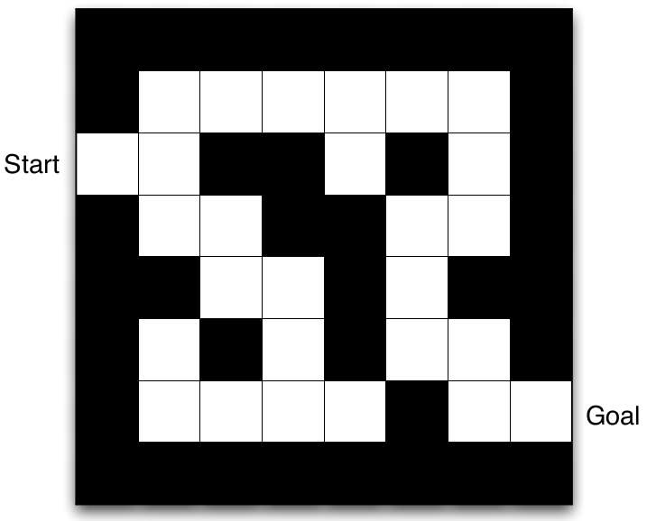]
]

- Винагорода: **-1 або 1 за крок**
- Дії: **N, E, S, W**
- Стани: **місцезнаходження агента**

---

class: middle, 

# Приклад з лабіринтом: стратегія

.center[
.width-60[]
]
- Стрілки представляють стратегію агента $\pi(s)$ для кожного стану $s$

---

class: middle, 

# Приклад з лабіринтом: функція цінності

.center[
.width-60[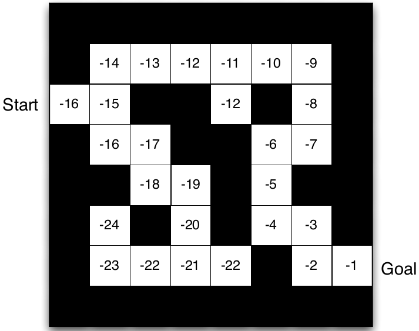]
]

- Числа представляють значення $v_{\pi}(s)$ для кожного стану $s$

---

class: middle, 

# Приклад з лабіринтом: модель

.center[
.width-60[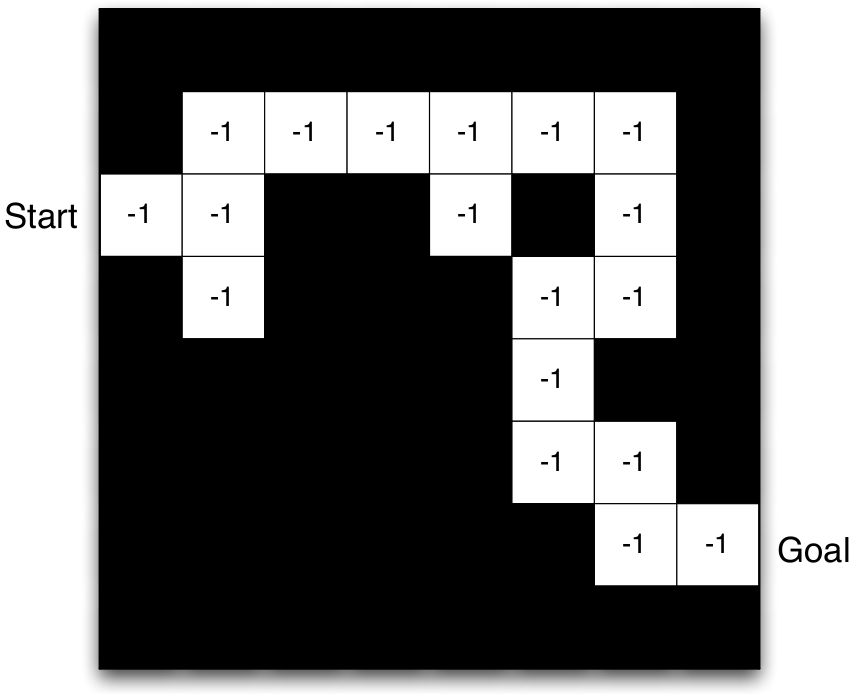]
]

- Даний шаблон являє собою модель часткового переходу $\mathcal{P}^a\_{s s^\prime}$
- Цифри позначають миттєву винагороду $\mathcal{R}^a\_{s s^\prime}$ (у цьому випадку однакова для усіх $a$ та $s^\prime$)

---

class: blue-slide, middle, center
count: false

.larger-xx[Класифікація агентів]

---

class: middle

# Класифікація агентів

- На основі цінності (Value Based)
  - Функція цінності
  - Відсутня стратегія (неявна)

---

class: middle
count: false

# Класифікація агентів
.gray-t[
- На основі цінності (Value Based)
  - Відсутня стратегія (неявна)
  - Функція цінності]
- На основі стратегії (Policy Based)
  - Стратегія 
  - Відсутня функція цінності

---

class: middle
count: false

# Класифікація агентів
.gray-t[
- На основі цінності (Value Based)
  - Відсутня стратегія (неявна)
  - Функція цінності
- На основі стратегії (Policy Based)
  - Стратегія 
  - Відсутня функція цінності]
- Актор-критик ([Actor Critic](http://incompleteideas.net/book/first/ebook/node66.html))
    - Стратегія 
    - Функція цінності

---

class: middle
count: false

# Класифікація агентів

- Без моделі (Model Free)
  - Стратегія і/або функція цінності
  - Немає моделі

---

class: middle
count: false

# Класифікація агентів

.gray-t[
- Без моделі (Model Free)
  - Стратегія і/або функція цінності
  - Немає моделі]
- На основі моделі (Model Based)
    - Стратегія і/або функція цінності (за бажанням)
    - Модель

---

class: blue-slide, middle, center
count: false

.larger-xx[Підзадачі RL]

---

class: middle

# Передбачення та контроль 

- **Передбачення**: оцінити майбутнє (для певної стратегії) 
    
---

class: middle
count: false

# Передбачення та контроль 
.gray-t[
- **Передбачення**: оцінити майбутнє (для певної стратегії)] 
- **Контроль**: оптимізувати майбутнє (знайти найкращу стратегію) 

    
---

class: middle
count: false

# Передбачення та контроль 
.gray-t[
- **Передбачення**: оцінити майбутнє (для певної стратегії) 
- **Контроль**: оптимізувати майбутнє (знайти найкращу стратегію)] 
Передбачення та контроль пов'язані між собою:
$$\boxed{\pi\_{\ast}(s) = \underset{a}{\text{argmax}} v\_\pi(s)}$$ 
    
---

class: middle

# Навчання та планування

Два фундаментальні завдання навчання з підкріплення  

- Навчання:
    - Середовище спочатку невідоме агенту
    - Агент взаємодіє з середовищем 

---

class: middle
count: false

# Навчання та планування

Два фундаментальні завдання навчання з підкріплення  
.gray-t[
- Навчання:
    - Середовище спочатку невідоме агенту
    - Агент взаємодіє з середовищем] 

- Планування:
    - Дається (або вивчається) модель середовища 
    - Плани агента в цій моделі (без зовнішньої взаємодії) 

---

class: middle

# Навчальні компоненти агента

- Усі компоненти є функціями:
    - Стратегія: $\pi: \mathcal{S} \rightarrow  \mathcal{A}$
    - Функція цінності: $v: \mathcal{S} \rightarrow  \mathbb{R}$
    - Модель: $m: \mathcal{S} \rightarrow \mathcal{S}$ та/або $r: \mathcal{S} \rightarrow \mathbb{R}$
    - Оновлення стану: $u: \mathcal{S} \times \mathcal{O} \rightarrow  \mathcal{S}$

- Наприклад, ми можемо використовувати нейронні мережі та використовувати методи *глибинного навчання* для вивчення цих функцій
- Глибинне навчання &mdash; важливий інструмент  
- Глибинне навчання з підкріпленням &mdash; це багата та активна галузь досліджень 
---

class: blue-slide, middle, center
count: false

.larger-xx[Приклад: Пересування]

---

class: middle, center, black-slide
count: true

<iframe width="600" height="450" src="https://www.youtube.com/embed/hx_bgoTF7bs" frameborder="0" allowfullscreen></iframe>

DeepMind - Emergence of Locomotion Behaviours in Rich Environments

---

class: end-slide, center
count: false

.larger-xx[Кінець]

---

count: false

# Література

.smaller-x[
- David Silver, [Lecture 1: Introduction to Reinforcement Learning](https://www.youtube.com/watch?v=2pWv7GOvuf0&t=1s)
- Hado van Hasselt, [Lecture Series - Introduction to Reinforcement Learning](https://www.youtube.com/watch?v=TCCjZe0y4Qc)
- Richard Sutton and Samuel Barto, [Reinforcement Learning: an introduction, second edition](http://incompleteideas.net/book/the-book-2nd.html)
- Richard Sutton [Learning to predict by the methods of temporal differences](https://link.springer.com/article/10.1007/BF00115009)
- Marco Wiering and Martijn van Otterlo, [Reinforcement Learning](https://www.springer.com/gp/book/9783642276446)
- Watkins Christopher and Peter Dayan, [Q-Learning](https://link.springer.com/article/10.1007/BF00992698)
]
