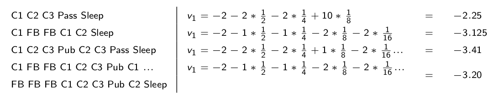
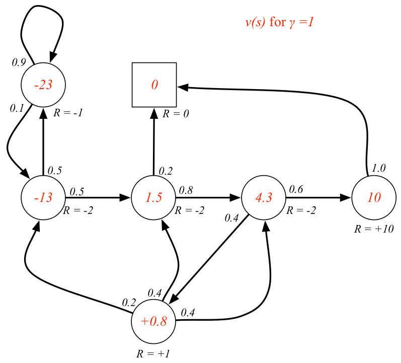
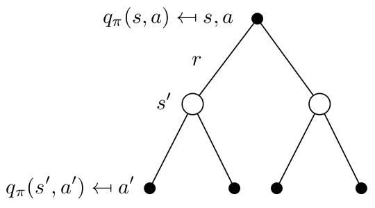

class: middle, center, title-slide

# Навчання з підкріпленням

Лекція 2: Марковськi процеси прийняття рiшень

  
Кочура Юрій Петрович 
[iuriy.kochura@gmail.com](mailto:iuriy.kochura@gmail.com)  
<a href="https://t.me/y_kochura">@y_kochura</a>  

---

class: middle

# Сьогодні

- Марківські процеси 
- Марківські процеси винагороди 
- Марківські процеси прийняття рішень (МППР)

---

class: middle

# Цикл взаємодії

.center[
.width-60[]
]

*Мета* &mdash; оптимізувати загальну винагороду, отриману агентом при взаємодії з навколишнім середовищем.

???
Алгоритм навчання з підкріпленням по суті створює агента, який діє у певному середовищі. Це середовище часто є грою, але загалом це будь-який процес, що продукує стани та винагороди. Агент має доступ до поточного стану середовища, тобто всіх даних про середовище в певний момент часу, $s\_t \in S$. Використовуючи інформацію про цей стан, агент здійснює дію $a\_t \in A$, яка може детерміновано або стохастично перевести агента у новий стан $s\_{t+1}$

---

class: middle

# Вступ до МППР

- Марківські процеси прийняття рішень формально описують середовище для навчання з підкріпленням
- Там, де середовище є повністю оглядовим
- Поточний стан агента повністю характеризує процес
- Майже всі задачі RL можна формалізувати як МППР
    - Оптимальне управління насамперед стосується безперервних МППР
    - Задачі в частково оглядовому середовищі можуть бути зведені до МППР

???
Здатність агента обирати найкращу дію, перебуваючи у деякому стані $s$, без врахування минулого (попередніх станів) є важливою властивістю для навчання з підкріпленням, яка називається властивістю Маркова. Гра або будь-яка інша задача з оптимального управління, що володіє властивістю Маркова, називається Марківським процесом прийняття рішень (МППР). Термін Марковська властивість позначає відсутності пам'яті в стохастичного процесу. Іншими словами, «майбутнє» процесу залежить лише від поточного стану агента, і не залежить від більш ранніх станів. 

У МППР поточний стан агента містить достатньо інформації для вибору оптимальних дій, щоб максимізувати майбутні винагороди. Моделювання задач з оптимального управління як МППР є ключовою концепцією для навчання з підкріпленням, оскільки це значно спрощує задачу RL, так як нам не потрібно враховуючи всі попередні стани чи дії агента - нам не потрібно мати пам’ять, агенту просто потрібно проаналізувати нинішню ситуацію. 

---

class: middle

# Властивість Маркова

.success[Майбутнє процесу не залежить від минулого, а залежить лише від поточного стану]

Стан $S\_t$ є Марківським тоді і тільки тоді

$$\boxed{\mathbb{P}[S\_{t + 1} | S\_{t}] = \mathbb{P}[S\_{t + 1} | S\_1, \cdots, S\_{t}]}$$

- Це означає, що поточний стан агента містить все, що нам потрібно знати з його історії

- Як тільки стан стане відомим, історію можна буде відкинути

- Тобто, стан &mdash; це достатня статистика для майбутнього 

---

class: middle
count: false

# Властивість Маркова

.smaller-xx[Щоб перевірити своє розуміння властивості Маркова, розглянемо декілька задач управління або задач прийняття рішень і подивимось, які з них мають властивість Маркова: ]

- Водіння автомобіля 
- Рішення інвестувати в акції чи ні
- Вибір лікування пацієнта
- Діагностика хвороби пацієнта
- Передбачити, яка команда виграє у футбольному матчі
- Пошук найкоротшого маршруту (найкоротшого) до певного пункту призначення 
- Наведення прицілу гармати на постріл у далеку мішень

???
Зазача подіння автомобіля володіє властивістю Маркова, оскільки Вам не потрібно знати, що сталося 10 хв тому, щоб мати можливість оптимально керувати автомобілем. Вам просто потрібно поточну ситуацію на дорозі і те, куди хочете доїхати.

Задача з інвестування в ації не володіє властивістю Маркова, оскільки Вам потрібно знати якусь інформацію про діяльності компанії в яку Ви хочете інвестувати та попередню вартість акцій, щоб прийняти рішення.

Вибір медичного лікування, схоже, має властивість Маркова, тому що Вам не потрібно знати біографію людини, щоб вибрати хороше лікування для того, щоб усунути існуючу проблему.

І навпаки, діагностика, безумовно, вимагає знання минулих станів. Часто дуже важливо знати історичний перебіг симптомів у пацієнта, щоб поставити правильний діагноз.

Передбачення того, яка футбольна команда виграє, не має властивості Маркова, оскільки, як і у прикладі з акціями, вам потрібно знати минулі результати діяльності футбольних команд, щоб зробити хороший прогноз. 

Вибір найкоротшого маршруту до пункту призначення має властивість Маркова, тому що вам просто потрібно знати відстань до пункту призначення для різних маршрутів, що не залежить від того, куди Ви їздили і де перебували до цього моменту. 

Наведення прицілу гармати на постріл у далеку мішень також має властивість Маркова, оскільки все, що вам потрібно знати, це місце, де знаходиться мішень і, можливо, поточні умови, такі як швидкість вітру та особливості вашої гармати. Вам не потрібно знати швидкість вітру вчора.   

---

class: middle, 

## Матриця зміни стану (state transition matrix)

Ймовірність переходу між Марківськими станами $s \rightarrow s^\prime$, визначається так:

$$\boxed{\mathcal{P}\_{ss^\prime} = \mathbb{P}[S\_{t + 1} = s^\prime | S\_{t} = s]}$$

Матриця зміни стану $\mathcal{P}$ визначає ймовірності переходу між усіма станами $s$ у всі можливі стани $s^\prime$:

$$\mathcal{P} =
\begin{bmatrix}
\mathcal{P}\_{11} & \cdots &  \mathcal{P}\_{1n}\\\\
\vdots & & \\\\
\mathcal{P}\_{n1} & \cdots &  \mathcal{P}\_{nn}
\end{bmatrix},$$

де кожен рядок матриці у сумі дорівнює 1.

???
Ймовірність, яка пов'язана з переходом агента з одного стану в інший, шляхом виконання дії, називається ймовірністю переходу (transition probability). Агент отримує винагороду $R\_t$ за виконану дію $A\_t$ у стані $S\_t$, що переводить агента до нового стану, $S\_{t + 1}$.   

---

class: middle

# Марківський процес

Марківський процес &mdash; це випадковий процес у якого відсутня пам'ять, тобто послідовність випадкових станів $S\_1, S\_2, \cdots$, які володіють властивістю Маркова.

Марківський процес (або ланцюг Маркова) &mdash; це кортеж $\langle\mathcal{S}, \mathcal{P}\rangle$:

- $\mathcal{S}$  &mdash; скінченнa множинa станів
- $\mathcal{P}$ &mdash; матриця зміни стану: $\mathcal{P}\_{ss^\prime} = \mathbb{P}[S\_{t + 1} = s^\prime | S\_{t} = s]$
---

class: blue-slide, middle, center
count: false

.larger-x[Приклад]

---

class: middle

# Студентський ланцюг Маркова

.center[
.width-80[]
]

.footnote[Джерело слайду: [Lecture 2: Markov Decision Processes](https://www.davidsilver.uk/wp-content/uploads/2020/03/MDP.pdf) [[video](https://www.youtube.com/watch?v=lfHX2hHRMVQ&list=PLqYmG7hTraZBiG_XpjnPrSNw-1XQaM_gB&index=3)], David Silver.]

---

class: middle

# Студентський ланцюг Маркова

.grid[
.center.kol-1-2[
.width-100[]
]

.smaller-xx.kol-1-2[ 
Початковий *епізод* починається з $S\_1 = C\_1$
$$S\_1, S\_2, \cdots, S\_T$$

- C1 C2 C3 Pass Sleep
- C1 FB FB C1 C2 Sleep
- C1 C2 C3 Pub C2 C3 Pass Sleep
- C1 FB FB C1 C2 C3 Pub C1 FB FB FB C1 C2 C3 Pub C2 Sleep
]
]

.footnote[Джерело слайду: [Lecture 2: Markov Decision Processes](https://www.davidsilver.uk/wp-content/uploads/2020/03/MDP.pdf) [[video](https://www.youtube.com/watch?v=lfHX2hHRMVQ&list=PLqYmG7hTraZBiG_XpjnPrSNw-1XQaM_gB&index=3)], David Silver.]

---

class: middle

## Студентський ланцюг Маркова: матриця зміни стану

.center.width-50[]

.smaller-xx[$$\mathcal{P} =
\begin{array}{c}
\\\\
C1 \\\\
C2 \\\\
C3 \\\\
Pass \\\\
Pub \\\\
FB \\\\
Sleep
\end{array}
\begin{matrix}
C1 & C2 &  C3 & Pass & Pub & FB & Sleep \\\\
 & 0.5 &  & & & 0.5 &\\\\
 &  & 0.8 & & &  & 0.2\\\\
 &  &  & 0.6 & & 0.4 & \\\\
 &  &  &  & &  & 1.0\\\\
 0.2 & 0.4 & 0.4 &  & &  & \\\\
 0.1 &  &  &  & & 0.9 & \\\\
  &  &  &  & &  & 1
\end{matrix}$$
]

.footnote[Джерело слайду: [Lecture 2: Markov Decision Processes](https://www.davidsilver.uk/wp-content/uploads/2020/03/MDP.pdf) [[video](https://www.youtube.com/watch?v=lfHX2hHRMVQ&list=PLqYmG7hTraZBiG_XpjnPrSNw-1XQaM_gB&index=3)], David Silver.]

---

class: blue-slide, middle, center
count: false

.larger-x[Марківські процеси винагороди]

---

class: middle

Марківський процес винагороди &mdash; ланцюг Маркова з винагородою.

Марківський процес винагороди &mdash; це кортеж $\langle\mathcal{S}, \mathcal{P}, \red{\mathcal{R}, \red{\gamma}}\rangle$:

- $\mathcal{S}$  &mdash; скінченнa множинa станів
- $\mathcal{P}$ &mdash; матриця зміни стану: $\mathcal{P}\_{ss^\prime} = \mathbb{P}[S\_{t + 1} = s^\prime | S\_{t} = s]$
- $\red{\mathcal{R}}$ &mdash; .red[функція винагороди]: $\red{\mathcal{R}\_s = \mathbb{E}[R\_{t+1} | S\_{t} = s]}$ 
- $\red{\gamma}$ &mdash; .red[коефіцієнт зменшення (знецінювання),] $\red{\gamma \in [0, 1]}$

---

class: middle

# Приклад: МПВ

.center.width-80[]

.footnote[Джерело слайду: [Lecture 2: Markov Decision Processes](https://www.davidsilver.uk/wp-content/uploads/2020/03/MDP.pdf) [[video](https://www.youtube.com/watch?v=lfHX2hHRMVQ&list=PLqYmG7hTraZBiG_XpjnPrSNw-1XQaM_gB&index=3)], David Silver.]

---

class: middle

# Загальна винагорода

Загальна винагорода &mdash; сумарна винагорода отримана агентом з моменту часу $t$ з урахування знецінювання:

$$\boxed{G\_t = R\_{t+1} + \gamma R\_{t+2}  + \cdots = \sum\_{k=0}^{\infty} \gamma^{k} R\_{t+k+1}}$$

- Коефіцієнт знецінювання $\gamma \in [0, 1]$ показує на цінність майбутніх винагород
- Значення винагороди $R$, отримане після $k+1$ кроків: $\gamma^{k} R$
- Чим менший коефіцієнт знецінювання, тим менше агент замислюється над вигодою від майбутніх своїх дій.

.footnote[Джерело слайду: [Lecture 2: Markov Decision Processes](https://www.davidsilver.uk/wp-content/uploads/2020/03/MDP.pdf) [[video](https://www.youtube.com/watch?v=lfHX2hHRMVQ&list=PLqYmG7hTraZBiG_XpjnPrSNw-1XQaM_gB&index=3)], David Silver.]

---

class: middle

# Яка роль знецінювання?

- Дозволяє уникнути нескінченної загальної винагороди в циклічних марківських процесах
- Невизначеність щодо майбутнього може бути представлена не повністю 
- Якщо винагорода є фінансовою, негайні винагороди можуть бути більш цікавими, ніж відстрочені винагороди 
- Поведінка тварин/людини демонструє перевагу миттєвій винагороді
- Іноді можна використовувати марківський процес винагороди без знецінювання(тобто $\gamma = 1$), наприклад якщо всі послідовності закінчуються. 

.footnote[Джерело слайду: [Lecture 2: Markov Decision Processes](https://www.davidsilver.uk/wp-content/uploads/2020/03/MDP.pdf) [[video](https://www.youtube.com/watch?v=lfHX2hHRMVQ&list=PLqYmG7hTraZBiG_XpjnPrSNw-1XQaM_gB&index=3)], David Silver.]

---

class: middle

# Функція цінності

Функція цінності $v(s)$ показує довгострокову цінність перебування агента у стані $s$

Функція цінності $v(s)$ марківського процесу винагороди &mdash; середнє значення загальної винагороди починаючи від стану $s$

$$\boxed{\begin{aligned}
v(s) &= \mathop{\mathbb{E}}\ [G\_t \ | \ S\_t = s] = \\\\
&= \mathop{\mathbb{E}}\ [R\_{t+1} + \gamma R\_{t+2} + \gamma^2 R\_{t+3} + \cdots  \ | \ S\_t = s]
\end{aligned}}$$

---

class: middle

## Приклад: МПВ загальна винагорода

Приклади загальної винагороди для раніше розглянутого прикладу. Покачок з $S\_1 = C\_1$ з $\gamma = \frac{1}{2}$

$$G\_1 = R\_2 + \gamma R\_3 + \cdots + \gamma^{T-2} R\_T$$ 

.center.width-100[]

.footnote[Джерело слайду: [Lecture 2: Markov Decision Processes](https://www.davidsilver.uk/wp-content/uploads/2020/03/MDP.pdf) [[video](https://www.youtube.com/watch?v=lfHX2hHRMVQ&list=PLqYmG7hTraZBiG_XpjnPrSNw-1XQaM_gB&index=3)], David Silver.]

---

class: middle

## Приклад: Функція цінності 

.center.width-80[]

.footnote[Джерело слайду: [Lecture 2: Markov Decision Processes](https://www.davidsilver.uk/wp-content/uploads/2020/03/MDP.pdf) [[video](https://www.youtube.com/watch?v=lfHX2hHRMVQ&list=PLqYmG7hTraZBiG_XpjnPrSNw-1XQaM_gB&index=3)], David Silver.]

---

class: middle

## Приклад: Функція цінності 

.center.width-80[]

.footnote[Джерело слайду: [Lecture 2: Markov Decision Processes](https://www.davidsilver.uk/wp-content/uploads/2020/03/MDP.pdf) [[video](https://www.youtube.com/watch?v=lfHX2hHRMVQ&list=PLqYmG7hTraZBiG_XpjnPrSNw-1XQaM_gB&index=3)], David Silver.]

---

class: middle

## Приклад: Функція цінності 

.center.width-80[]

.footnote[Джерело слайду: [Lecture 2: Markov Decision Processes](https://www.davidsilver.uk/wp-content/uploads/2020/03/MDP.pdf) [[video](https://www.youtube.com/watch?v=lfHX2hHRMVQ&list=PLqYmG7hTraZBiG_XpjnPrSNw-1XQaM_gB&index=3)], David Silver.]

---

class: middle

## Рівняння Беллмана для МПВ 

$$\boxed{\begin{aligned}
v(s)  &= \mathop{\mathbb{E}}\ [G\_t \ | \ S\_t = s] = \\\\
&= \mathop{\mathbb{E}}\ [R\_{t+1} + \gamma R\_{t+2} + \gamma^2 R\_{t+3} + \cdots  \ | \ S\_t = s] = \\\\
&= \mathop{\mathbb{E}}\ [R\_{t+1} + \gamma (R\_{t+2} + \gamma R\_{t+3} + \cdots ) \ | \ S\_t = s] = \\\\
&= \mathop{\mathbb{E}}\ [R\_{t+1} + \gamma G\_{t + 1} \ | \ S\_t = s] = \\\\
&= \mathop{\mathbb{E}}\ [R\_{t+1} +  \gamma v(S\_{t + 1})  \ | \ S\_t = s]
\end{aligned}}$$

.footnote[Джерело слайду: [Lecture 2: Markov Decision Processes](https://www.davidsilver.uk/wp-content/uploads/2020/03/MDP.pdf) [[video](https://www.youtube.com/watch?v=lfHX2hHRMVQ&list=PLqYmG7hTraZBiG_XpjnPrSNw-1XQaM_gB&index=3)], David Silver.]

---

class: middle

## Рівняння Беллмана: усереднення 

$$v(s) = \mathop{\mathbb{E}}\ [R\_{t+1} +  \gamma v(S\_{t + 1})  \ | \ S\_t = s]$$

.center.width-40[]

$$v(s) =\mathcal{R}\_s +  \gamma \sum\_{s^\prime \in \mathcal{S}} \mathcal{P}\_{ss^\prime} v(s^\prime)$$

.footnote[Джерело слайду: [Lecture 2: Markov Decision Processes](https://www.davidsilver.uk/wp-content/uploads/2020/03/MDP.pdf) [[video](https://www.youtube.com/watch?v=lfHX2hHRMVQ&list=PLqYmG7hTraZBiG_XpjnPrSNw-1XQaM_gB&index=3)], David Silver.]

---

class: middle

## Приклад усереднення рівняння Беллмана

.center.width-70[]

.footnote[Джерело слайду: [Lecture 2: Markov Decision Processes](https://www.davidsilver.uk/wp-content/uploads/2020/03/MDP.pdf) [[video](https://www.youtube.com/watch?v=lfHX2hHRMVQ&list=PLqYmG7hTraZBiG_XpjnPrSNw-1XQaM_gB&index=3)], David Silver.]

---

class: middle

## Матрична форма рівняння Беллмана

Рівняння Беллмана можна виразити у матричній формі:

$$v =\mathcal{R} +  \gamma \mathcal{P} v,$$

де $v$ &mdash; вектор-стовпець з одним записом для кожного стану. 

$$\begin{aligned}
\begin{bmatrix}
v(1) \\\\
\vdots \\\\
v(n) 
\end{bmatrix} 
= \begin{bmatrix}
\mathcal{R}\_1 \\\\
\vdots \\\\
\mathcal{R}\_n 
\end{bmatrix}  + \gamma
\begin{bmatrix}
\mathcal{P}\_{11} & \cdots &  \mathcal{P}\_{1n}\\\\
\vdots & & \\\\
\mathcal{P}\_{n1} & \cdots &  \mathcal{P}\_{nn}
\end{bmatrix}
\begin{bmatrix}
v(1) \\\\
\vdots \\\\
v(n) 
\end{bmatrix}
\end{aligned}$$

.footnote[Джерело слайду: [Lecture 2: Markov Decision Processes](https://www.davidsilver.uk/wp-content/uploads/2020/03/MDP.pdf) [[video](https://www.youtube.com/watch?v=lfHX2hHRMVQ&list=PLqYmG7hTraZBiG_XpjnPrSNw-1XQaM_gB&index=3)], David Silver.]

---

class: middle

## Розв'язок рівняння Беллмана

- Рівняння Беллмана є лінійним рівнянням
- Його можна розв'язати точних методів (алгебраїчним способом):

$$\begin{aligned}
v &=\mathcal{R} +  \gamma \mathcal{P} v \\\\
v(1 - \gamma \mathcal{P}) &= \mathcal{R} \\\\
v &= (1 - \gamma \mathcal{P})^{-1} \mathcal{R}
\end{aligned}$$

- Обчислювальна складність становить $O(n^3)$ для $n$ станів 
- Алгебраїчний спосіб розв'язку можливий лише для малих МПВ ($n \sim 10^4$)
- Існує багато ітераційних методів для великих МПВ ($n \sim 10^7$)
    - Динамічне програмування
    - Оцінка Монте-Карло 
    - Навчання часових різниць

???
У динамічному програмуванні для керованого процесу серед множини усіх допустимих рішень шукають оптимальне у сенсі деякого критерію тобто таке яке призводить до екстремального (найбільшого або найменшого) значення цільової функції — деякої числової характеристики процесу.
 
Оцінка Монте-Карло. В алгоритмі, який імітує ітерацію за стратегіями, можуть застосовуватися найпростіші методи Монте-Карло. Ітерація за стратегіями складається з двох кроків: оцінки стратегії (англ. policy evaluation) та вдосконалення стратегії (англ. policy improvement). Методи Монте-Карло використовуються на кроці оцінки стратегії. На цьому кроці метою є для заданої постійної детерміністичної стратегії $\pi$  обчислити значення функції $q^{\pi}(s, a)$ (або її добре наближення) для всіх пар стан-дія $(s, a)$.

.footnote[Джерело слайду: [Lecture 2: Markov Decision Processes](https://www.davidsilver.uk/wp-content/uploads/2020/03/MDP.pdf) [[video](https://www.youtube.com/watch?v=lfHX2hHRMVQ&list=PLqYmG7hTraZBiG_XpjnPrSNw-1XQaM_gB&index=3)], David Silver.]

---

class: blue-slide, middle, center
count: false

.larger-x[Марківські процеси прийняття рішень (МППР)]

---

class: middle

## МППР

Марківський процес прийняття рішень (МППР) &mdash; марківський процес винагороди з рішеннями (прийнятими діями). Це середовище, у якому всі стани є марківськими. 

МППР &mdash; це кортеж $\langle\mathcal{S}, \red{\mathcal{A}}, \mathcal{P}, \mathcal{R}, \gamma\rangle$:

- $\mathcal{S}$  &mdash; скінченнa множинa станів
- $\red{\mathcal{A}}$ &mdash; .red[скінченнa множинa дій]
- $\mathcal{P}$ &mdash; матриця зміни стану: $\mathcal{P}^\red{a}\_{ss^\prime} = \mathbb{P}[S\_{t + 1} = s^\prime | S\_{t} = s, \red{A\_t = a}]$
- $\mathcal{R}$ &mdash; функція винагороди: $\mathcal{R}^\red{a}\_s = \mathbb{E}[R\_{t+1} | S\_{t} = s, \red{A\_t = a}]$ 
- $\gamma$ &mdash; коефіцієнт зменшення (знецінювання), $\gamma \in [0, 1]$

---

class: middle

## Приклад: МППР 

.center.width-70[]

.footnote[Джерело слайду: [Lecture 2: Markov Decision Processes](https://www.davidsilver.uk/wp-content/uploads/2020/03/MDP.pdf) [[video](https://www.youtube.com/watch?v=lfHX2hHRMVQ&list=PLqYmG7hTraZBiG_XpjnPrSNw-1XQaM_gB&index=3)], David Silver.]

---

class: blue-slide, middle, center
count: false

.larger-x[Стратегія]

---

class: middle

# Стратегія 

$$\pi(a | s) = \mathbb{P} (A\_t = a | S\_t = s)$$

- Стратегія повністю визначає поведінку агента
- Стратегія у МППР залежить від поточного стану, а не від історії
- Тобто, стратегія є стаціонарною (не залежить від часу): 
    $A\_t \sim \pi(\cdot | S\_t), \forall t > 0$

.footnote[Джерело слайду: [Lecture 2: Markov Decision Processes](https://www.davidsilver.uk/wp-content/uploads/2020/03/MDP.pdf) [[video](https://www.youtube.com/watch?v=lfHX2hHRMVQ&list=PLqYmG7hTraZBiG_XpjnPrSNw-1XQaM_gB&index=3)], David Silver.]

???

- Стратегія &mdash; це план переходу між станом агента до дії

- Детерімінована стратегія: $A = \pi(S)$

- Стохастична стратегія: $\pi(a | s) = \mathbb{P} (A\_t = a | S\_t = s)$

---

class: middle

- Для заданого МППР $\mathcal{M} = \langle\mathcal{S}, \mathcal{A}, \mathcal{P}, \mathcal{R}, \gamma\rangle$ та стратегії $\pi$
- Послідовність станів $S\_1, S\_2, \cdots $ &dmash; марківський процес $\langle\mathcal{S}, \mathcal{P}^\pi\rangle$
- Послідовність зі станів та винагород $S\_1, R\_2, S\_2, \cdots $ &dmash; марківський процес винагород $\langle\mathcal{S}, \mathcal{P}^\pi, \mathcal{R}^\pi, \gamma\rangle$ 

$$\mathcal{P}^\pi = \sum\_{a \in \mathcal{A}} \pi(a | s) \mathcal{P}^a\_{ss^\prime}$$

$$\mathcal{R}^\pi = \sum\_{a \in \mathcal{A}} \pi(a | s) \mathcal{R}^a\_{s}$$

.footnote[Джерело слайду: [Lecture 2: Markov Decision Processes](https://www.davidsilver.uk/wp-content/uploads/2020/03/MDP.pdf) [[video](https://www.youtube.com/watch?v=lfHX2hHRMVQ&list=PLqYmG7hTraZBiG_XpjnPrSNw-1XQaM_gB&index=3)], David Silver.]

---

class: middle

# Функція цінності

Функція цінності $v\_{\pi}(s)$ МППР &mdash; середнє значення загальної винагороди починаючи від стану $s$ при дотриманні заданої стратегії $\pi$

$$\boxed{\begin{aligned}
v\_{\pi}(s) &= \mathop{\mathbb{E}}\ [G\_t \ | \ S\_t = s, \pi] = \\\\
&= \mathop{\mathbb{E}}\ [R\_{t+1} + \gamma R\_{t+2} + \gamma^2 R\_{t+3} + \cdots  \ | \ S\_t = s, \pi]
\end{aligned}}$$

Q-функція:

$$\boxed{\begin{aligned}
q\_{\pi}(s, a) &= \mathop{\mathbb{E}}\ [G\_t \ | \ S\_t = s, A\_t = a, \pi] = \\\\
&= \mathop{\mathbb{E}}\ [R\_{t+1} + \gamma R\_{t+2} + \gamma^2 R\_{t+3} + \cdots  \ | \ S\_t = s, A\_t = a, \pi]
\end{aligned}}$$

---

class: middle

## Приклад функції цінності 

.center.width-70[]

.footnote[Джерело слайду: [Lecture 2: Markov Decision Processes](https://www.davidsilver.uk/wp-content/uploads/2020/03/MDP.pdf) [[video](https://www.youtube.com/watch?v=lfHX2hHRMVQ&list=PLqYmG7hTraZBiG_XpjnPrSNw-1XQaM_gB&index=3)], David Silver.]

---

class: middle

## Рівняння Беллмана для МППР 

$$\boxed{\begin{aligned}
v\_{\pi}(s)  &= \mathop{\mathbb{E}}\ [G\_t \ | \ S\_t = s, \pi] = \\\\
&= \mathop{\mathbb{E}}\ [R\_{t+1} + \gamma R\_{t+2} + \gamma^2 R\_{t+3} + \cdots  \ | \ S\_t = s, \pi] = \\\\
&= \mathop{\mathbb{E}}\ [R\_{t+1} + \gamma (R\_{t+2} + \gamma R\_{t+3} + \cdots ) \ | \ S\_t = s, \pi] = \\\\
&= \mathop{\mathbb{E}}\ [R\_{t+1} + \gamma G\_{t + 1} \ | \ S\_t = s, \pi] = \\\\
&= \mathop{\mathbb{E}}\ [R\_{t+1} +  \gamma v\_{\pi}(S\_{t + 1})  \ | \ S\_t = s, \pi]
\end{aligned}}$$

$$\boxed{\begin{aligned}
q\_{\pi}(s, a) &= \mathop{\mathbb{E}}\ [G\_t \ | \ S\_t = s, A\_t = a, \pi] = \\\\
&= \mathop{\mathbb{E}}\ [R\_{t+1} + \gamma q\_{\pi}(S\_{t + 1}, A\_{t + 1})  \ | \ S\_t = s, A\_t = a, \pi]
\end{aligned}}$$

.footnote[Джерело слайду: [Lecture 2: Markov Decision Processes](https://www.davidsilver.uk/wp-content/uploads/2020/03/MDP.pdf) [[video](https://www.youtube.com/watch?v=lfHX2hHRMVQ&list=PLqYmG7hTraZBiG_XpjnPrSNw-1XQaM_gB&index=3)], David Silver.]

---

class: middle

# Рівняння Беллмана $v\_{\pi}$  

.center.width-50[]

$$v\_{\pi}(s) = \sum\_{a \in \mathcal{A}} \pi(a|s) q\_{\pi}(s, a)$$

.footnote[Джерело слайду: [Lecture 2: Markov Decision Processes](https://www.davidsilver.uk/wp-content/uploads/2020/03/MDP.pdf) [[video](https://www.youtube.com/watch?v=lfHX2hHRMVQ&list=PLqYmG7hTraZBiG_XpjnPrSNw-1XQaM_gB&index=3)], David Silver.]

---

class: middle

# Рівняння Беллмана $q\_{\pi}$  

.center.width-50[]

$$q\_{\pi}(s, a) = \mathcal{R}^a\_{s} + \gamma \sum\_{s^\prime \in \mathcal{S}} \mathcal{P}^a\_{ss^\prime} v\_{\pi}(s^\prime)$$

.footnote[Джерело слайду: [Lecture 2: Markov Decision Processes](https://www.davidsilver.uk/wp-content/uploads/2020/03/MDP.pdf) [[video](https://www.youtube.com/watch?v=lfHX2hHRMVQ&list=PLqYmG7hTraZBiG_XpjnPrSNw-1XQaM_gB&index=3)], David Silver.]

---

class: middle

# Рівняння Беллмана &mdash; 2  $v\_{\pi}$   

.center.width-50[]

$$v\_{\pi}(s) = \sum\_{a \in \mathcal{A}} \pi(a|s) \left( \mathcal{R}^a\_{s} + \gamma \sum\_{s^\prime \in \mathcal{S}} \mathcal{P}^a\_{ss^\prime} v\_{\pi}(s^\prime) \right)$$

.footnote[Джерело слайду: [Lecture 2: Markov Decision Processes](https://www.davidsilver.uk/wp-content/uploads/2020/03/MDP.pdf) [[video](https://www.youtube.com/watch?v=lfHX2hHRMVQ&list=PLqYmG7hTraZBiG_XpjnPrSNw-1XQaM_gB&index=3)], David Silver.]

---

class: middle

# Рівняння Беллмана &mdash; 2  $q\_{\pi}$  

.center.width-50[]

$$q\_{\pi}(s, a) = \mathcal{R}^a\_{s} + \gamma \sum\_{s^\prime \in \mathcal{S}} \mathcal{P}^a\_{ss^\prime} \sum\_{a^\prime \in \mathcal{A}} \pi(a^\prime|s^\prime) q\_{\pi}(s^\prime, a^\prime)$$

.footnote[Джерело слайду: [Lecture 2: Markov Decision Processes](https://www.davidsilver.uk/wp-content/uploads/2020/03/MDP.pdf) [[video](https://www.youtube.com/watch?v=lfHX2hHRMVQ&list=PLqYmG7hTraZBiG_XpjnPrSNw-1XQaM_gB&index=3)], David Silver.]

---

class: middle

# Приклад рівняння Беллмана для МППР 

.center.width-70[]

.footnote[Джерело слайду: [Lecture 2: Markov Decision Processes](https://www.davidsilver.uk/wp-content/uploads/2020/03/MDP.pdf) [[video](https://www.youtube.com/watch?v=lfHX2hHRMVQ&list=PLqYmG7hTraZBiG_XpjnPrSNw-1XQaM_gB&index=3)], David Silver.]

---

class: middle

## Матрична форма рівняння Беллмана для МППР

Рівняння Беллмана можна виразити у матричній формі:

$$v\_\pi =\mathcal{R}^\pi +  \gamma \mathcal{P}^\pi v\_\pi ,$$

де $v\_\pi$ &mdash; вектор-стовпець з одним записом для кожного стану. 

$$\begin{aligned}
\begin{bmatrix}
v\_\pi(1) \\\\
\vdots \\\\
v\_\pi(n) 
\end{bmatrix} 
= \begin{bmatrix}
\mathcal{R}^\pi\_1 \\\\
\vdots \\\\
\mathcal{R}^\pi\_n 
\end{bmatrix}  + \gamma
\begin{bmatrix}
\mathcal{P}^\pi\_{11} & \cdots &  \mathcal{P}^\pi\_{1n}\\\\
\vdots & & \\\\
\mathcal{P}^\pi\_{n1} & \cdots &  \mathcal{P}^\pi\_{nn}
\end{bmatrix}
\begin{bmatrix}
v\_\pi(1) \\\\
\vdots \\\\
v\_\pi(n) 
\end{bmatrix}
\end{aligned}$$

Точний розв'язок: 

$$v\_\pi = (1 - \gamma \mathcal{P}^\pi)^{-1} \mathcal{R}^\pi$$

.footnote[Джерело слайду: [Lecture 2: Markov Decision Processes](https://www.davidsilver.uk/wp-content/uploads/2020/03/MDP.pdf) [[video](https://www.youtube.com/watch?v=lfHX2hHRMVQ&list=PLqYmG7hTraZBiG_XpjnPrSNw-1XQaM_gB&index=3)], David Silver.]

---

class: middle

# Оптимальна функція цінності

Оптимальна функція цінності $v\_\*(s)$ &mdash; це максимальне значення функції серед усіх стратегій:

$$v\_\*(s) = \max\_\pi v\_\pi (s)$$

Оптимальна Q-функція $q\_\*(s, a)$ &mdash; це максимальне значення функції серед усіх стратегій:

$$q\_\*(s, a) = \max\_\pi q\_\pi (s, a)$$

- Оптимальна функція цінності вказує на найкращу з можливих продуктивностей у МППР. 
- МППР є ''вирішиним'', коли ми знаємо оптимальне значення функції цінності. 

---

class: middle

# Приклад: оптимум $v\_\*(s)$

.center.width-70[]

.footnote[Джерело слайду: [Lecture 2: Markov Decision Processes](https://www.davidsilver.uk/wp-content/uploads/2020/03/MDP.pdf) [[video](https://www.youtube.com/watch?v=lfHX2hHRMVQ&list=PLqYmG7hTraZBiG_XpjnPrSNw-1XQaM_gB&index=3)], David Silver.]

---

class: middle

# Приклад: оптимум $q\_\*(s, a)$

.center.width-70[]

.footnote[Джерело слайду: [Lecture 2: Markov Decision Processes](https://www.davidsilver.uk/wp-content/uploads/2020/03/MDP.pdf) [[video](https://www.youtube.com/watch?v=lfHX2hHRMVQ&list=PLqYmG7hTraZBiG_XpjnPrSNw-1XQaM_gB&index=3)], David Silver.]

---

class: middle

# Оптимальна стратегія

Упорядкування стратегій:

$\pi > \pi^\prime$ якщо $v\_\pi(s) > v\_\pi^\prime(s), \forall s$

*Теорема.* Для будь-якого МППР
- існує оптимальна стратегія $\pi\_\*$, яка краща або не гірша за інші стратегії: $\pi\_\* > \pi, \forall \pi$
- усі оптимальні стратегії досягають оптимальної функції цінності: $v\_{\pi\_\*}(s) =  v\_{\*}(s)$
- усі оптимальні стратегії досягають оптимального значення Q-функції: $q\_{\pi\_\*}(s, a) =  q\_{\*}(s, a)$

.footnote[Джерело слайду: [Lecture 2: Markov Decision Processes](https://www.davidsilver.uk/wp-content/uploads/2020/03/MDP.pdf) [[video](https://www.youtube.com/watch?v=lfHX2hHRMVQ&list=PLqYmG7hTraZBiG_XpjnPrSNw-1XQaM_gB&index=3)], David Silver.]

---

class: middle

# Пошук оптимальної стратегії

Оптимальна стратегія може бути знайдена, шляхом знаходження максимуму $q\_{\*}(s, a)$

$$\pi\_\*(a|s) = \begin{cases} 
1, \; \text{if} \, a = arg\max\_{a \in \mathcal{A}} q\_{\*}(s, a) \\\\
0, \; \text{else} 
\end{cases} $$

- Для будь-якого МППР завжди існує детермінована оптимальна стратегія
- Якщо відомо $q\_{\*}(s, a)$, ми одразу маємо оптимальну стратегію 

---

class: middle

## Приклад: оптимальна стратегія для МППР

.center.width-70[]

.footnote[Джерело слайду: [Lecture 2: Markov Decision Processes](https://www.davidsilver.uk/wp-content/uploads/2020/03/MDP.pdf) [[video](https://www.youtube.com/watch?v=lfHX2hHRMVQ&list=PLqYmG7hTraZBiG_XpjnPrSNw-1XQaM_gB&index=3)], David Silver.]

---

class: end-slide, center

.larger-x[Кінець]

---

# Література

.smaller-x[
- David Silver, [Lecture 2: Markov Decision Processes](https://www.davidsilver.uk/wp-content/uploads/2020/03/MDP.pdf)
]
