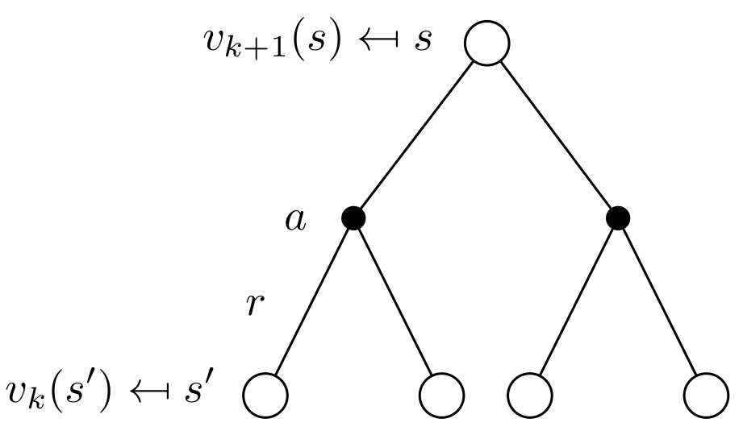
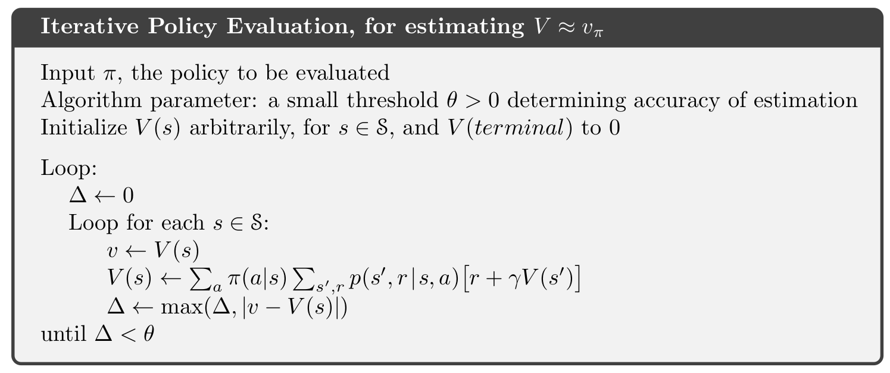
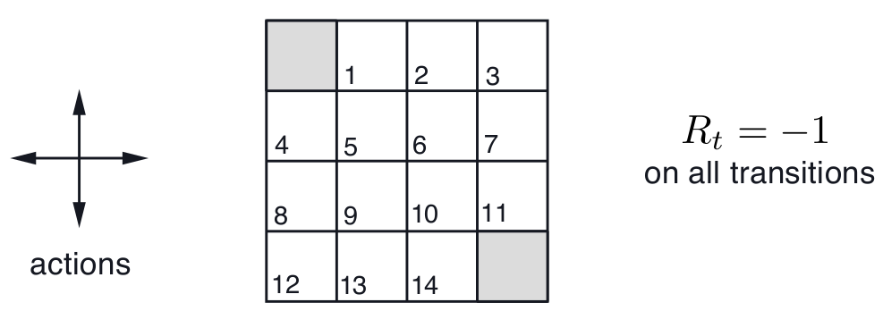
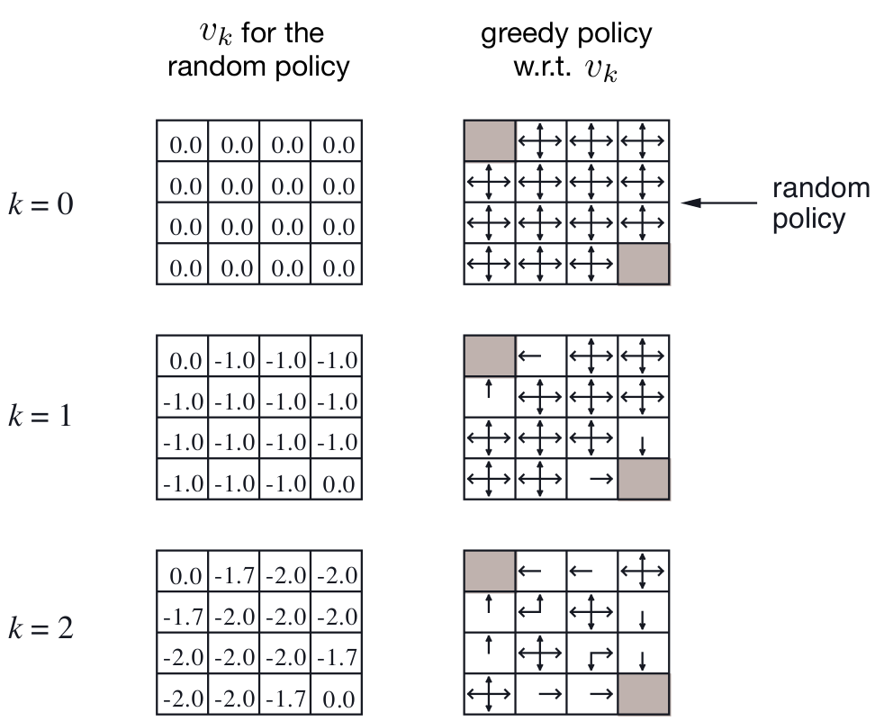
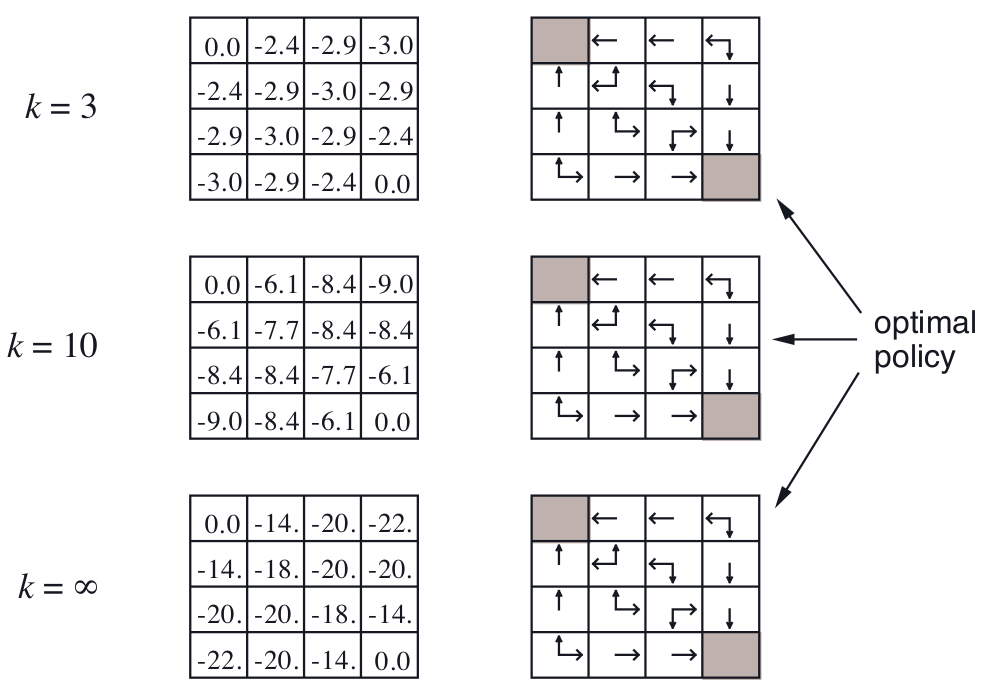
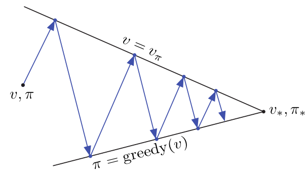
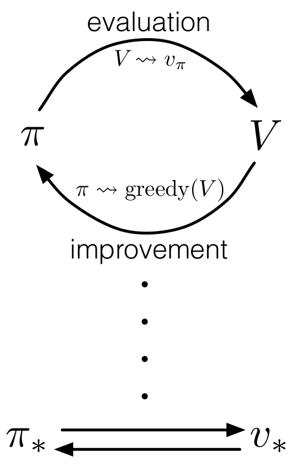

class: middle, center, title-slide

# Навчання з підкріпленням

Лекція 3: Планування за допомогою динамiчного програмування

  
Кочура Юрій Петрович 
[iuriy.kochura@gmail.com](mailto:iuriy.kochura@gmail.com)  
<a href="https://t.me/y_kochura">@y_kochura</a>  

---

class: middle

# Сьогодні

- Вступ 
- Оцінка стратегії
- Ітерація стратегії

---

class: blue-slide, middle, center
count: false

.larger-xx[Вступ]

---

class: middle

# Що таке динамічне програмування?

*Динамічний*: послідовний або часовий компонент задачі

*Програмування*: оптимізація задачі (наприклад, стратегії)
    - лінійне програмування
    - нелінійне програмування

???
Термін динамічне програмування (DP) відноситься до набору алгоритмів, які можна використовувати для обчислення оптимальної стратегії з урахуванням ідеальної моделі середовища як марковського процесу прийняття рішень (MDP). Минулого разу ми з Вами розглядали як формалізувати задачу навчання з підкріпленням використовуючи MDP. Проте ми не розглядали з Вами як вирішити (розв'язати) MDP. Сьогодні і решту курсу ми будемо розглядати методи для розв'язання MDP.

Одним з фундаментальних підходів не лише в навчанні з підкріпленням, а й в багатокрокових задачах оптимального управління є динамічне програмування. Динамічне програмування &mdash; це техніка в комп’ютерному програмуванні, яка допомагає ефективно вирішувати клас проблем, які мають перекриваючі підпроблеми та властивість оптимальної підструктури.

Якщо деяку задачу можна розділити на підзадачі, які, у свою чергу, можна розділити на ще менші підзадачі, і якщо ці підздачі перекриваються, тоді розв'язок цих підзадач можна зберегти для використання в майбутньому. Таким чином можна підвищити ефективність вирішення поставленої задачі. Цей метод розв’язування називається динамічним програмуванням.

У динамічному програмуванні, для керованого процесу серед множини усіх допустимих підзадач шукають оптимальний розв'язок, у сенсі деякого критерію, тобто такий, який призводить до екстремального (найбільшого або найменшого) значення цільової функції. Глобальна задача при цьому ділиться на ряд послідовних підзадач, що відповідають, як правило, різним моментам часу. Таким чином, в назві «Динамічне програмування» під «програмуванням» розуміють «ухвалення рішень», «планування», а слово «динамічне» вказує на суттєве значення часу та порядку виконання операцій в процесах і методах, що розглядаються. 

[Dynamic Programming](https://www.programiz.com/dsa/dynamic-programming)

---

class: middle
count:false

# Що таке динамічне програмування?

*Динамічний*: послідовний або часовий компонент задачі

*Програмування*: оптимізація задачі (наприклад, стратегії)
    - лінійне програмування
    - нелінійне програмування

- Метод вирішення складних задач

---

class: middle
count:false

# Що таке динамічне програмування?

*Динамічний*: послідовний або часовий компонент задачі

*Програмування*: оптимізація задачі (наприклад, стратегії)
    - лінійне програмування
    - нелінійне програмування

- Метод вирішення складних задач
- Шляхом розбиття їх на підзадачі

---

class: middle
count:false

# Що таке динамічне програмування?

*Динамічний*: послідовний або часовий компонент задачі

*Програмування*: оптимізація задачі (наприклад, стратегії)
    - лінійне програмування
    - нелінійне програмування

- Метод вирішення складних задач
- Шляхом розбиття їх на підзадачі
    - Розв’язати підзадачі

---

class: middle
count:false

# Що таке динамічне програмування?

*Динамічний*: послідовний або часовий компонент задачі

*Програмування*: оптимізація задачі (наприклад, стратегії)
    - лінійне програмування
    - нелінійне програмування

- Метод вирішення складних задач
- Шляхом розбиття їх на підзадачі
    - Розв’язати підзадачі
    - Об'єднати рішення підзадач

---

class: middle

# Вимоги до динамічного програмування

Динамічне програмування &mdash; це загальний метод вирішення задач, які мають дві властивості:

- Оптимальна підструктура
    - Виконуєтсья принцип оптимальності

---

class: middle
count: false

# Вимоги до динамічного програмування

Динамічне програмування &mdash; це загальний метод вирішення задач, які мають дві властивості:

- Оптимальна підструктура
    - Виконуєтсья принцип оптимальності
    - Оптимальне рішення можна розкласти на підзадачі

---

class: middle
count: false

# Вимоги до динамічного програмування

Динамічне програмування &mdash; це загальний метод вирішення задач, які мають дві властивості:

- Оптимальна підструктура
    - Виконуєтсья принцип оптимальності
    - Оптимальне рішення можна розкласти на підзадачі

- Перекриття підзадач
    - Підзадачі повторюються багато разів

---

class: middle
count: false

# Вимоги до динамічного програмування

Динамічне програмування &mdash; це загальний метод вирішення задач, які мають дві властивості:

- Оптимальна підструктура
    - Виконуєтсья принцип оптимальності
    - Оптимальне рішення можна розкласти на підзадачі

- Перекриття підзадач
    - Підзадачі повторюються багато разів
    - Розв'язок можна зберегти та повторно використовувати

---

class: middle
count: false

# Вимоги до динамічного програмування

Динамічне програмування &mdash; це загальний метод вирішення задач, які мають дві властивості:

- Оптимальна підструктура
    - Виконуєтсья принцип оптимальності
    - Оптимальне рішення можна розкласти на підзадачі

- Перекриття підзадач
    - Підзадачі повторюються багато разів
    - Розв'язок можна зберегти та повторно використовувати

- Марковський процес прийняття рішень задоволяняє обидві властивості
    - Рівняння Беллмана дає рекурсивне розкладання

---

class: middle
count: false

# Вимоги до динамічного програмування

Динамічне програмування &mdash; це загальний метод вирішення задач, які мають дві властивості:

- Оптимальна підструктура
    - Виконуєтсья принцип оптимальності
    - Оптимальне рішення можна розкласти на підзадачі

- Перекриття підзадач
    - Підзадачі повторюються багато разів
    - Розв'язок можна зберегти та повторно використовувати

- Марковський процес прийняття рішень задоволяняє обидві властивості
    - Рівняння Беллмана дає рекурсивне розкладання
    - Функція цінності зберігає та повторно використовує рішення

---

class: blue-slide, middle, center
count: false

.larger-xx[Приклад 

[[ipynb](https://colab.research.google.com/github/YKochura/rl-kpi/blob/main/tutor/dp/Dynamic_Programming.ipynb)]]

---

class: middle

# Планування за допомогою динамічного програмування

- Динамічне програмування передбачає повне знання MDP
- Використовується для планування в MDP
- Для передбачення:
    - *Вхід:* MDP $\langle\mathcal{S}, \mathcal{A}, \mathcal{P}, \mathcal{R}, \gamma\rangle$ та стратегія $\pi$
        - або: MRP $\langle\mathcal{S}, \mathcal{P}^\pi, \mathcal{R}^\pi, \gamma\rangle$
    - **Вихід:** функція цінності $v_\pi$

- Або для управління:
    - *Вхід:* MDP $\langle\mathcal{S}, \mathcal{A}, \mathcal{P}, \mathcal{R}, \gamma\rangle$
     **Вихід:** оптимальна функція цінності $v_*$

???
Термін динамічне програмування (DP) відноситься до набору алгоритмів, які можна використовувати для обчислення оптимальної стратегії з урахуванням ідеальної моделі середовища як марковського процесу прийняття рішень (MDP). Класичні алгоритми DP мають обмежену користь у навчанні з підкріпленням як через припущення ідеальної моделі, так і через великі обчислювальні витрати, але вони все ще важливі теоретично. DP забезпечує важливу основу для розуміння методів, які ми будемо розглядати далі у рамках цього курсу. Насправді всі ці методи можна розглядати як спроби досягти майже такого ж ефекту, як DP, тільки з меншими обчисленнями та без припущення ідеальної моделі середовища.

Будемо вважати, що середовище є скінченним MDP. Тобто ми припускаємо, що множини станів, дій та винагород агента (S, A та R) також будуть скінченними, а його динаміка задана множиною ймовірностей $p(s\prime, r |s, a)$. 

Хоча ідеї DP можуть бути застосовані до проблем із неперервними просторами станів і дій, точні рішення можливі лише в особливих випадках. Хоча ідеї DP можуть бути застосовані до проблем із неперервними просторами станів і дій, точні розв'язки можливі лише в особливих випадках. Поширеним способом отримання наближених розв'язків для завдань із неперервними станами та діями є квантування просторів станів і дій, а потім застосування методів DP для кінцевої множини станів.

---

class: middle

# Інші застосування динамічного програмування

Динамічне програмування використовується для вирішення багатьох інших проблем, наприклад: 

- Алгоритми планування (Scheduling algorithms)
- [Алгоритм рядка](https://web.stanford.edu/class/cs97si/10-string-algorithms.pdf) (String algorithms), напр. вирівнювання послідовності
- Алгоритми на графах (Graph algorithms), напр. алгоритми пошуку найкоротшого шляху
- Графова модель (Graphical models), напр. алгоритм Вітербі
- Біоінформатика, напр. граткові моделі

???
В обчислювальній техніці планування — це дія призначення ресурсів для виконання завдань. Ресурсами можуть бути процесори, мережеві канали або карти розширення. Завданнями можуть бути потоки, процеси або потоки даних. Діяльність планування виконується процесом, який називається планувальником. Планувальники часто розроблені таким чином, щоб усі ресурси комп’ютера були зайняті (як у випадку балансування навантаження), дозволяли багатьом користувачам ефективно спільно використовувати системні ресурси або досягали цільової якості обслуговування.

Графова модель, або імовірнісна графова моде́ль (ІГМ, англ. probabilistic graphical model, PGM) — це ймовірнісна модель, для якої умовні залежності між випадковими змінними виражено графом.
Алгоритм Вітербі — алгоритм пошуку найбільш відповідного списку станів (званого шляхом Вітербі), який в контексті ланцюгів Маркова отримує найбільш ймовірну послідовність подій, що відбулися. Алгоритм був запропонований Ендрю Вітербі в 1967 році як алгоритм декодування згорткового коду, переданого по мережах за наявністю шуму. 

Алгоритм Вітербі — це алгоритм динамічного програмування для отримання максимальної апостеріорної оцінки ймовірності найімовірнішої послідовності прихованих станів — так званого шляху Вітербі — результатом якого є послідовність спостережуваних подій, особливо в контексті джерел інформації Маркова та прихованого Маркова. моделі (HMM).

Решітчасті (граткові) білки — це дуже спрощені моделі білковоподібних гетерополімерних ланцюгів у конформаційному просторі решітки, які використовуються для дослідження згортання білка.

---

class: blue-slide, middle, center
count: false

.larger-xx[Оцінка стратегії]

---

class: middle

# Оцінка стратегії

- Задача: оцінити дану стратегію $\pi$
- Розв'язок: ітеративна оцінка рівняння Беллмана
- $v\_1 \rightarrow v\_2 \rightarrow \cdots \rightarrow v\_{\pi}$

???
Спочатку ми розглянемо, як обчислити функцію цінності  $v_\pi$ для довільної стратегії $\pi$. У літературі з DP це називається оцінкою стратегії. Ми також називаємо це задачею передбачення.

---

class: middle
count: false

# Оцінка стратегії

- Задача: оцінити дану стратегію $\pi$
- Розв'язок: ітеративна оцінка рівняння Беллмана
- $v\_1 \rightarrow v\_2 \rightarrow \cdots \rightarrow v\_{\pi}$

- Синхронна оцінка:
    - На кожній ітерації $k + 1$
    - Для всіх станів $s \in \mathcal{S}$
    - Оновити $v\_{k + 1} (s)$ з $v\_{k}(s^\prime)$

- Збіжність до $v\_{\pi}$ буде доведена пізніше
---

class: middle
count: false

# Оцінка стратегії

.center.width-60[]

$$v\_{k + 1}(s) = \sum\_{a \in \mathcal{A}} \pi(a|s) \left( \mathcal{R}^a\_{s} + \gamma \sum\_{s^\prime \in \mathcal{S}} \mathcal{P}^a\_{ss^\prime} v\_k(s^\prime) \right)$$

$$\mathbf{v}^{k + 1}(s) =  \mathbf{\mathcal{R}^{\pi}} + \gamma \mathbf{\mathcal{P}^{\pi}} \mathbf{v}\_k$$

---

class: middle
count: false

# Оцінка стратегії

.center.width-100[]

.footnote[Джерело: R. S. Sutton and A. G. Barto: Reinforcement Learning: An Introduction]

---

class: middle

# Приклад 

.center.width-60[]

- Епізодичний MDP без знецінювання ($\gamma = 1$)
- Нетермінальні стани:  $\mathcal{S} = {1, \cdots, 14}$
- Чотири дії можливі для кожного стану: $\mathcal{A} = {\text{left}, \text{right}, \text{up}, \text{down}}$
- Термінальні стани позначені сірим кольором (два квадрати)
- Дії, що виходять із сітки, залишають стан без змін
- Винагорода становить -1, доки не буде досягнуто термінального стану
- Агент дотримується стратегії:
$$\pi(n | \cdot) = \pi(s| \cdot) = \pi(e | \cdot) = \pi(w | \cdot) = 0.25$$

.footnote[Джерело: R. S. Sutton and A. G. Barto: Reinforcement Learning: An Introduction]

---

class: middle

# Ітеративна оцінка стратегії

.center.width-80[]

.footnote[Джерело: R. S. Sutton and A. G. Barto: Reinforcement Learning: An Introduction]

---

class: middle

# Ітеративна оцінка стратегії

.center.width-80[]

.footnote[Джерело: R. S. Sutton and A. G. Barto: Reinforcement Learning: An Introduction]

---

class: blue-slide, middle, center
count: false

.larger-xx[Ітерація стратегії]

---

class: middle

# Як вдосконалити стратегію?

- Дано стратегію $\pi$

---

class: middle
count: false

# Як вдосконалити стратегію?

- Дано стратегію $\pi$
    - **Оцінка** стратегії $\pi$:

    $$v(s) = \mathop{\mathbb{E}}\ [R\_{t+1} + \gamma R\_{t+2} + \gamma^2 R\_{t+3} + \cdots  \ | \ S\_t = s]$$

    - **Вдосконалення** стратегії, діючи жадібно щодо $v_\pi$:

$$\pi^\prime = \text{greedy}(v_\pi)$$

- У розглянутому попередньому прикладі вдосконалена стратегія була оптимальною: $\pi^\prime = \pi_*$
- У загальному випадку потрібно виконати більше ітерацій вдосконалення стратегії
- Процес ітеративної оцінки стратегії завжди збігається до  $\pi_*$

---

class: middle

# Ітерація стратегії

.grid[
.kol-1-2[
.center.width-100[]

]

.kol-1-2[
.center.width-40[]
]
]

- **Оцінка стратегії**: обчислення $v_\pi$
    - Ітеративна оцінка стратегії

- **Вдосконалення стратегії**: отримання $\pi^\prime \geq \pi$
    - Жадівне вдосконалення стратегії 

.footnote[Джерело: R. S. Sutton and A. G. Barto: Reinforcement Learning: An Introduction]  

---

class: end-slide, center

.larger-xx[Кінець]

???
DP може бути непрактичним для дуже великих проблем, але порівняно з іншими методами вирішення MDP, методи DP насправді є досить ефективними. Якщо ми проігноруємо кілька технічних деталей, то в гіршому випадку час, який знадобиться методам DP для пошуку оптимальної стратегії, буде поліноміальним від кількості станів і дій. Якщо n і k позначають кількість станів і дій, це означає, що метод DP виконує кількість обчислювальних операцій, яка є меншою за деяку поліноміальну функцію від n і k. 

Метод DP гарантовано знайде оптимальну стратегію за поліноміальний час, навіть якщо загальна кількість (детермінованих) стратегій дорівнює $k^n$. У цьому сенсі DP є експоненціально швидшим, ніж будь-який прямий пошук, оскільки прямий пошук мав би вичерпно досліджувати кожну стратегію, щоб забезпечити однакову гарантію. Методи лінійного програмування також можна використовувати для вирішення MDP, і в деяких випадках їх збіжність може бути кращою, ніж у методів DP. Але методи лінійного програмування стають непрактичними для великих задач.

На практиці методи DP можна використовувати на сучасних комп’ютерах для вирішення MDP з мільйонами станів.

Для задач із великими просторами станів часто надають перевагу асинхронним методам DP.

---

class: blue-slide, middle, center
count: false

.larger-xx[Приклад]

[[Динамiчне програмування vs Монте-Карло](https://github.com/YKochura/rl-kpi/blob/main/tutor/dp/DPvs%20Monte-Carlo.pdf)]

---

# Література

.smaller-x[
- David Silver, [Lecture 3: Planning by Dynamic Programming](https://www.youtube.com/watch?v=Nd1-UUMVfz4&t=2251s)
- R. S. Sutton and A. G. Barto: [Reinforcement Learning: An Introduction](http://incompleteideas.net/book/RLbook2020.pdf). Ch. 4 - Dynamic Programming
]
