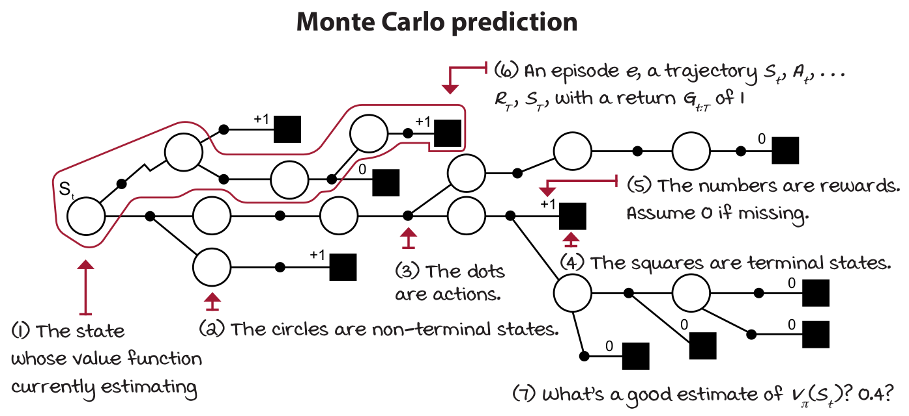
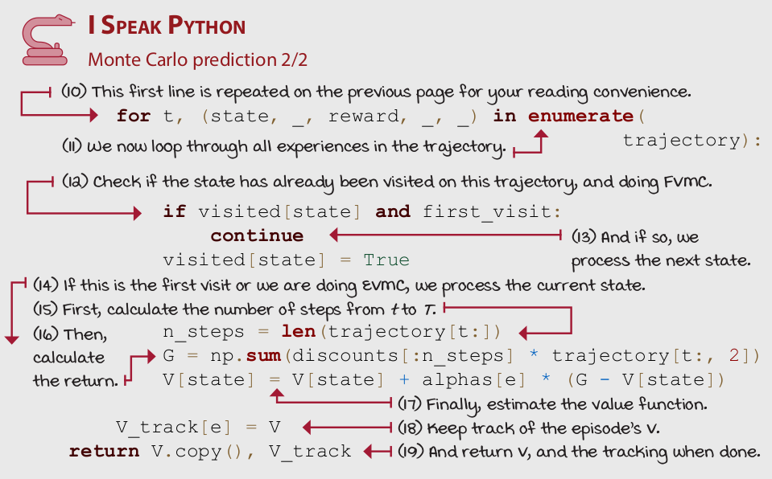
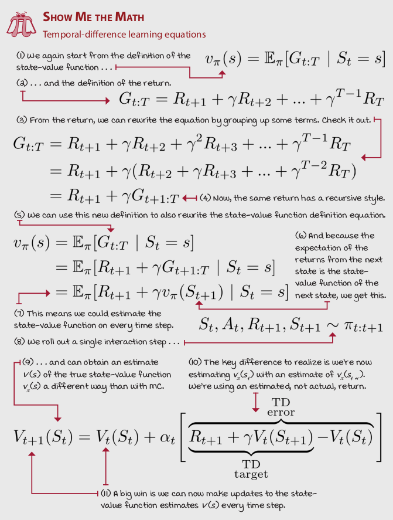
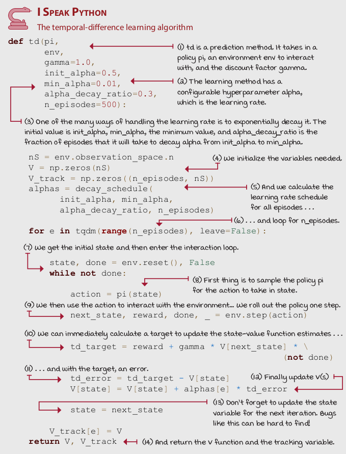
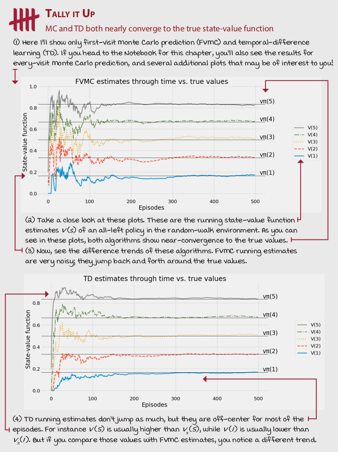
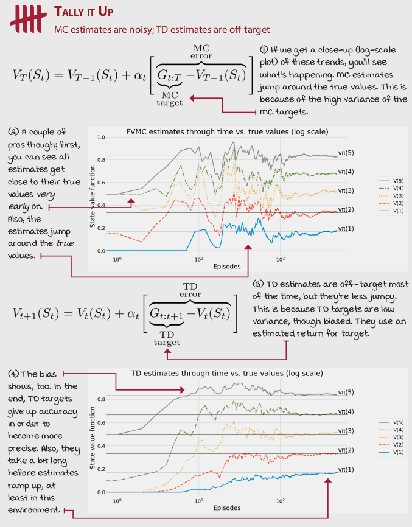
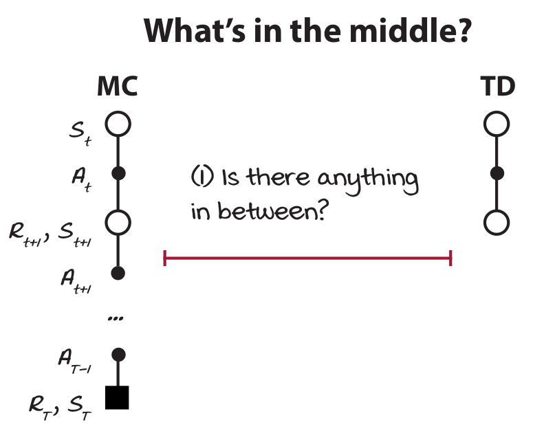
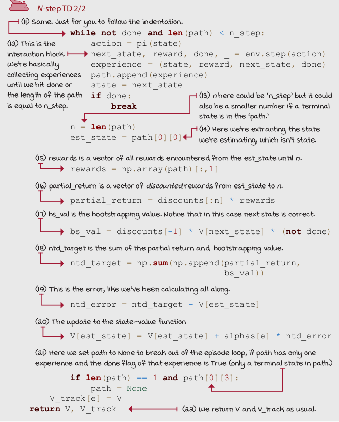
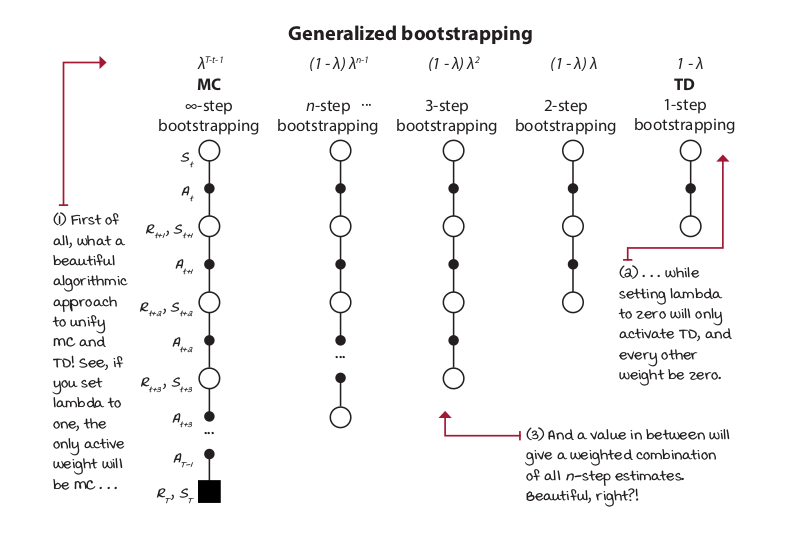

class: middle, center, title-slide

# Навчання з підкріпленням

Лекція 5: Методи апроксимацiї функцiї цiнностi

  
Кочура Юрій Петрович 
[iuriy.kochura@gmail.com](mailto:iuriy.kochura@gmail.com)  
<a href="https://t.me/y_kochura">@y_kochura</a>  

???
Важливо зрозуміти, чому ми використовуємо апроксимацiю (наближення) функцiї цiнностi для навчання з підкріпленням. Часто можна заплутатись в словах і вибирати щось через хайп. Наприклад, якщо ви почуєте термін "глибинне навчання", ви скоріше за все відчуєте більше піднесення, ніж якщо почуєте "нелінійне наближення функцій", але за сюттю це одне і те ж саме. Така природа людини. Це трапляється зі мною; і це трапляється з багатьма. Але наша мета &mdash; усунути упередженість і спростити наше мислення.

Сьогодні ми будемо говорити про використання апроксимації функцій для вирішення завдань навчання з підкріпленням. 

---

class: middle

# Сьогодні

- Вступ  
- Iнкрементнi методи
- Пакетнi методи

---

class: blue-slide, middle, center
count: false

.larger-x[Вступ]

---

class: middle, 

.center[
.width-90[]
]

.footnote[Джерело: Grokking Deep Reinforcement Learning, Miguel Morales.]

???
jjkj 

---

class: middle, 

.smaller-x.question[**Винагорода** $R\_{t}$: скалярний сигнал, який отримує агент у якості зворотного зв'язку від середовища після виконання дії агеном. Відноситься до однокрокового сигналу: агент спостерігає за станом середовища, обирає дію та отримує сигнал винагороди. Миттєва винагорода є ключовим поняттм в RL, але це не те, що агент намагається максимізувати.]

.smaller-x.question[**Загальна винагорода (return)**: сумарна винагорода отримана агентом з моменту часу $t$ з урахування знецінювання $\gamma$.  Розраховується від будь-якого стану агента і зазвичай триває до кінця епізоду. Тобто, коли досягається *стан завершення* (terminal state), обчислення припиняється. 

$$G\_t = R\_{t+1} + \gamma R\_{t+2}  + \cdots = \sum\_{k=0}^{\infty} \gamma^{k} R\_{t+k+1}$$]
s

.smaller-x.question[**Функція цінності**: визначає усереднену загальну винагороду:
$$\begin{aligned}
v(s) &= \mathop{\mathbb{E}}\ [G\_t \ | \ S\_t = s] = \\\\
&= \mathop{\mathbb{E}}\ [R\_{t+1} + \gamma R\_{t+2} + \gamma^2 R\_{t+3} + \cdots  \ | \ S\_t = s]
\end{aligned}$$]

---

class: middle, 

## Середовище [випадкового блукання](https://ru.wikipedia.org/wiki/%D0%A1%D0%BB%D1%83%D1%87%D0%B0%D0%B9%D0%BD%D0%BE%D0%B5_%D0%B1%D0%BB%D1%83%D0%B6%D0%B4%D0%B0%D0%BD%D0%B8%D0%B5)

.center[
.width-90[]
]

.footnote[Джерело: Grokking Deep Reinforcement Learning, Miguel Morales.]

???
Основне середовище, яке будемо використовувати у якості прикладу &mdash; одновимірне випадкове блукання по числовій прямій цілих чисел з п'ятьма *non-terminal states*. Ви можете розглядати випадкове блуканна (ВБ) як середовище у якому ймовірність піти ліворуч або праворуч є однаковою. Агент буде йти ліворуч 50% свого часу блуканна, і решту 50% часу вправо незалежно від дії, яку він виконує.

Ви можете задатись питанням: який сенс вивчати RL (основу для вивчення оптимального керування) в середовищі, в якому немає можливого контролю!?

Давайте поглянемо на ВБ з іншої сторони. Ми можемо розглядати ВБ як середовище з детермінованою функцією переходу (це означає, що якщо агент вибирає  дію ліворуч, агент рухається вліво, і навпаки, рухається вправо, якщо вибирає дію праворуч &mdash; як і очікувалося).

Але уявіть, що агент хоче оцінити стохастичну стратегію, яка рівномірно вибирає дії випадковим чином. Тобто половина часу, коли агент вибирає рухатись ліворуч, а іншу половину &mdash; праворуч. У будь-якому випадку, концепція однакова: у нас є п’ять нетермінальних станів, у яких агент рухається ліворуч і праворуч рівномірно випадковим чином. Мета &mdash; оцінити очікувану загальну винагороду з урахування коефіцієнта знецінювання, яку агент може отримати за цих обставин. 

---

class: blue-slide, middle, center
count: false

.larger-x[Методи Монте-Карло (MK)]

---

class: middle

- Методи MK вчаться безпосередньо з епізодів (досвіду)
- МК методи безмодельні: відсутні знання про МППР
- Методи МК навчаються з повних епізодів: без [бутстрапінга](https://www.greelane.com/uk/%d0%bd%d0%b0%d1%83%d0%ba%d0%b0-%d1%82%d0%b5%d1%85%d0%bd%d0%be%d0%bb%d0%be%d0%b3%d1%96%d1%8f-%d0%bc%d0%b0%d1%82%d0%b5%d0%bc%d0%b0%d1%82%d0%b8%d0%ba%d0%b0/%d0%bc%d0%b0%d1%82%d0%b5%d0%bc%d0%b0%d1%82%d0%b8%d1%87%d0%bd%d0%b8%d0%b9/what-is-bootstrapping-in-statistics-3126172/) 
- Ми називаємо пряму вибірку епізодів Монте-Карло 
- Примітка: методи МК можна застосовувати лише до епізодичних МППР
    - Усі епізоди мають бути кінцевими
- Методи МК використовують просту ідею: цінність = середня загальна винагорода

???
Бутстрапінг в RL, коли Ви оцінюєте щось на основі іншої оцінки. 

---

class: middle

## Оцінка стратегії Монте-Карло

- Мета: вивчити $v\_{\pi}(s)$ з епізодів досвіду в рамках стратегії $\pi$
$$S\_t, A\_t, R\_{t+1}, \cdots, S\_T \sim \pi$$
- Загальна винагорода:
$$G\_{t:T} = R\_{t+1} + \gamma R\_{t+2} + \cdots + \gamma^{T-1} R\_{T}$$
- Функція цінності:
$$v\_{\pi}(s) = \mathop{\mathbb{E}}\_{\pi}\ [G\_t \ | \ S\_t = s]$$

---

class: middle

## Перше відвідування Монте-Карло (First-visit Monte Carlo, FVMC): покращення оцінок після кожного епізоду 

.center[
.width-100[]
]

.footnote[Джерело: Grokking Deep Reinforcement Learning, Miguel Morales.]

???
Мета полягає в тому, щоб оцінити цінність стратегії, тобто дізнатися, яку загальну винагороду можна очікувати при дотриманні заданої стратегії. Іншими словами, мета полягає в оцінці функції цінності стану $v\_{\pi}(s)$ для стратегії $\pi$. Найпростіший підхід, який спадає на думку — це запустити кілька епізодів із цією стратегією, збираючи сотні траєкторій, а потім обчислити середні значення для кожного стану. Цей метод оцінки функцій цінності називається прогнозом Монте-Карло (MК). 

MК легко реалізувати. Агент спочатку буде взаємодіяти з середовищем, використовуючи cтратегію $\pi$, поки агент не досягне термінального стану $S\_T$. Набір стану $S\_t$, дії $A\_t$, винагороди $R\_{t+1}$ і наступного стану $S\_{t+1}$ називається кортежем досвіду. Послідовність з таких кортежів називається траєкторією. Перше, що вам потрібно зробити, це попросити вашого агента створити траєкторію. 

Коли у вас є траєкторія, Ви розраховуєте загальну винагороду $G\_{t:T}$ для кожного стану $S\_t$, що зустрічається. Наприклад, Ви починаєте зі стану $S\_t$ і переходите у інші стани, отримуючи та додаючи на цьому шляху винагороди: $R\_{t+1}$, $R\_{t+2}$, $R\_{t+3}$, $\cdots$, $R\_{T}$ до кінця траєкторії на часовому кроці $T$. Потім ви повторюєте цей процес для стану $S\_{t+1}$, додаючи загальну винагороду від часового кроку $t+1$, поки знову не досягнете $T$; потім для $S\_{t+2}$ і так далі для всіх станів, крім $S\_T$, який за визначенням має цінність 0.

Після генерування траєкторії та обчислення загальної винагороди для всіх станів $S\_t$, ви можете оцінити функцію цінності стану $v\_{\pi}(s)$ в кінці кожного епізоду $e$, просто усереднюючи результати, отримані від кожного стану $s$. Усе досить просто.

---
## FVMC

1. $v\_{\pi}(s) = \mathop{\mathbb{E}}\_{\pi}\ [G\_t \ | \ S\_t = s]$
2. $G\_{t:T} = R\_{t+1} + \gamma R\_{t+2} + \cdots + \gamma^{T-1} R\_{T}$
3. $S\_t, A\_t, R\_{t+1}, \cdots, R\_{T},S\_T \sim \pi$
4. $T\_T(S\_t) = T\_T(S\_t) + G\_{t:T}$
5. $N\_T(S\_t) = N\_T(S\_t) + 1$
6. $V\_T(S\_t) =\frac{T\_T(S\_t)}{N\_T(S\_t)}$
7. Якщо $N(s) \rightarrow \infty$, тоді $V(s) \rightarrow v\_{\pi}(s)$

$$\boxed{V\_T(S\_t) = V\_{T-1}(S\_t) + \frac{1}{N\_t(S\_t)}\bigg[G\_{t:T} -  V\_{T-1}(S\_t)\bigg]}$$

$$\boxed{V\_T(S\_t) = V\_{T-1}(S\_t) + \alpha\_t\big[\overbrace{\underbrace{G\_{t:T}}\_{\text{MC target}} -  V\_{T-1}(S\_t)}^{\text{MC error}}\big]}$$

???
3. Знаючи траєкторію, ми можемо обчислити загальну винагороду для всіх станів, що зустрічаються.
4. Потім додати загальні винагороди для кожного стану.
5. Оновити лічильник
6. Ми можемо оцінити середню загальну винагороду за допомогою емпіричного середнього
7. За законом великих чисел 

Але зверніть увагу, що середню загальну винагорду можна обчислювати інкрементро. Немає необхідності відстежувати суму загальних винагород для всіх станів. Це рівняння є еквівалентним і більш ефективним.

Cереднє значення заміняється на навчальний параметр $\alpha\_t$, який може залежати від часу або бути константою.

Зверніть увагу, що $V$ обчислюється лише в кінці епізоду, на часовому кроці $T$, оскільки $G$ залежить від нього.  

---

class: middle

## Кожне відвідування Монте-Карло (Every-visit Monte Carlo, EVMC):  інший спосіб обробки відвіданих станів

Ви, напевно, помітили, що на практиці можна реалізувати два різних способи алгоритму з усереднення загальної винагороди. Це викликано тим, що одна траєкторія може містити кілька відвідувань одного і того ж стану. У цьому випадку, чи варто розраховувати загальну винагороду після кожного з цих відвідувань
незалежно, а потім включити всі ці значення до усереднення, чи ми повинні використовувати обраховану загальну винагороду лише від першого візиту до кожного стану?

Обидва підходи є робочими та мають схожі теоретичні властивості.    

.footnote[Джерело: Grokking Deep Reinforcement Learning, Miguel Morales.]

???
Більш «стандартний» підхід є перше відвідування МК (FVMC), його властивості збіжності легко обґрунтувати, оскільки кожна траєкторія є незалежною та однаково розподіленою (IID) вибіркою $v\_{\pi}(s)$, тому, коли ми збираємо нескінченну вибірку, оцінка функції цінності наближається до дійсного значення.

Кожне відвідування МК (EVMC) дещо відрізняється, оскільки загальні винагороди більше не є незалежними та однаково розподіленими для ситуації, коли стани відвідуються кілька разів на одній і тій самій траєкторії. Але, на щастя, доведено, що цінка функції цінності в EVMC збігається до дійсного значення зі збільшенням вибірки. 

---

class: middle, 

## Перше vs Кожне відвідування Монте-Карло

.smaller-x.question[Передбачення МК оцінює $v\_{\pi}(s)$ як усереднене значення загальних винагород при дотриманні стратегії $\pi$. FVMC використовує лише одне значення загальної винагороди для одного стану протягом епізоду: загальна винагорода після першого відвідування стану. EVMC усереднює загальну винагороду для усіх відвідувань одного і того ж стану протягом епізоду.]

.footnote[Джерело: Grokking Deep Reinforcement Learning, Miguel Morales.]

---

class: middle, 

## Історія

.smaller-x.alert[Ви, напевно, чули раніше термін "симуляції Монте-Карло" або "імітаційне моделювання". Методи Монте-Карло, загалом відомі з 1940-х років і є широким класом алгоритмів, які використовують випадкову вибірку для оцінок. Проте, у 1996 році вперше методи першого та кожного відвідування МК були визначені у статті [Сатіндера Сінгха](https://web.eecs.umich.edu/~baveja/) (Satinder Singh) та [Річарда Саттона](https://en.wikipedia.org/wiki/Richard_S._Sutton) "Reinforcement Learning with Replacing Eligibility Traces".]

.footnote[Джерело: Grokking Deep Reinforcement Learning, Miguel Morales.]

---

class: middle

.center[
.width-80[]
]

.footnote[Джерело: Grokking Deep Reinforcement Learning, Miguel Morales.]

---

class: middle

.center[
.width-80[]
]

.footnote[Джерело: Grokking Deep Reinforcement Learning, Miguel Morales.]

---

class: middle

.center[
.width-60[]
]

.footnote[Джерело: Grokking Deep Reinforcement Learning, Miguel Morales.]

---

class: middle

.center[
.width-80[]
]

.footnote[Джерело: Grokking Deep Reinforcement Learning, Miguel Morales.]

---

class: middle

.center[
.width-80[]
]

.footnote[Джерело: Grokking Deep Reinforcement Learning, Miguel Morales.]

---

class: blue-slide, middle, center
count: false

.larger-x[Методи часових різниць (temporal difference, TD)]

---

class: middle

.center[
.width-100[]
]

.footnote[Джерело: Grokking Deep Reinforcement Learning, Miguel Morales.]

---

class: middle

.center[
.width-100[]
]

.footnote[Джерело: Grokking Deep Reinforcement Learning, Miguel Morales.]

???
Одним з основних недоліків методів МК є те, що агент повинен чекати до кінця епізоду, щоб він зміг отримати фактичне повернення $G\_{t:T}$, щоб оновити оцінку функції цінності $V\_T (S\_t )$. 

З одного боку, методи MК мають досить хорошу збіжності, оскільки вони оновлюють оцінку функції цінності $V\_T (S\_t )$ за фактичним значенням $G\_{t:T}$, що є неупередженою (без зміщення) оцінкою дійсної функції цінності $v\_{\pi}(s)$. 

Однак, хоча фактичне значення загальної винагороди є досить точною оцінкою для заданого стану в конкретному епізоді, в загальному випадку ця оцінка також не є дуже точною, оскілки фактичне значення загальної винагороди є оцінкою з високою дисперсією істинної функції цінності $v\_{\pi}(s)$. Тобто, фактичні значення загальної винагороди накопичують багато випадкових подій на одній траєкторії; всі дії, всі наступні стани, всі нагороди є випадковими подіями. Фактична загальна винагорода $G\_{t:T}$ збирає та об'єднує всю цю випадковість для сукупності часових кроків, від $t$ до $T$. 

Саме через високу дисперсію фактичної загальної винагороди $G\_{t:T}$, методи МК можуть бути неефективними.

Вся ця випадковість перетворюється на шум, який можна пом'якшити лише за допомогою даних, великої кількості даних, великої кількості траєкторій і фактичних вибірок загальної винагороди.

Один із способів зменшити вплив високої дисперсії - замість використання фактичного значення загальної винагороди $G\_{t:T}$, використовувати оцінку. Тому постає питання, як ми можемо миттєву винагороду з кожного кроку для оцінки загальної винагороди? Ви можете використовувати миттєву винагороду $R\_{t+1}$, а коли Ви спостерігаєте наступний стан $S\_{t+1}$,  ви можете використовувати оцінку функції цінності $V\_{t+1}$ як оцінку загальної винагороди на наступному кроці $G\_{t+1:T}$.

Це зв'язок використовується у рівняннях методів часової різниці (TD). Ці методи, на відміну від МК, можуть вчитися на неповних епізодах, використовуючи фактичне значення загальної винагороди з одного кроку, що є просто миттєвою винагородою $R\_{t+1}$.

---

class: middle, 

## Методи часових різниць (TD) та бутстрапінг

.smaller-x.alert[TD методи оцінюють $v\_{\pi}(s)$ з використанням оцінки $v\_{\pi}(s)$. Це підхід відомий як бутстрапінг, робить здогадку з здогадки; він використовує оціночну загальну винагороду замість фактичної. Формально цей метод використовує:
$$R\_{t+1} +  \gamma V\_{t}(S\_{t+1})$$

для розрахунку та оцінки $V\_{t+1}(S\_{t})$.

Оскільки TD використовує один крок фактичного значення загальної винагороди $R\_{t+1}$, він усе ще працюватиме добре. Цей сигнал винагороди $R\_{t+1}$ поступово «вносить реальність» в оцінки. ]

.footnote[Джерело: Grokking Deep Reinforcement Learning, Miguel Morales.]

---

class: middle

.center[
.width-60[]
]

.footnote[Джерело: Grokking Deep Reinforcement Learning, Miguel Morales.]

---

class: middle

.center[
.width-60[]
]

.footnote[Джерело: Grokking Deep Reinforcement Learning, Miguel Morales.]

---

class: middle

.center[
.width-60[]
]

.footnote[Джерело: Grokking Deep Reinforcement Learning, Miguel Morales.]

---

class: middle

.center[
.width-60[]
]

.footnote[Джерело: Grokking Deep Reinforcement Learning, Miguel Morales.]

---

class: middle

.center[
.width-60[]
]

.footnote[Джерело: Grokking Deep Reinforcement Learning, Miguel Morales.]

---

class: middle

## Оцінювання функції цінності з кількох кроків 

.center[
.width-60[]
]

.footnote[Джерело: Grokking Deep Reinforcement Learning, Miguel Morales.]

---

class: middle

## N-кроковий TD 

.center[
.width-80[]
]

.footnote[Джерело: Grokking Deep Reinforcement Learning, Miguel Morales.]

---

class: middle

.center[
.width-60[]
]

.footnote[Джерело: Grokking Deep Reinforcement Learning, Miguel Morales.]

---

class: middle

.center[
.width-60[]
]

.footnote[Джерело: Grokking Deep Reinforcement Learning, Miguel Morales.]

---

class: blue-slide, middle, center
count: false

.larger-x[TD($\lambda$): Покращена оцінка усіх відвіданих станів]

---

class: middle

.center[
.width-80[]
]

.footnote[Джерело: Grokking Deep Reinforcement Learning, Miguel Morales.]

---

class: middle

.center[
.width-60[]
]

.footnote[Джерело: Grokking Deep Reinforcement Learning, Miguel Morales.]

---

class: middle

.center[
.width-60[]
]

.footnote[Джерело: Grokking Deep Reinforcement Learning, Miguel Morales.]

---

class: middle

.center[
.width-60[]
]

.footnote[Джерело: Grokking Deep Reinforcement Learning, Miguel Morales.]

---

class: blue-slide, middle, center
count: false

.larger-x[[Демо](https://github.com/YKochura/rl-kpi/blob/main/tutor/mf-prediction/RL_Model_Free_Prediction.ipynb)]

---

class: end-slide, center

.larger-x[Кінець]

---

# Література

.smaller-x[
- David Silver, [Lecture 4: Model-Free Prediction](https://www.youtube.com/watch?v=PnHCvfgC_ZA&list=PLqYmG7hTraZBiG_XpjnPrSNw-1XQaM_gB&index=6)
]
