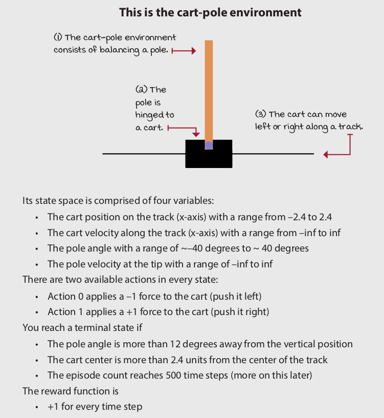
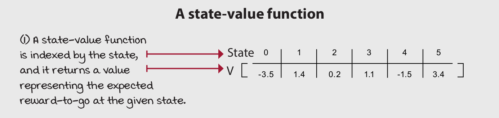
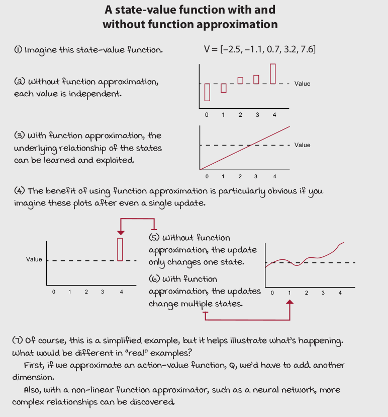
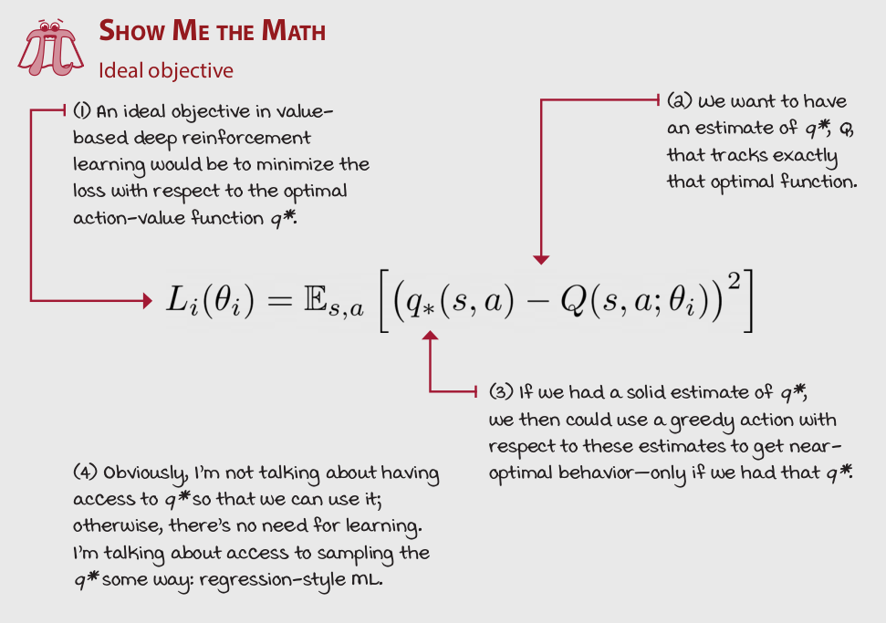
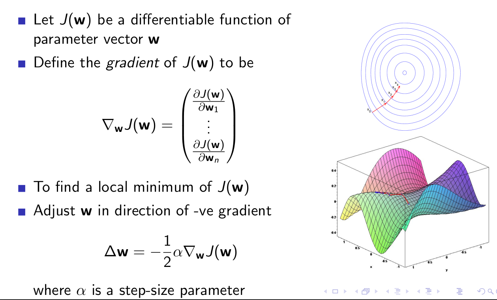
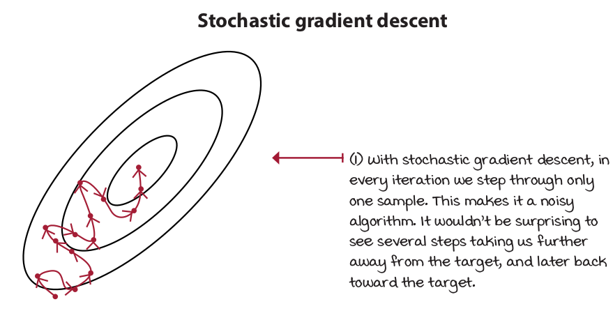
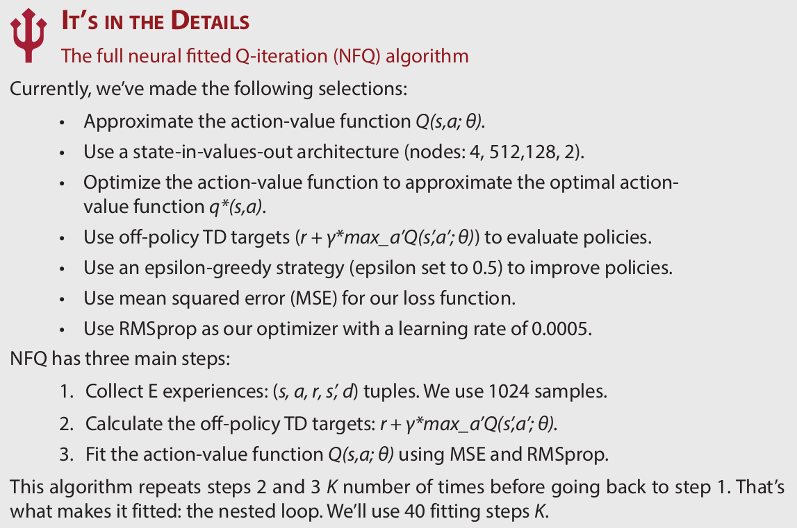

class: middle, center, title-slide

# Навчання з підкріпленням

Лекція 5: Методи апроксимацiї функцiї цiнностi

  
Кочура Юрій Петрович 
[iuriy.kochura@gmail.com](mailto:iuriy.kochura@gmail.com)  
<a href="https://t.me/y_kochura">@y_kochura</a>  

???
Важливо зрозуміти, чому ми використовуємо апроксимацiю (наближення) функцiї цiнностi для навчання з підкріпленням. Часто можна заплутатись в словах і вибирати щось через хайп. Наприклад, якщо ви почуєте термін "глибинне навчання", ви скоріше за все відчуєте більше піднесення, ніж якщо почуєте "нелінійне наближення функцій", але за сюттю це одне і те ж саме. Така природа людини. Це трапляється зі мною; і це трапляється з багатьма. Але наша мета &mdash; усунути упередженість і спростити наше мислення.

Сьогодні ми будемо говорити про використання апроксимації функцій для вирішення завдань навчання з підкріпленням. 

---

class: middle

# Сьогодні

- Вступ  
- Iнкрементнi методи
- Пакетнi методи

---

class: blue-slide, middle, center
count: false

.larger-x[Вступ]

---

class: middle, 

.center[
.width-90[]
]

.footnote[Джерело: Grokking Deep Reinforcement Learning, Miguel Morales.]

???
Основним недоліком табличних методів навчання з підкріпленням є те, що використання таблиці для представлення функцій цінності більше не є практичним в складних задачах. Табличні методи використовуються у задач у яких простори станів і дій агента є досить малими, тоді у такому випадку наближені значення функції цінності представляються у вигляді масивів або таблиць. Середовище існування агента може бути багатовимірним простором станів, що означає, що кількість змінних, які описують один стан агента, величезна. 

Наприклад, гра Atari є багатовимірним простором станів, оскільки зображення гри 210 на 160 пікселів з трьома каналами кольорів. Незалежно від значень, які можуть приймати ці пікселі, коли йде мова про розмірність (багатовимірність), йдеться насемперед про кількість змінних, які утворюють один стан. 

---

class: middle, 

.center[
.width-90[]
]

.footnote[Джерело: Grokking Deep Reinforcement Learning, Miguel Morales.]

???
Задачі навчання з підкріпленням можуть мати неперервні простори станів і дій. Тобто середовище може мати неперервні змінні, що означає, що змінна може приймати нескінченну кількість значень. Для уточнення, простори станів і дій можуть бути багатовимірними з дискретними змінними і  можуть бути низьковимірними з неперервними змінними. 

Навіть якщо змінні є дискретними і, отже, не є нескінченно великими, вони все одно можуть приймати велику кількість значень, що робить їх непрактичним для навчання без використання апроксимації функцій. Це, наприклад, у випадку з Atari, коли кожен піксель зображення може приймати 256 значень (0–255 цілих значень). У вас є кінцевий простір станів, але досить великий, тому ми можемо використовувати проксимацію функцій для навчання агента.

Але іноді навіть простори станів низької розмірності можуть бути нескінченно великими просторами станів. Наприклад, уявіть собі задачу, в якій є лише координати робота x, y, z, які  складають простір його станів. Звичайно, простір з трьома змінними є досить низьковимірним середовищем простору станів, але що, якщо будь-яка зі змінних надається в безперервній формі, тобто ця змінна може мати нескінченно малу точність? Скажімо, це може бути 1.56, 1.5683, 1.5683256 тощо. Тоді постає питання як створити таблицю, яка враховує всі ці значення?  Ви можете дискретизувати простір станів за допомогою апроксимація.   

---

class: middle, 

.center[
.width-70[]
]

.footnote[Джерело: Grokking Deep Reinforcement Learning, Miguel Morales.]

???
Середовище (cart-pole) перевернутий маятник з рухомою основою є класичним у навчанні з підкріпленням. Простір станів є низькорозмірними, але безперервним, що робить його чудовим середовищем для розробки алгоритмів; навчання швидке, але все ще дещо складне, і апроксимація функцій може допомогти. 

---

class: middle, 

## Апроксимація функцій має переваги 

.center[
.width-90[]
]

.footnote[Джерело: Grokking Deep Reinforcement Learning, Miguel Morales.]

???
Я сподіваюсь, ви зрозуміли, що в багатовимірних середовищах  або з неперервними простором станів немає щодних практичних причин, щоб  не використовувати апроксимацію функцій. Методи планування в RL представляють функції цінності за допомогою таблиць. Наприклад, методи ітерації за функцією цінності станів $v$  (value iteration),   які застосовуються у  MDP і виводить оптимальну стратегію для такого MDP шляхом розрахунку оптимальної функції $v$. Для методи ітерацій відстежує зміну функції $v$ протягом кількох ітерацій. Цей вектор зберігається у таблицю пошуку для запиту й оновлення оцінок. 

---

class: middle, 

## Апроксимація функцій має переваги 

.center[
.width-90[]
]

.footnote[Джерело: Grokking Deep Reinforcement Learning, Miguel Morales.]

???
Алгоритми Q-навчання не потребують MDP і не використовують функцію цінності стану $v$. Натомість у Q-навчанні ми оцінюємо значення оптимальної функції дій агента (функція ціності дій $q$). Функція ціності дій $q$ не є векторами вже, натомість вона представлена у вигляді матриці. Ці матриці є двовимірними таблицями, індексованими за станами та діями.

---

class: middle, 

<!-- ## Апроксимація функцій має переваги  -->

.center[
.width-70[]
]

.footnote[Джерело: Grokking Deep Reinforcement Learning, Miguel Morales.]

???
У середовищі cart-pole ми хочемо використовувати узагальнення, оскільки це ефективніше використання досвіду. Завдяки наближенню функцій агенти вивчають і використовують шаблони з меншою кількістю даних (і, можливо, швидше).

У той час як value iteration та Q-навчання вирішують проблеми за допомогою вибіркового зворотного зв’язку, це робить їх непрактичними, а відсутність узагальнення робить їх неефективними. Під цим я маю на увазі те, що ми могли б знайти способи використання таблиць у середовищах із неперервними змінними станів, але ми б це коштувало для нас дорого. Наприклад, дискретизація значень дійсно може зробити можливими використання таблиць. Але навіть якби ми могли розробити спосіб використання таблиць для збереження значень функцій цінності, таким чином ми б втратили переваги узагальнення. 

Наприклад, у середовищі cart-pole наближення функцій допомогло б нашим агентам вивчити зв’язок на відстані $x$. Агенти, ймовірно, дізнаються, що бути на відстані 2.35 одиниць від центру трохи краще, ніж бути на відстані 2.2 одиниць. Ми знаємо, що 2.4 є межею $x$ -- фініш. Цю додаткову особливість використання узагальнення не варто недооцінювати. Функції цінностей часто мають основні зв’язки вирішення поствленого завдання, які агенти можуть вивчати та використовувати.
Використання апроксимацій функцій, наприклад, нейронні мережі, можуть виявити ці основні зв’язки.  

---

class: middle, 

## Апроксимація функцій має переваги 

.center[
.width-90[]
]

.footnote[Джерело: Grokking Deep Reinforcement Learning, Miguel Morales.]

---

class: middle, 

## First decision point: Selecting a value function to approximate

- The state-value function $v(s)$
- The action-value function $q(s,a)$
- The action-advantage function $a(s,a)$

.footnote[Джерело: Grokking Deep Reinforcement Learning, Miguel Morales.]

---

class: middle, 

## Which Function Approximator?

There are many function approximators, e.g.

- Linear combinations of features
- Neural network
- Decision tree
- Nearest neighbour
- Fourier / wavelet bases
- ...

.footnote[Джерело: [David Silver](https://www.davidsilver.uk/wp-content/uploads/2020/03/FA.pdf).]

---

class: middle, 

## Which Function Approximator?

We consider **differentiable** function approximators, e.g.

- **Linear combinations of features**
- **Neural network**
- Decision tree
- Nearest neighbour
- Fourier / wavelet bases
- ...

.footnote[Джерело: [David Silver](https://www.davidsilver.uk/wp-content/uploads/2020/03/FA.pdf).]

---

class: middle, 

## Second decision point: Selecting a neural network architecture

.center[
.width-90[]
]

.footnote[Джерело: Grokking Deep Reinforcement Learning, Miguel Morales.]

---

class: middle, 

## Second decision point: Selecting a neural network architecture

.center[
.width-90[]
]

.footnote[Джерело: Grokking Deep Reinforcement Learning, Miguel Morales.]

???
Попередня архітектура буде чудово працювати в середовищі cart-pole. Але більш ефективна архітектура полягає лише у введенні стану (чотири значення  для cart-pole) до нервової нейронної мережі  і виведення Q-значень для всіх дій у цьому стані (дві дії у середовищі cart-pole). Це безсумнівно має свої переваги під час використання стратегій вивчення середовища, таких як epsilon-жадібна або softmax, тому що для отримання значень усіх дій для будь-якого стану необхідно виконати лише один прохід вперед, щоб отримати високопродуктивну реалізацію, особливо в середовищах з великою кількістю дій.

---

class: middle, 

## Third decision point: Selecting what to optimize

.center[
.width-90[]
]

.footnote[Джерело: Grokking Deep Reinforcement Learning, Miguel Morales.]

???
Давайте на секунду припустимо, що середовище з cart-pole є проблемою контрольованого навчання. Скажімо, у вас є набір даних зі станами як вхідними параметрами і функцією цінності як мітки. Яку функцію цінності Ви хотіли б мати для міток? Звичайно, такими мітками оптимально обрати Q-функцію. Але чому це нездійсненна мрія? Ну, основна причина полягає в тому, що ми не маємо оптимальної функції цінності дій $q(s,a)$, але на довершення ми не можемо навіть випробувати ці оптимальні значення $Q$, тому що ми також не маємо оптимальної стратегії. 

На щастя, ми можемо використовувати підходи повторення узагальненої стратегії, коли ми чергуємо процеси оцінки стратегії та вдосконалення стратегії, щоб знайти найкращу стратегію. Але так як ми використовуємо апроксимацію нелінійної функції, гарантії сбіжності цього алгоритму більше не немає.

---

class: middle, 

.center[
.width-90[]
]

.footnote[Джерело: Grokking Deep Reinforcement Learning, Miguel Morales.]

???
Давайте на секунду припустимо, що середовище з cart-pole є проблемою контрольованого навчання. Скажімо, у вас є набір даних зі станами як вхідними параметрами і функцією цінності як мітки. Яку функцію цінності Ви хотіли б мати для міток? Звичайно, такими мітками оптимально обрати Q-функцію.

---

class: middle, 

## Fourth decision point: Selecting the targets for policy evaluation

.center[
.width-90[]
]

.footnote[Джерело: Grokking Deep Reinforcement Learning, Miguel Morales.]

---

class: middle, 

## Fifth decision point: Selecting an exploration strategy

Another thing we need to decide is which policy improvement step to use for our generalized
policy iteration needs.

.footnote[Джерело: Grokking Deep Reinforcement Learning, Miguel Morales.]

???
Інша річ, яку нам потрібно вирішити, – це який крок удосконалення стратегії використовувати для потреб узагальнення ітерацій стратегії. 

---

class: middle, 

.center[
.width-90[]
]

.footnote[Джерело: Grokking Deep Reinforcement Learning, Miguel Morales.]

---

class: middle, 

## Sixth decision point: Selecting a loss function

- L1
- L2, MSE
- ...

.footnote[Джерело: Grokking Deep Reinforcement Learning, Miguel Morales.]

???
Інша річ, яку нам потрібно вирішити, – це який крок удосконалення стратегії використовувати для потреб узагальнення ітерацій стратегії. 

---

class: middle, 

## Seventh decision point: Selecting an optimization method

- Batch gradient descent
- Mini-batch gradient descent
- Stochastic gradient descent
- Mini-batch gradient descent vs. momentum

.footnote[Джерело: Grokking Deep Reinforcement Learning, Miguel Morales.]
 
---

class: middle, 

# Batch gradient descent

.center[
.width-90[]
]

.footnote[Джерело: [David Silver](https://www.davidsilver.uk/wp-content/uploads/2020/03/FA.pdf).]

---

class: middle,

.center[
.width-90[]
]

.footnote[Джерело: Grokking Deep Reinforcement Learning, Miguel Morales.]

---

class: middle,

.center[
.width-90[]
]

.footnote[Джерело: Grokking Deep Reinforcement Learning, Miguel Morales.]

---

class: middle,

.center[
.width-90[]
]

.footnote[Джерело: Grokking Deep Reinforcement Learning, Miguel Morales.]

---

class: middle,

.center[
.width-90[]
]

.footnote[Джерело: Grokking Deep Reinforcement Learning, Miguel Morales.]

---

class: middle,

.center[
.width-90[]
]

.footnote[Джерело: Grokking Deep Reinforcement Learning, Miguel Morales.]

---

class: middle,

.center[
.width-70[]
]

.footnote[Джерело: Grokking Deep Reinforcement Learning, Miguel Morales.]

---

class:  middle, center
count: false

.larger-x[[Демо](https://github.com/YKochura/rl-kpi/blob/main/tutor/nfq/nfq-s.ipynb)]

---

# Література

.smaller-x[
- David Silver, Lecture 6: Value Function Approximation. [[video](https://www.youtube.com/watch?v=UoPei5o4fps&list=PLqYmG7hTraZBiG_XpjnPrSNw-1XQaM_gB&index=7)], [[slides](https://www.davidsilver.uk/wp-content/uploads/2020/03/FA.pdf)]
- [Reinforcement Learning: An Introduction](http://incompleteideas.net/book/RLbook2018.pdf) - Chapter 9: On-policy Prediction with Approximation
- [Reinforcement Learning: An Introduction](http://incompleteideas.net/book/RLbook2018.pdf) - Chapter 10: On-policy Control with Approximation
- [Tutorial: Introduction to Reinforcement Learning with Function Approximation](https://www.youtube.com/watch?v=ggqnxyjaKe4)

]

---

class: end-slide, center

.larger-x[Кінець]

