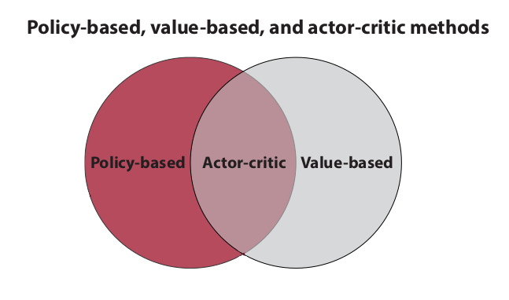
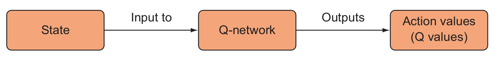
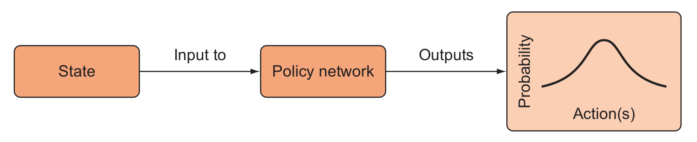
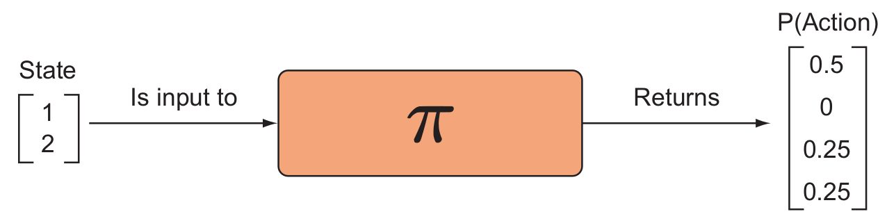
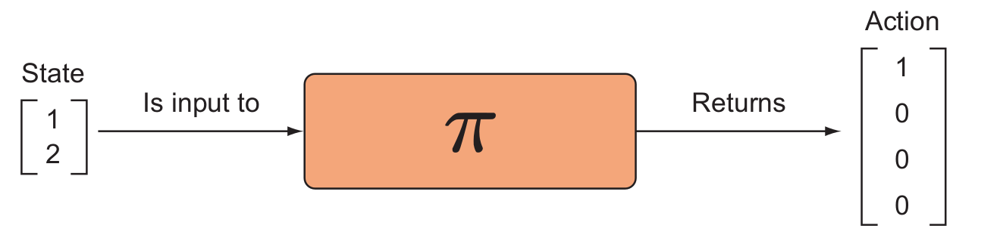
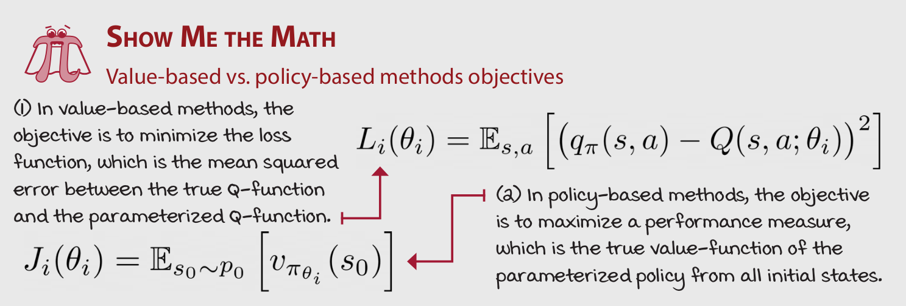
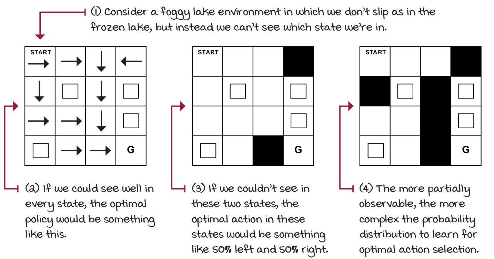
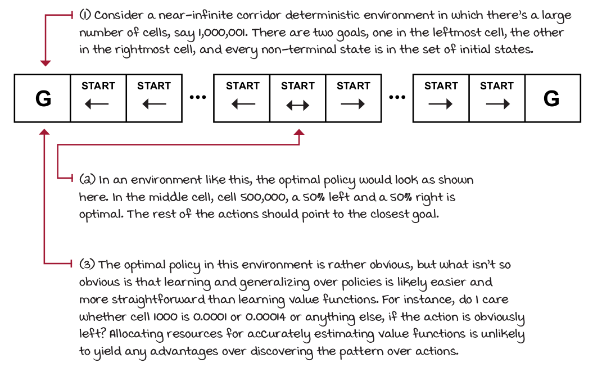
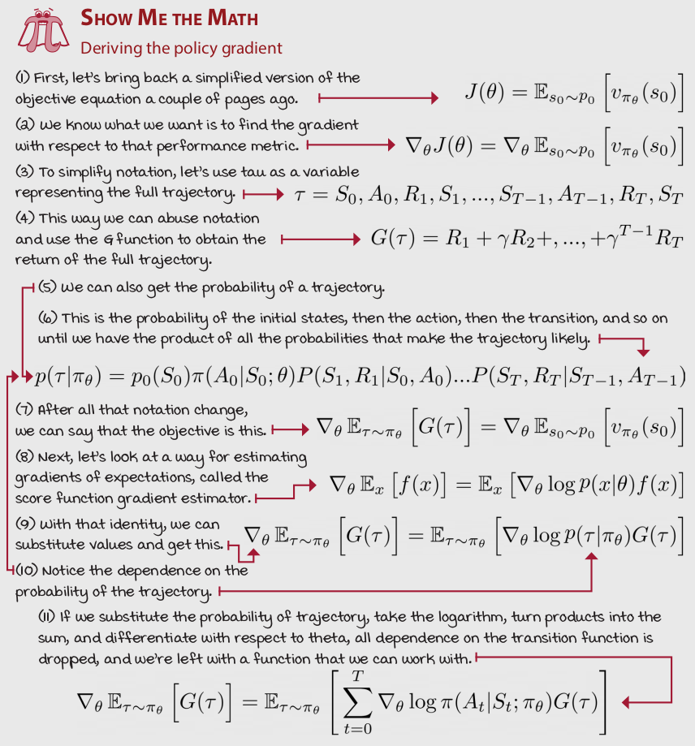

class: middle, center, title-slide

# Навчання з підкріпленням

Лекція 6: Методи градієнту стратегії

  
Кочура Юрій Петрович 
[iuriy.kochura@gmail.com](mailto:iuriy.kochura@gmail.com)  
<a href="https://t.me/y_kochura">@y_kochura</a>  

???
Раніше ми розглянули методи, які дозволяють агентам вивчити (знайти) очікувану загальну винагороду, відвідавши кожну пару стан-дія. Зрештою, агент може обирати найціннішу дію на кожному часовому кроці, щоб максимізувати винагороду. Ми розглянули три різні способи оцінки середнього значення загальної винагороди &mdash;  Монте-Карло, динамічне програмування та методи часових різниць, але усі вони намагаються визначити кількісно цінність кожного стану. Давайте подумаємо над проблемою ще раз. Чому ми намагаємось визначити (вивчити) очікувані значення загальної винагороди?  Вони дозволяють агенту виконувати дії наближено до оптимальної стратегії. Q-навчання дозволяє знайти оптимальну стратегію, багаторазово максимізуючи наступне очікуване значення загальної винагороди.  Чи можна  знайти оптимальну стратегію прямо без знаходження функцій цінності?  Відповідь &mdash; так. Методи на основі стратегій дозволяють агенту вибирати дії не звертаючись до фунції цінності та прямо вивчати (знаходити) оптимальну стратегію.

Методи, які називаються методами на основі стратегії (policy-based) чи градієнту стратегії (policy-gradient), параметризують стратегію та коригують її, щоб максимізувати очікувану загальну винагороду. 

---

class: middle

# Сьогодні

- Градієнтні методи стратегії

---

class: blue-slide, middle, center
count: false

.larger-xx[Вступ]

---

class: middle, 

.center[
.width-90[]
]

.footnote[Джерело: Grokking Deep Reinforcement Learning, Miguel Morales.]

???
Комбінований клас методів, які вивчають як стратегію, так і функції цінностей, називають акторо-критик (actor-critic), оскільки стратегію, яка обирає дії, можна розглядати як актора, а функцію цінності, яка оцінює стратегію, можна розглядати як критику. Методи актор-критик часто працюють краще, ніж методи, які базуються на функціях цінності або стратегії окремо на багатьох бенчмарках глибинного навчання з підкріпленням. Методи актор-критик часто дають передові результати за різноманітними наборами критеріїв глибинного навчання з підкріпленням. 

---

class: middle, 

.center[
.width-90[]
]

.footnote[Джерело: Deep Reinforcement Learning in Action, Alexander Zai and Brandon Brown.]

???
На останній лекції ми розглядали Q-мережі, алгоритми, які апроксимують Q-функцію за допомогою нейронної мережі. На виході Q-мережі отримуємо значення Q, що відповідають кожній дії агента для даного стану. Для нагадування, значення Q &mdash; це очікувана (середньозважена) винагорода. У Q-навчанні ми оцінюємо значення оптимальної функції дій агента (функція ціності дій $q$). Функція ціності дій $q$ представляється у вигляді матриці. Ці матриці є двовимірними таблицями, індексованими за станами та діями.

Більш ефективна архітектура полягає лише у введенні стану (чотири значення  для cart-pole: положення візка, швидкість, кут відхилення маятника від вертикалі, кутова швидкість маятника на кінці) до нейронної мережі  і виведення Q-значень для всіх дій у цьому стані (дві дії у середовищі cart-pole). Це безсумнівно має свої переваги під час використання стратегій вивчення середовища, таких як epsilon-жадібна або softmax, тому що для отримання значень усіх дій для будь-якого стану необхідно виконати лише один прохід вперед, щоб отримати високопродуктивну реалізацію, особливо в середовищах з великою кількістю дій.

Q-мережа приймає стан і повертає значення Q (цінність дії) для кожної дії. Ми можемо використовувати ці значення Q, щоб вирішити, які дії виконувати. Використовуючи стратегію, наприклад, $\varepsilon$-жадібну, агент буде обирати на кожному часовому кроці дію випадковим чином з ймовірністю $\varepsilon$ і з ймовірністю $1 - \varepsilon$ -- дію, яка асоціюється з набільшим значенням Q. Існує багато інших стратегій, які ми могли б дотримуватися, наприклад, використовувати шар softmax для значень Q.

Що, якщо ми пропустимо вибір стратегії для DQN і замість цього навчимо нейронну мережу виводити прямо дії, які слід виконувати агенту? Якщо ми це зробимо, наша нейронна мережа в кінцевому підсумку стане функцією стратегії або мережею стратегії (policy network).  

---

class: middle, 

.center[
.width-90[]
]

.footnote[Джерело: Deep Reinforcement Learning in Action, Alexander Zai and Brandon Brown.]

???
На відміну від Q-мережі, мережа стратегії вказує нам, що робити для кожного стану в якому ми перебуваємо. Подальше прийняття рішень уже непотрібне.  Все, що нам потрібно зробити, це випадковим чином зробити вибірку з розподілу ймовірностей $P(A|S)$, і ми отримаємо дію, яку потрібно виконати. Дії, які найімовірніше принесуть найбільшу винагороду, матимуть найвищий шанс бути обраними з випадкової вибірки, оскільки їм присвоюється найвища ймовірність. 

Мережа стратегії &mdash; це функція, яка приймає стан і повертає розподіл ймовірності щодо можливих дій. Цей клас алгоритмів називається методами градієнта стратегії. Вони мають кілька важливих відмінностей від алгоритмів DQN, про які ми буде сьогодні говорити. Методи градієнта стратегії надають кілька переваг порівняно з методами передбачення функції цінності, такими як DQN. 

Одна з переваг полягає в тому, що, як вже було зазначено, нам більше не потрібно турбуватися про вигадування стратегії вибору дій, як-от epsilon-greedy; натомість ми безпосередньо обираємо дій із стратегії. Слід пам’ятайти, що для DQN потрібно слідкувати за стабільністю їх навчання для цього існує ряд методів у науковій літературі, які дозволяють це робити. Мережа стратегії, як правило, спрощує цей процес. 

---

class: middle,

# Стохастична стратегія 

.center[
.width-90[]
]

.footnote[Джерело: Deep Reinforcement Learning in Action, Alexander Zai and Brandon Brown.]

???
Існує багато різних різновидів методів градієнта стратегії. Ми почнемо з стохастичного градієнта стратегії (рисунок на слайді). З стохастичним градієнтом стратегії, вихід нашої нейронної мережі є вектором дій, який представляє розподіл ймовірностей. 

Стохастична мережа стратегії приймає стан і повертає розподіл ймовірності для дій. Стохастична, оскільки повертає розподіл ймовірності за діями, а не детерміновану, єдину дію. 

Стратегія, яку ми будемо дотримуватися &mdash; це вибір дії з цього розподілу ймовірностей. Це означає, що якщо наш агент опиняється в одному і тому ж стані двічі, ми можемо не виконувати однакові дії щоразу. На малюнку цього слайду ми передаємо нашій мережі стратегії стан $(1,2)$, а на виході отримуємо вектор ймовірностей, що відповідає кожній дії. Наприклад, якщо агент існує та діє у лабіринті, ймовірність того, що агент буде рухатись вперед, була б 0.50, без шансів рухатись назад,  ліворуч &mdash; 0.25 і праворуч &mdash; 0.25. 

---

class: middle,

# Детермінована стратегія 

.center[
.width-90[]
]

.footnote[Джерело: Deep Reinforcement Learning in Action, Alexander Zai and Brandon Brown.]

???
Якщо середовище є стаціонарним, тобто коли розподіл станів і винагород є незмінними, і якщо ми використовуємо детерміновану стратегію, ми очікуємо, що розподіл ймовірностей зрештою зійдеться до виродженого розподілу, як показано на рисунку цього слайду. Вироджений розподіл ймовірностей &mdash; це розподіл, у якому вся маса ймовірностей приписується одному потенційному результату. Коли ми маємо справу з дискретними розподілами ймовірностей, усі ймовірності повинні у сумі давати 1, тому вироджений розподіл &mdash; це розподіл, де всім результатам присвоюється 0 ймовірність, за винятком одного, якому присвоєно 1. 

На початку навчання ми хочемо, щоб розподіл був досить однорідним, щоб ми могли максимізувати дослідження, але в ході навчання ми хочемо, щоб розподіл збігався до оптимальних дій для деякого заданого стану.  Якщо для стану існує лише одна оптимальна дія, ми очікуємо збіжність до виродженого розподілу, але якщо є дві однаково хороші дії, то ми очікуємо, що розподіл буде мати два режими.  Режим розподілу ймовірностей &mdash; це просто інше слово для «піка». 

---

class: middle,

# Цільова функція

.center[
.width-100[]
]

.footnote[Джерело: Grokking Deep Reinforcement Learning, Miguel Morales.]

???
Перший момент, який слід підкреслити, це те, що в градієнтних методах стратегії, на відміну від методів, заснованих на функціях цінності, ми намагаємося максимізувати цільову функцію продуктивності. Основне завдання методів, що ґрунтуються на цінностях &mdash; навчитися оцінювати стратегію.  Тому мета цих методів полягає в тому, щоб мінімізувати втрати між прогнозованими та цільовими значеннями функції цінності. Іншими словами, наша мета полягає в тому, щоб узгодити справжню q-функцію, яка показує якість дій агента для заданої стратегії, тому ми параметризували функцію цінності та мінімізували середню квадратичну помилку між прогнозованими та цільовими значеннями. Зауважте, що ми не володіємо справжніми цільовими значеннями, натомість ми використовували фактичний наближений результат, отриманий методами Монте-Карло або методами бутстрапінгу (bootstrapping). 

З іншого боку, у методах, заснованих на стратегії, мета &mdash; максимізувати продуктивність параметризованої стратегії, тому ми виконуємо градієнтний підйом (або виконуємо звичайний градієнтний спуск для негативної продуктивності).  Досить інтуїтивно зрозуміло, що продуктивність агента &mdash; це очікувана загальна  винагорода з урахуванням знецінювання, отримана агентом від початкового стану, еквівалентна очікуваному значенню функції цінності стану $v$ від усіх ініціалізованих станів даної стратегії. 

---

class: middle,

# Цільова функція

- Goal: given policy $\pi_\theta(s, a)$ with parameters $\theta$, find best $\theta$
- But how do we measure the quality of a policy $\pi_\theta$?
- In episodic environments we can use the **start value**

$$J\_1(\theta) = V\_{\pi\_\theta} (s\_0) = \mathbb{E} [v\_{\pi\_\theta} (s\_0)]$$

- In continuing environments we can use the **average value**

$$J\_{av}(\theta) = \sum\_s d\_{\pi\_\theta} (s) V\_{\pi\_\theta} (s)$$

- Or the **average reward per time-step**
$$J\_{avR}(\theta) = \sum\_s d\_{\pi\_\theta} (s) \sum\_a \pi\_\theta (s, a) \mathcal{R}^a\_s$$

- where $d\_{\pi\_\theta} (s)$ is **stationary distribution** of Markov chain for $\pi\_\theta$

.footnote[Джерело: [David Silver](https://www.davidsilver.uk/wp-content/uploads/2020/03/pg.pdf).]

???

---

class: middle,

## Value-based vs. policy-based vs. policy-gradient vs. actor-critic methods

- .bold[Value-based methods:] Refers to algorithms that learn value functions and only value functions. Q-learning,  DQN are all value-based methods.

- .bold[Policy-based methods:] Refers to a broad range of algorithms that optimize policies, including black-box optimization methods, such as genetic algorithms.

- .bold[Policy-gradient methods:] Refers to methods that solve an optimization problem on the gradient of the performance of a parameterized policy.

- .bold[Actor-critic methods:] Refers to methods that learn both a policy and a value function, primarily if the value function is learned with bootstrapping and used as the score for the stochastic policy gradient.

.footnote[Джерело: Grokking Deep Reinforcement Learning, Miguel Morales.]

???
Методи на основі функції цінності: відносяться до алгоритмів, які вивчають лише функції цінності. Приклад: Q-навчання, DQN методи.

Методи на основі стратегії: відноситься до широкого діапазону алгоритмів, які оптимізують стратегію, включаючи такі методи як генетичні алгоритми та SARSA.

Методи градієнта стратегії: відноситься до методів, які вирішують задачу оптимізації на основі градієнта для параметризованої стратегії.

Методи актор-критики: стосуються методів, які вивчають як стратегію так і функцію цінності.

---

class: middle,

# Policy Optimisation

- Policy based reinforcement learning is an **optimisation** problem
- Find $\theta$ that maximises $J(\theta)$
- Some approaches do not use gradient
	- [Hill climbing](https://en.wikipedia.org/wiki/Hill_climbing)
	- [Simplex / amoeba / Nelder Mead](https://chejunkie.com/knowledge-base/simplex-nelder-mead-optimization-amoeba-search/)
	- [Genetic algorithms](https://towardsdatascience.com/introduction-to-genetic-algorithms-including-example-code-e396e98d8bf3)
- Greater efficiency often possible using gradient
	- Gradient descent
	- [Conjugate gradient](https://en.wikipedia.org/wiki/Conjugate_gradient_method)
	- [Quasi-newton](https://en.wikipedia.org/wiki/Quasi-Newton_method)

.footnote[Джерело: [David Silver](https://www.davidsilver.uk/wp-content/uploads/2020/03/pg.pdf).]

???
Навчання з підкріпленням на основі стратегії є проблемою **оптимізації**

Деякі підходи не використовують градієнт:
- У числовому аналізі підйом на пагорб (Hill climbing) є технікою математичної оптимізації, яка належить до сімейства локального пошуку. Це ітераційний алгоритм, який починається з довільного розв'язку проблеми, а потім намагається знайти кращий розв'язок, вносячи поступові зміни в розв'язок. Якщо це призводить до кращого розв'язку, тоді обирається цей розв'язок та вноситься ще одна поступова зміна і так далі, доки не буде знайдено подальших покращень.

- Метод Нелдера — Міда (метод симплексного спуску, метод амеби, або політопний метод)) є популярним чисельним методом, що використовується для пошуку мінімуму або максимуму цільової функції в багатовимірному просторі, включаючи розривні функції, де значення функції є невизначеними або піддаються шуму.

- Генетичний алгоритм (англ. genetic algorithm) – це еволюцiйний алгоритм пошуку, що використовується для вирiшення задач оптимiзацiї i моделювання шляхом послiдовного пiдбору, комбiнування i варiацiї шуканих параметрiв з використанням механiзмiв, що нагадують бiологiчну еволюцiю.

Особливiстю генетичного алгоритму є акцент на використаннi оператора схрещення, який виконує рекомбiнацiю рiшень-кандидатiв, роль якого аналогiчна ролi схрещення
в живiй природi. “Батьком-засновником” генетичних алгоритмiв вважається американський вчений Джон Голланд (англ. John Holland), книга якого “Адаптацiя в природних i штучних системах” (англ. Adaptation in Natural and Artificial Systems) є фундаментальною в цiй сферi дослiджень. Важливими поняттями для еволюцiйних алгоритмiв є популяцiя (поколiння), хромосома (iндивiд) та ген.

Еволюцiйнi обчислення (моделювання) є загальним термiном для методiв оптимiзацiї в основу яких закладена iдея теорiї еволюцiї та принцип природного добору (вiдбору)
Чарлза Дарвiна та Альфреда Воллеса.

Більша ефективність часто можлива за допомогою градієнта
- Градієнтний спуск
- Спряжений градієнт 
У математиці метод спря́женого градієнта є алгоритмом чисельного рішення окремих систем лінійних рівнянь, а саме тих, чия матриця симетрична і позитивно-визначена. Метод спряженого градієнта часто реалізовується як ітераційний алгоритм, застосовний до розріджених систем, які занадто великі, щоб обробляти їх шляхом прямої реалізації або інших прямих методів, таких як декомпозиція Холеського. Великі розріджені системи часто виникають при чисельному вирішенні часткових диференціальних рівнянь або задачах оптимізації. Метод спряженого градієнта також може бути використаний для вирішення задач оптимізації, таких як мінімізація енергії.

- Квазіньютонівські — це методи, які використовуються для знаходження нулів або локальних максимумів і мінімумів функцій як альтернатива методу Ньютона. Їх можна використовувати, якщо якобіан чи гессе недоступні або занадто дорогі для обчислення на кожній ітерації. «Повний» метод Ньютона вимагає якобіана для пошуку нулів або матриці гесе для пошуку екстремумів. Квазіньютонівські методи оптимізації, засновані на накопиченні інформації про кривизну цільової функції щодо спостережень за зміною градієнта,  виключається явне формування матриці Гессе, замінюючи її наближенням.
---

class: middle,

## Advantages of Policy-Based RL

Advantages:

- Better convergence properties

- Effective in high-dimensional or continuous action spaces

- Can learn stochastic policies

Disadvantages:

- Typically converge to a local rather than global optimum
- Evaluating a policy is typically inefficient and high variance

.footnote[Джерело: [David Silver](https://www.davidsilver.uk/wp-content/uploads/2020/03/pg.pdf).]

???
Основна перевага вивчення параметризованих стратегій полягає в тому, що стратегії тепер можуть бути будь-якою функцією, яку можна вивчати. У методах на основі функцій цінності ми працювали з дискретними просторами дій, в основному тому, що обчислюємо максимальне значення для дій. У багатовимірному середовищі дій пошук цього максимального значення може бути досить ресурсо затратним. Більше того, у випадку неперевного простору, методи, засновані на функціях цінності, сильно обмежені.

З іншого боку, методи, засновані на стратегії, можуть легше вивчати стохастичні стратегії, що, у свою чергу, має ряд додаткових переваг.  По-перше, вивчення стохастичних стратегій означає кращу продуктивність агента у частково оглядових середовищах. Інтуїція полягає в тому, що оскільки ми можемо вивчати довільні ймовірності дій, агент менше залежить від припущення Маркова. Наприклад, якщо агент не може відрізнити кілька станів від своїх спостережень, найкраща стратегія часто &mdash; це діяти випадково з певними ймовірностями. 

Переваги:
- Кращі властивості збіжності
- Ефективні у великих або неперервних просторах дії
- Можуть вивчити стохастичну стратегію

Недоліки:
- Зазвичай збігаються до локального, а не глобального оптимуму
- Оцінка стратегії зазвичай є неефективною та має високу дисперсію

---

class: middle,

## Learning stochastic policies could get us out of trouble

.center[
.width-100[]
]

.footnote[Джерело: Grokking Deep Reinforcement Learning, Miguel Morales.]

???
Вивчення стохастичних стратегій може позбавити нас від неприємностей. Цікаво, що навіть якщо ми вивчаємо стохастичні стратегії, ніщо не заважає алгоритму навчання сходитись до детермінованої стратегії. Це на відміну від методів, заснованих на цінностях, у яких під час навчання ми повинні змушувати агента вивчати середовище з певною ймовірністю, щоб забезпечити оптимальність дій. У методах, заснованих на стратегії, вивчення середовище за допомогою стохастичних стратегій  вбудовується у модель (вивчену функцію нейронною мережею), що забезпечує збіжність до детермінованої стратегії для даного стану. 

2. Якби ми могли добре бачити кожен стан, оптимальний стратегія була б такою.
3. Якби ми не могли бачити в цих двох станах, оптимальною дією в цих станах було б приблизно 50% ліворуч і 50% праворуч.
4. Чим менш оглядове середовище, тим складніший розподіл ймовірностей, який необхідно вивчити для вибору оптимальної дії.

---

class: middle,

## Learning policies could be an easier, more generalizable problem to solve

.center[
.width-100[]
]

.footnote[Джерело: Grokking Deep Reinforcement Learning, Miguel Morales.]

???
Ще одна перевага вивчення стохастичних стратегій полягає в тому, що апроксимація функції може бути більш простою для представлення стратегій, ніж функції цінності.  Іноді функції цінності містять занадто багато зайвої інформації. Тобто, можливо, саме обчислення точного значення цінності стану або q-функції є непотрібним і часто складним. 

Розглянемо майже нескінченний коридор детермінованого середовища, в якому є велика кількість комірок, скажімо, 1 000 001. Є два термінальні стани, один в крайній лівій комірці, інший в крайній правій комірці, а кожен нетермінальний стан можна розглядати як початковий стан. 

У такому середовищі оптимальна стратегія виглядала б так, як показано тут. Для середньої комірки 500 001, оптимальною стратегією є ймовірність піти вліво 50% і 50% вправо. Решта дій повинні вказувати напрямок до найближчої мети (термінального стану). 

Оптимальна стратегія в цьому середовищі досить очевидна, але те, що не так очевидно, так це те, що вивчення та узагальнення стратегій, ймовірно, легші та простіші, ніж вивчення функції цінності. Наприклад, чи буде цікавить нас, яка  цінність перебування агента у стані 1000  $0.0001$ чи $0.00014$ чи щось інше, якщо дія очевидно рухатись ліворуч? Розподіл ресурсів для точної оцінки функцій цінності навряд чи дасть якісь переваги перед виявленням шаблону над діями. 

---

class: middle,

.center[
.width-75[]
]

.footnote[Джерело: Grokking Deep Reinforcement Learning, Miguel Morales.]

???
Алгоритм градієнту стратегії:
1. Визначення цільової функції.
2. Ми знаємо, що нам потрібно обчислити градієнт цієї цільової функції.
3. Щоб спростити позначення, давайте використовувати $\tau$ для представлення повної траєкторію.
4. Таким чином ми можемо використати позначення $\tau$ для визначення функції G, щоб отримати загальну винагороду від повної траєкторії.
5. Ми також можемо знайти ймовірність траєкторії.
6. Це ймовірність початкових станів, потім дії, потім переходу і так далі, поки ми не отримаємо добуток усіх ймовірностей, які визначають траєкторію.
7. Після всіх цих змін позначень ми можемо сказати, що цільова функція буде така.
8. Далі розглянемо спосіб оцінки градієнтів очікувань, який називається оцінкою градієнта.
9. З цією тотожністю ми можемо замінити значення та отримати це.
10. Зверніть увагу на залежність від імовірності траєкторії.
11. Якщо ми візьмемо логарифм ймовірність траєкторії, то перетворимо добутки на суму та продиференціювавши за тета, усі залежності від функції переходу зануляться і у резульататі отримаємо функцію, з якою можна працювати.

---

# Література

.smaller-x[
- David Silver, Lecture 7: Policy Gradient Methods. [[video](https://www.youtube.com/watch?v=KHZVXao4qXs&list=PLqYmG7hTraZBiG_XpjnPrSNw-1XQaM_gB&index=8)], [[slides](https://www.davidsilver.uk/wp-content/uploads/2020/03/pg.pdf)]
- [Reinforcement Learning: An Introduction](http://incompleteideas.net/book/RLbook2018.pdf) - Chapter 13: Policy Gradient Methods
- [Reinforcement Learning Series: Overview of Methods](https://www.youtube.com/watch?v=i7q8bISGwMQ&list=PLMrJAkhIeNNQe1JXNvaFvURxGY4gE9k74&index=4)

]

---

class: end-slide, center

.larger-xx[Кінець]

