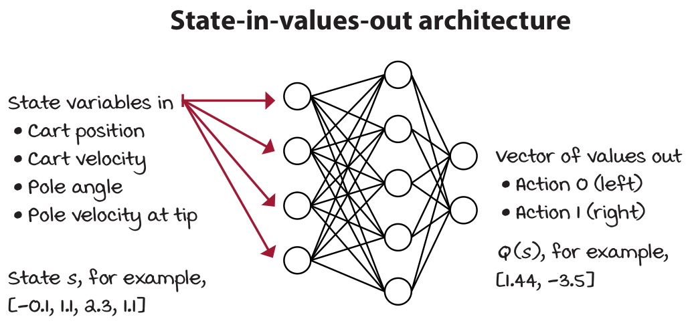

class: middle, center, title-slide

# Навчання з підкріпленням

Лекція 7: Методи апроксимацiї функцiї цiнностi

  
Кочура Юрій Петрович 
[iuriy.kochura@gmail.com](mailto:iuriy.kochura@gmail.com)  
<a href="https://t.me/y_kochura">@y_kochura</a>  

???
Важливо зрозуміти, чому ми використовуємо апроксимацiю (наближення) функцiї цiнностi для навчання з підкріпленням. Часто можна заплутатись в словах і вибирати щось через хайп. Наприклад, якщо ви почуєте термін "глибинне навчання", ви скоріше за все відчуєте більше піднесення, ніж якщо почуєте "нелінійна апроксимація функцій", але за сюттю це одне і те ж саме. Така природа людини. Це трапляється зі мною; і це трапляється з багатьма. Але наша мета &mdash; усунути упередженість і спростити наше мислення.

Сьогодні ми будемо говорити про використання апроксимації функцій для вирішення завдань навчання з підкріпленням. 

---

class: middle

# Сьогодні

- Вступ  
- Iнкрементнi методи
- Пакетнi методи

---

class: blue-slide, middle, center
count: false

.larger-xx[Вступ]

---

class: middle, 

.center[
.width-90[]
]

.footnote[Джерело: Grokking Deep Reinforcement Learning, Miguel Morales. p. 248]

???
Критичним аспектом задачі, з якою зіштовхуєтьс агент, завжди є доступна йому обчислювальна потужність, зокрема обсяг обчислень, які він може виконати за один часовий крок. Розмір доступної пам'яті агенту також є важливим обмеженням. Для апроксимації функцій цінності, стратегій та моделей часто потрібен великий обсяг пам’яті. У середовищах з невеликими кінцевими наборами станів можна сформувати ці наближення за допомогою масивів або таблиць з одним записом для кожного стану (або пари стан–дія). Такі методи називають **табличними**. Однак у багатьох випадках, що представляють практичний інтерес, існує набагато більше станів, ніж може бути записів у таблиці. У цих випадках функції повинні бути апроксимовані, використовуючи якесь більш компактне параметризоване представлення функції.

Основним недоліком табличних методів є те, що використання таблиці для представлення функцій цінності більше не є практичним в складних задачах. Табличні методи використовуються у задач у яких простори станів і дій агента є досить малими, тоді у такому випадку наближені значення функції цінності представляються у вигляді масивів або таблиць. Середовище існування агента може бути багатовимірним простором станів, що означає, що кількість змінних, які описують один стан агента, величезна. 

1. Це стан. Кожен стан є унікальною конфігурацією змінних
2. Наприклад, змінними можуть бути положення, швидкість, кут, місцезнаходження, піксель тощо.
3. Багатовимірний стан має багато змінних. Наприклад, один кадр в грі має 210 x 160 x 3 = 100 800 пікселів. Незалежно від значень, які можуть приймати ці пікселі, коли йде мова про розмірність (багатовимірність), йдеться насемперед про кількість змінних, які утворюють один стан.

---

class: middle, 

.center[
.width-90[]
]

.footnote[Джерело: Grokking Deep Reinforcement Learning, Miguel Morales.]

???
Задачі навчання з підкріпленням можуть мати неперервні простори станів і дій. Тобто середовище може мати неперервні змінні, що означає, що змінна може приймати нескінченну кількість значень. Для уточнення, простори станів і дій можуть бути багатовимірними з дискретними змінними і  можуть бути низьковимірними з неперервними змінними. 

Навіть якщо змінні є дискретними і, отже, не є нескінченно великими, вони все одно можуть приймати велику кількість значень, що робить їх непрактичним для навчання без використання апроксимації функцій. Це, наприклад, у випадку з Atari, коли кожен піксель зображення може приймати 256 значень (0–255 цілих значень). У вас є кінцевий простір станів, але досить великий, тому ми можемо використовувати проксимацію функцій для навчання агента.

Але іноді навіть простори станів низької розмірності можуть бути нескінченно великими. Наприклад, уявіть собі задачу, в якій є лише координати робота x, y, z, які  складають простір його станів. Звичайно, простір з трьома змінними є досить низьковимірним середовищем простору станів, але що, якщо будь-яка зі змінних надається в безперервній формі, тобто ця змінна може мати нескінченно малу точність? Скажімо, це може бути 1.56, 1.5683, 1.5683256 тощо. Тоді постає питання як створити таблицю, яка враховує всі ці значення?  Ви можете дискретизувати простір станів за допомогою апроксимації. 

1. Це стан. Кожен стан є унікальною конфігурацією змінних
2. Наприклад, змінними можуть бути положення, швидкість, кут, місцезнаходження, піксель тощо.
3. Неперервний простір станів має принаймні одну змінну, яка може приймати нескінченну кількість значень. Наприклад, положення, кути та висота є змінними, які можуть мати нескінченно малу точність: скажімо, 2,1, або 2.12, або 2.123 і так далі. 

---

class: middle, 

.center[
.width-70[]
]

.footnote[Джерело: Grokking Deep Reinforcement Learning, Miguel Morales.]

???
Середовище (cart-pole) перевернутий маятник з рухомою основою є класичним у навчанні з підкріпленням. Простір станів є низькорозмірними, але безперервним, що робить його чудовим середовищем для розробки алгоритмів; навчання швидке, але все ще дещо складне, і апроксимація функцій може допомогти. 

1. Завданням у середовищі перевернутого маятника на візку є утримання маятника у вертикальному положенні.
2. Маятник прикріплений до візка за допомогою шарніру (з'єднувальний пристрій, що допускає взаємні повороти).
3. Візок може рухатися вліво або вправо вздовж лінії.

Його простір станів складається з чотирьох змінних:
1. Положення візка на доріжці (вісь х) з діапазоном від -2.4 до 2.4
2. Швидкість візка на доріжці (вісь х) із діапазоном від –inf до inf
3. Кут відхилення маятника від вертикалі із діапазоном від ~-40 градусів до ~40 градусів
4. Кутова швидкість маятника на кінці з діапазоном від –inf до inf

У кожному стані доступні дві дії:
1. Дія 0 застосовує силу –1 до візка (штовхнути його ліворуч)
2. Дія 1 застосовує силу +1 до візка (штовхнути його праворуч)

Досягаємо термінального (кінцевого) стану, якщо
1. Кут відхилення маятника від вертикалі більше ніж на 12 градусів
2. Центр візка знаходиться далі ніж на 2.4 одиниці від центру доріжки
3. Кількість епізодів досягає 500 часових кроків

Функція винагороди є
- +1 за кожен часовий крок

---

class: middle, 

## Апроксимація функцій має переваги 

.center[
.width-90[]
]

.footnote[Джерело: Grokking Deep Reinforcement Learning, Miguel Morales.]

???
Я сподіваюсь, ви зрозуміли, що в багатовимірних середовищах  або з неперервними простором станів немає щодних практичних причин, щоб  не використовувати апроксимацію функцій. Методи планування в RL представляють функції цінності за допомогою таблиць. Наприклад, методи ітерації за функцією цінності станів $v$  (value iteration),   які застосовуються у  MDP та знаходять оптимальну стратегію для такого MDP шляхом розрахунку оптимальної функції $v$. Ітеративний метод відстежує зміну функції $v$ протягом кількох ітерацій. Цей вектор зберігається у таблицю пошуку для запиту й оновлення оцінок.

1. Функція цінності індексується за станами. Повертає масив, що представляє собою набір значень загальної винагороди для кожного стану. 

---

class: middle, 

## Апроксимація функцій має переваги 

.center[
.width-90[]
]

.footnote[Джерело: Grokking Deep Reinforcement Learning, Miguel Morales.]

???
Алгоритми Q-навчання не потребують MDP і не використовують функцію цінності стану $v$. Натомість у Q-навчанні ми оцінюємо значення оптимальної функції дій агента (функція ціності дій $q$). Функція ціності дій $q$ не є векторами вже, натомість вона представлена у вигляді матриці. Ці матриці є двовимірними таблицями, індексованими за станами та діями.

---

class: middle, 

<!-- ## Апроксимація функцій має переваги  -->

.center[
.width-70[]
]

.footnote[Джерело: Grokking Deep Reinforcement Learning, Miguel Morales.]

???
У середовищі cart-pole ми хочемо, щоб агент використовував узагальнення, оскільки це більш ефективне використання досвіду. Завдяки апроксимації функцій агенти вивчають і використовують шаблони з меншою кількістю даних (і, можливо, швидше).

У той час як методи ітерацій (value iteration) та Q-навчання вирішують проблеми за допомогою вибіркового зворотного зв’язку, це робить їх непрактичними, а відсутність узагальнення робить їх неефективними. Під цим я маю на увазі те, що ми могли б знайти способи використання таблиць у середовищах із неперервними змінними станів, але б це коштувало для нас дорого. Наприклад, дискретизація значень дійсно може зробити можливими використання таблиць. Але навіть якби ми могли розробити спосіб використання таблиць для збереження значень функцій цінності, таким чином ми б втратили переваги узагальнення. 

Наприклад, у середовищі cart-pole наближення функцій допомогло б нашим агентам вивчити зв’язок на відстані $x$. Агенти, ймовірно, дізнаються, що бути на відстані 2.35 одиниць від центру трохи краще, ніж бути на відстані 2.2 одиниць. Ми знаємо, що 2.4 є межею $x$ -- фініш. Цю додаткову особливість використання узагальнення не варто недооцінювати. Функції цінностей часто мають певні зв’язки вирішення поствленого завдання, які агенти можуть вивчати та використовувати.
Використання апроксимацій функцій, наприклад, нейронні мережі, можуть виявити ці основні зв’язки. 

1. Уявіть, що це функція цінності станів
2. Без апроксимації функції кожне значення є незалежним
3. З апроксимацією функції, основний зв’язок станів можна вивчити та використовувати.
4. Перевага використання апроксимації функції проявляється навіть після одного оновлення.
5. Без апроксимації функції, оновлення змінює лише один стан.
6. За допомогою апроксимації функції оновлення змінюють багато станів.
7. Звичайно, це спрощений приклад, але він допомагає проілюструвати, що відбувається. Що було б інакше в «реальних» прикладах?

По-перше, якщо ми апроксимуємо функцію цінності дій Q, нам доведеться б додати ще один вимір. Крім того, за допомогою нелінійної апроксимації, наприклад, нейронної мережі, можна виявити більш складні зв’язки.

---

class: middle, 

## Апроксимація функцій має переваги 

.center[
.width-90[]
]

.footnote[Джерело: Grokking Deep Reinforcement Learning, Miguel Morales.]

???
Мотивація використання апроксимації функцій полягає не лише у розв’язанні проблем, які неможливо розв’язати інакше, але й у розв’язанні проблем ефективніше.

---

class: middle, 

## First decision point: Selecting a value function to approximate

- The state-value function $v(s)$
- The action-value function $q(s,a)$
- The action-advantage function $a(s,a) = q(s,a) - v(s)$

.footnote[Джерело: Grokking Deep Reinforcement Learning, Miguel Morales.]

???
Починаємо з вибору функції цінності для апроксимації

Ви, мабуть, пам’ятаєте, що функція цінності стану $v(s)$, хоча й корисна для багатьох задач, але сама по собі недостатня для вирішення проблеми керування. Знаходження v(s) допомагає дізнатися, яку очікувану загальну винагороду зі знижкою ви можете отримати від стату s для заданої стратегії π. Але, щоб визначити, яку дію виконати за допомогою V-функції, вам також потрібен MDP середовища, щоб ви могли виконувати поетапний перегляд і брати до уваги всі можливі наступні стани після вибору кожної дії.

Ви, ймовірно, також пам’ятаєте, що функція цінності дії q(s,a) дозволяє нам розв’язати задачу керування. Наприклад, у середовищі cart-pole ми хочемо вивчити значення дій для всіх станів, щоб збалансувати жердину (маятник), керуючи візком. Якби ми мали значення пар стан-дія, ми могли б диференціювати дії, які привели б нас або до максимізації очікуваної винагороди, у випадку жадібної стратегії.

Функція вигоди  дії a(s,a) може допомогти нам розрізняти значення різних дій, а також дозволяє нам легко побачити, наскільки окрема дія краща за поточну стратегію. Ця функція може приймати негативні значення, що буде означати, що дія $a$ в $A(s,a)$ є гіршим вибором, ніж поточна стратегія.

---

class: middle, 

## Which Function Approximator?

There are many function approximators, e.g.

- Linear combinations of features
- Neural network
- Decision tree
- Nearest neighbour
- Fourier / wavelet bases
- ...

.footnote[Джерело: [David Silver](https://www.davidsilver.uk/wp-content/uploads/2020/03/FA.pdf).]

---

class: middle, 

## Which Function Approximator?

We consider **differentiable** function approximators, e.g.

- **Linear combinations of features**
- **Neural network**
- Decision tree
- Nearest neighbour
- Fourier / wavelet bases
- ...

.footnote[Джерело: [David Silver](https://www.davidsilver.uk/wp-content/uploads/2020/03/FA.pdf).]

---

class: middle, 

## Second decision point: Selecting a neural network architecture

.center[
.width-90[]
]

.footnote[Джерело: Grokking Deep Reinforcement Learning, Miguel Morales.]

---

class: middle, 

## Second decision point: Selecting a neural network architecture

.center[
.width-90[]
]

.footnote[Джерело: Grokking Deep Reinforcement Learning, Miguel Morales.]

???
Попередня архітектура буде чудово працювати в середовищі cart-pole. Але більш ефективна архітектура полягає лише у введенні стану (чотири значення  для cart-pole) до нейронної мережі  і виведення Q-значень для всіх дій у цьому стані (дві дії у середовищі cart-pole). Це безсумнівно має свої переваги під час використання стратегій вивчення середовища, таких як epsilon-жадібна або softmax, тому що для отримання значень усіх дій для будь-якого стану необхідно виконати лише один прохід вперед, щоб отримати високопродуктивну реалізацію, особливо в середовищах з великою кількістю дій.

---

class: middle, 

## Third decision point: Selecting what to optimize

.center[
.width-90[]
]

.footnote[Джерело: Grokking Deep Reinforcement Learning, Miguel Morales.]

???
Давайте на секунду припустимо, що середовище з cart-pole є проблемою контрольованого навчання. Скажімо, у вас є набір даних зі станами як вхідними параметрами і функцією цінності як мітки. Яку функцію цінності Ви хотіли б мати для міток? Звичайно, такими мітками оптимально обрати Q-функцію. Але чому це нездійсненна мрія? Ну, основна причина полягає в тому, що ми не маємо оптимальної функції цінності дій $q(s,a)$, але на довершення ми не можемо навіть випробувати ці оптимальні значення $Q$, тому що ми також не маємо оптимальної стратегії. 

На щастя, ми можемо використовувати підходи повторення узагальненої стратегії, коли ми чергуємо процеси оцінки стратегії та вдосконалення стратегії, щоб знайти найкращу стратегію. Але так як ми використовуємо апроксимацію нелінійної функції, гарантії збіжності цього алгоритму більше не немає.

Для нашої реалізації neural fitted Q (NFQ) iteration (нейронно підігнана ітерація Q (NFQ)) ми починаємо з довільно ініціалізованої функції цінності дій (і неявної стратегії). Потім ми оцінюємо стратегію, вибираючи дії з неї. Далі покращуємо стратегію за допомогою методу дослідження, такого як epsilon-greedy. Цей процес повторюється, доки не досягнемо бажаної продуктивності.

---

class: middle, 

.center[
.width-90[]
]

.footnote[Джерело: Grokking Deep Reinforcement Learning, Miguel Morales.]

---

class: middle, 

## Fourth decision point: Selecting the targets for policy evaluation

.center[
.width-90[]
]

.footnote[Джерело: Grokking Deep Reinforcement Learning, Miguel Morales.]

???
Існує кілька способів оцінки стратегії. Якщо говорити точніше, існують різні методі, які ми можемо використовувати для оцінки функції цінності дій та  стратегії π. Основні методи, про які ми розглядали минулого разу, це метод Монте-Карло (MC), метод тимчасової різниці (TD), n-кроковий TD та  TD (лямбда).

---

class: middle, 

## Fifth decision point: Selecting an exploration strategy

Another thing we need to decide is which policy improvement step to use for our generalized
policy iteration needs.

.footnote[Джерело: Grokking Deep Reinforcement Learning, Miguel Morales.]

???
Інша річ, яку нам потрібно вирішити, – це який крок удосконалення стратегії використовувати для потреб узагальнення ітерацій стратегії. Tto keep it
simple, we’re going to use an epsilon-greedy strategy on our NFQ implementation.

---

class: middle, 

.center[
.width-90[]
]

.footnote[Джерело: Grokking Deep Reinforcement Learning, Miguel Morales.]

???
1. Функція select_action для методу **epsilon-greedy** починається з отриманням Q-значень для стану s
2. Робимо «зручними для NumPy» і видаляю додатковий вимір.
3. Потім отримайте випадкове число і, якщо воно більше за епсилон, дійте жадібно.
4. В іншому випадку дійте випадково за кількістю дій.

---

class: middle, 

## Sixth decision point: Selecting a loss function

- L1
- L2, MSE
- ...

.footnote[Джерело: Grokking Deep Reinforcement Learning, Miguel Morales.]

???
Інша річ, яку нам потрібно вирішити, – це який крок удосконалення стратегії використовувати для потреб узагальнення ітерацій стратегії. 

---

class: middle, 

## Seventh decision point: Selecting an optimization method

- Batch gradient descent
- Mini-batch gradient descent
- Stochastic gradient descent
- Mini-batch gradient descent vs. momentum

.footnote[Джерело: Grokking Deep Reinforcement Learning, Miguel Morales.]
 
---

class: middle, 

# Batch gradient descent

.center[
.width-90[]
]

.footnote[Джерело: [David Silver](https://www.davidsilver.uk/wp-content/uploads/2020/03/FA.pdf).]

---

class: middle,

.center[
.width-90[]
]

.footnote[Джерело: Grokking Deep Reinforcement Learning, Miguel Morales.]

---

class: middle,

.center[
.width-90[]
]

.footnote[Джерело: Grokking Deep Reinforcement Learning, Miguel Morales.]

---

class: middle,

.center[
.width-90[]
]

.footnote[Джерело: Grokking Deep Reinforcement Learning, Miguel Morales.]

---

class: middle,

.center[
.width-90[]
]

.footnote[Джерело: Grokking Deep Reinforcement Learning, Miguel Morales.]

---

class: middle,

.center[
.width-90[]
]

.footnote[Джерело: Grokking Deep Reinforcement Learning, Miguel Morales.]

???
NFQ був представлений у 2005 році Мартіном Рідміллером у статті під назвою «Neural Fitted Q Iteration – First Experiences with a Data Efficient Neural Reinforcement Learning Method».

---

class: middle,

.center[
.width-90[]
]

.footnote[Джерело: Grokking Deep Reinforcement Learning, Miguel Morales.]

---

class: middle,

.center[
.width-70[]
]

.footnote[Джерело: Grokking Deep Reinforcement Learning, Miguel Morales.]

???
Незважаючи на те, що NFQ далекий від найсучаснішого методу глибинного навчання з підкріпленням, який заснованого на функції цінності, у дещо спрощеному середовищі, такому як перевернутий маятник на візку, NFQ показує гідну продуктивність.

1. Один цікавий момент полягає в тому, що ви бачите, що винагорода під час навчання ніколи не досягає максимуму в 500 за епізод. Причина в тому, що ми використовуємо епсилон 0.5. Наявність такого високого рівня дослідження допомагає знаходити точніше функцію цінності, але показує гіршу продуктивність під час навчання.
2. На другому рисунку подано середню винагороду під час етапу валідації. Етап валідації показує нам найкращою продуктивністю, яку ми можемо отримати від агента.
3. Основна проблема з NFQ полягає в тому, що потрібно зробити занадто багато кроків, щоб отримати гідну продуктивність. Іншими словами, з точки зору ефективності вибірки, NFQ працює погано. Щоб отримати хороші результати, потрібно багато зразків. Він не отримує максимум від кожного зразка.

---

class:  middle, center
count: false

.larger-xx[[Демо](https://github.com/YKochura/rl-kpi/blob/main/tutor/nfq/nfq-s.ipynb)]

---

# Література

.smaller-x[
- David Silver, Lecture 6: Value Function Approximation. [[video](https://www.youtube.com/watch?v=UoPei5o4fps&list=PLqYmG7hTraZBiG_XpjnPrSNw-1XQaM_gB&index=7)], [[slides](https://www.davidsilver.uk/wp-content/uploads/2020/03/FA.pdf)]
- [Reinforcement Learning: An Introduction](http://incompleteideas.net/book/RLbook2018.pdf) - Chapter 9: On-policy Prediction with Approximation
- [Reinforcement Learning: An Introduction](http://incompleteideas.net/book/RLbook2018.pdf) - Chapter 10: On-policy Control with Approximation
- [Tutorial: Introduction to Reinforcement Learning with Function Approximation](https://www.youtube.com/watch?v=ggqnxyjaKe4)
- [Neural Fitted Q Iteration - First Experiences with a Data Efficient Neural Reinforcement Learning Method](https://github.com/YKochura/rl-kpi/blob/main/tutor/nfq/paper.pdf)

]

---

class: end-slide, center

.larger-xx[Кінець]

